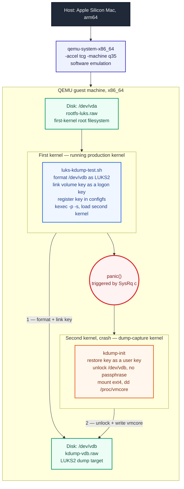
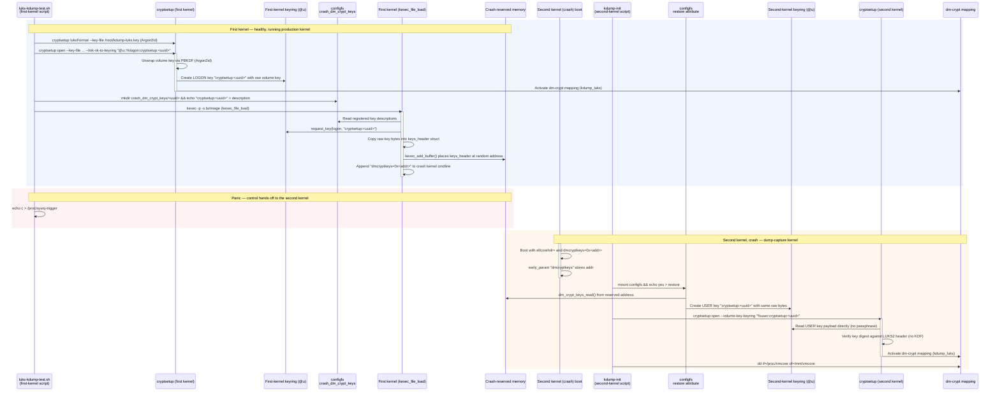
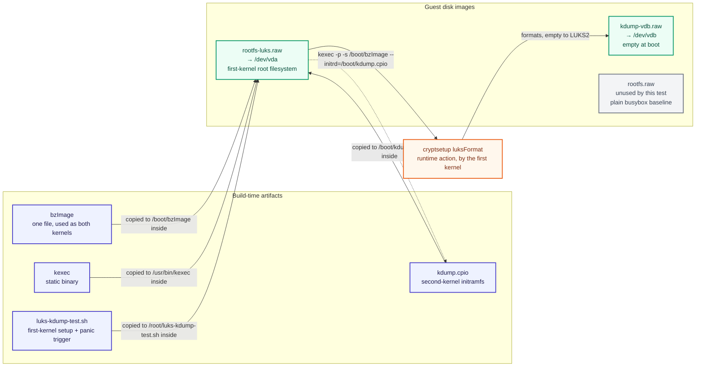

# Vanilla-x86: Validating CONFIG_CRASH_DM_CRYPT on Upstream Kernel

## Introduction

When a Linux system crashes, **kdump** boots a small second kernel — the **crash kernel** — into memory that was reserved ahead of time, and that second kernel writes a memory snapshot of the dying system (**`vmcore`**) to disk. This works cleanly when the dump target is a plain filesystem. It becomes a hard problem the moment the dump target sits on a **LUKS-encrypted** volume, because the crash kernel boots into a minimal, often unattended environment: there is no one to type a passphrase, a virtual keyboard may not exist, and even if a passphrase were available, LUKS2's default **Argon2** key-derivation function is deliberately memory-hard — re-deriving the volume key during a crash can require far more RAM than a typical `crashkernel=` reservation provides.

`CONFIG_CRASH_DM_CRYPT` solves this by having the **first kernel** do the expensive unlock once, while it is still healthy, and then hand the *already-unlocked* volume key to the crash kernel through a small, purpose-built channel: a kernel keyring, a `configfs` interface, and a reserved slice of crash memory. The crash kernel never runs Argon2 and never asks for a passphrase — it simply reuses the key that was proven to work moments before the panic.

This document is a **complete, standalone record** of validating that mechanism end-to-end on **x86_64**, using QEMU under TCG emulation on an Apple Silicon host. It assumes no prior context: every kernel option, every script, every file, and every keyring concept involved is explained from first principles, with the real command output from a passing run used as evidence throughout. The scope here is x86_64 only — aarch64 and ppc64le use a different mechanism (a device-tree property instead of a kernel command-line parameter) and are explicitly out of scope for this write-up.

Throughout this document, the two kernels involved are referred to consistently as:

- the **first kernel** — the normal, running production kernel, healthy and in control until the moment of the panic.
- the **second kernel (crash)** — the kdump-capture kernel, loaded by the first kernel ahead of time and jumped into only after a panic. This is what upstream documentation calls the "crash kernel" or "dump-capture kernel"; this document uses **second kernel (crash)** as the standard term to keep the two roles visually distinct.

---

## Table of Contents

- [1. Big-Picture Architecture](#1-big-picture-architecture)
  - [1.1 The Same Architecture, as a Step-by-Step Timeline](#11-the-same-architecture-as-a-step-by-step-timeline)
- [2. Key Concepts and Terminology](#2-key-concepts-and-terminology)
- [3. The Key Lifecycle, End to End](#3-the-key-lifecycle-end-to-end)
- [4. Deep-Dive Questions and Answers](#4-deep-dive-questions-and-answers)
  - [What is Argon2 (an "Argon2 key"), and what is it used for?](#what-is-argon2-an-argon2-key-and-what-is-it-used-for)
  - [What is the role of `luksUUID`, and what is `LUKS_UUID`?](#what-is-the-role-of-luksuuid-and-what-is-luks_uuid)
  - [What is the role of `dmcryptkeys`?](#what-is-the-role-of-dmcryptkeys)
  - [Why is `--volume-key-keyring` used?](#why-is---volume-key-keyring-used)
  - [Why is `kdump_luks` used?](#why-is-kdump_luks-used)
  - [Is `/proc/vmcore` related to `kdump_luks`?](#is-procvmcore-related-to-kdump_luks)
  - [What is `kdump.cpio` used for, and what does it contain?](#what-is-kdumpcpio-used-for-and-what-does-it-contain)
  - [Why are `kdump-vdb.raw`, `rootfs-luks.raw`, and `rootfs.raw` used?](#why-are-kdump-vdbraw-rootfs-luksraw-and-rootfsraw-used)
  - [What is a logon key?](#what-is-a-logon-key)
  - [Is the second kernel loaded automatically by the first kernel, or does something have to trigger it?](#is-the-second-kernel-loaded-automatically-by-the-first-kernel-or-does-something-have-to-trigger-it)
  - [How does the first kernel unlock the volume and link the volume key into a kernel logon key?](#how-does-the-first-kernel-unlock-the-volume-and-link-the-volume-key-into-a-kernel-logon-key)
  - [On panic, how does the second kernel (crash) restore that key and open the disk with no passphrase and no second Argon2 run?](#on-panic-how-does-the-second-kernel-crash-restore-that-key-and-open-the-disk-with-no-passphrase-and-no-second-argon2-run)
  - [What is the difference between `dmcryptkeys`, logon keys, and the user keyring?](#what-is-the-difference-between-dmcryptkeys-logon-keys-and-the-user-keyring)
  - [What is `dracut`, and how does it help build the initrd or load modules?](#what-is-dracut-and-how-does-it-help-build-the-initrd-or-load-modules)
  - [What is `makedumpfile`, and what problem does it solve?](#what-is-makedumpfile-and-what-problem-does-it-solve)
  - [What is `kdump-utils` doing, that this test instead does by hand?](#what-is-kdump-utils-doing-that-this-test-instead-does-by-hand)
- [5. Kernel Configuration Requirements](#5-kernel-configuration-requirements)
- [6. QEMU and Memory Requirements](#6-qemu-and-memory-requirements)
- [7. Userspace Tooling: First Kernel vs. Second Kernel (Crash)](#7-userspace-tooling-first-kernel-vs-second-kernel-crash)
- [8. Disk and Image Artifacts](#8-disk-and-image-artifacts)
- [9. Step-by-Step Walkthrough](#9-step-by-step-walkthrough)
- [10. Pass/Fail Determination](#10-passfail-determination)
- [11. Running It Yourself](#11-running-it-yourself)
- [12. Validating the vmcore with `crash(8)`](#12-validating-the-vmcore-with-crash8)
- [13. Upstream Tracking](#13-upstream-tracking)

---

## 1. Big-Picture Architecture

The test runs entirely inside one QEMU virtual machine. The host is an arm64 Mac; because Apple's hypervisor (HVF) cannot accelerate an x86_64 guest, QEMU falls back to **TCG** (pure software emulation), which is slower but fully correct for this purpose.

The guest has **two virtio block devices**:

- `/dev/vda` — the root filesystem the first kernel boots from.
- `/dev/vdb` — a raw, initially-empty disk that becomes the LUKS2-encrypted kdump target.

Both the first kernel and the second kernel (crash) are **the same `bzImage` file**. What differs is *how* and *with what command line* each boot happens: the first boot is a normal QEMU `-kernel` boot; the second boot is triggered internally, from inside the guest, by `kexec`.



The same `bzImage`, loaded twice, behaves as two different roles because of what each boot's command line and `configfs` state tell it to do. Every arrow in this diagram points forward in time — `/dev/vdb` receives two separate, clearly numbered actions (format-and-link from the first kernel, then unlock-and-write from the second kernel) rather than being referenced back and forth. Everything else in this document explains the mechanics behind each arrow.

### 1.1 The Same Architecture, as a Step-by-Step Timeline

The diagram above is a **structural** view — it shows every component once, color-coded by which kernel owns it, so you can see at a glance how the pieces relate to each other. The diagram below shows exactly the same components (the host, QEMU, both virtio disks, both kernels) but rearranged as a single, strictly **top-to-bottom timeline**, with every step numbered in the order it actually happens on the wire. Where the diagram above answers "what talks to what," this one answers "what happens, and when."

```mermaid
flowchart TD
    classDef hostStyle fill:#1f2937,stroke:#111827,color:#f9fafb,stroke-width:2px
    classDef firstStyle fill:#eff6ff,stroke:#2563eb,color:#1e3a8a,stroke-width:2px
    classDef panicStyle fill:#fef2f2,stroke:#dc2626,color:#7f1d1d,stroke-width:3px
    classDef secondStyle fill:#fff7ed,stroke:#ea580c,color:#7c2d12,stroke-width:2px
    classDef resultStyle fill:#ecfdf5,stroke:#059669,color:#064e3b,stroke-width:2px

    HOST["Host: Apple Silicon Mac, arm64"]:::hostStyle
    HOST --> LAUNCH["Launch qemu-system-x86_64 -accel tcg -machine q35<br/>software emulation, since HVF cannot run an x86_64 guest"]:::hostStyle
    LAUNCH --> VM["QEMU virtual machine starts<br/>1 GiB RAM, two virtio disks attached:<br/>/dev/vda = rootfs-luks.raw  ·  /dev/vdb = kdump-vdb.raw, empty"]:::hostStyle

    VM --> BOOT1["Step 1 — First kernel boots<br/>bzImage, loaded by QEMU's -kernel flag<br/>root filesystem = /dev/vda"]:::firstStyle

    subgraph FIRST [" FIRST KERNEL — healthy, running production kernel "]
        direction TB
        BOOT1 --> S1["Step 2 — Format /dev/vdb as LUKS2<br/>cryptsetup luksFormat, Argon2id + passphrase"]:::firstStyle
        S1 --> S2["Step 3 — Unlock it and link the volume key<br/>cryptsetup open --link-vk-to-keyring<br/>creates a LOGON key in the user keyring"]:::firstStyle
        S2 --> S3["Step 4 — Register the key in configfs<br/>mkdir + description file under<br/>/sys/kernel/config/crash_dm_crypt_keys/&lt;uuid&gt;"]:::firstStyle
        S3 --> S4["Step 5 — Load the second kernel<br/>kexec -p -s bzImage --initrd=kdump.cpio<br/>kexec_file_load copies the key into<br/>crash-reserved memory, sets dmcryptkeys="]:::firstStyle
        S4 --> S5["Step 6 — Trigger the panic<br/>echo c > /proc/sysrq-trigger"]:::firstStyle
    end

    S5 --> PANIC(("panic()<br/>control jumps to the loaded image")):::panicStyle

    subgraph SECOND [" SECOND KERNEL, CRASH — the dump-capture kernel "]
        direction TB
        PANIC --> S6["Step 7 — Second kernel boots from crash-reserved memory<br/>command line already contains<br/>elfcorehdr=... dmcryptkeys=0x...<br/>root = kdump.cpio initramfs, not any disk"]:::secondStyle
        S6 --> S7["Step 8 — Restore the key<br/>echo yes > .../crash_dm_crypt_keys/restore<br/>creates a USER key with the same bytes"]:::secondStyle
        S7 --> S8["Step 9 — Unlock /dev/vdb, no passphrase<br/>cryptsetup open --volume-key-keyring<br/>digest check only, no Argon2"]:::secondStyle
        S8 --> S9["Step 10 — Mount the ext4 filesystem<br/>that was created inside that LUKS volume<br/>back in Step 2"]:::secondStyle
        S9 --> S10["Step 11 — Copy the dump<br/>dd if=/proc/vmcore of=/mnt/vmcore"]:::secondStyle
    end

    S10 --> RESULT["Result — encrypted vmcore<br/>sitting on /dev/vdb, readable only<br/>after the volume is unlocked again"]:::resultStyle
```



Reading it top to bottom: the host launches one QEMU machine with two disks; everything inside the **first kernel** box happens before the panic and touches `/dev/vdb` only to format and lock in the key; the panic is the single hand-off point; everything inside the **second kernel (crash)** box happens after the panic and touches `/dev/vdb` only to unlock it (using the key handed off through the panic) and write the dump. The two kernels never run at the same time, and `/dev/vdb` is the only thing both halves of the timeline share.

---

## 2. Key Concepts and Terminology

A handful of kernel and cryptsetup concepts recur throughout this test. Getting these precise up front avoids confusion later, especially because several of them share the word "key" or "user" while meaning very different things.

| Term | What it actually is |
| --- | --- |
| **Volume key** | The raw symmetric key (for example, AES-XTS key material) that dm-crypt uses to encrypt and decrypt data on the block device. It is *not* the passphrase — the passphrase only unwraps the volume key from a LUKS keyslot. |
| **Argon2 / Argon2id** | The **password-based key derivation function (PBKDF)** LUKS2 uses by default to turn a human passphrase into something strong enough to unwrap the volume key. It is deliberately slow and deliberately memory-hard. It is *not itself a key* — see the dedicated question below. |
| **Logon key** | A kernel key *type* (`key_type_logon`) whose payload cannot be read back out by a userspace process via the `keyctl`/`read()` syscalls. Only privileged, in-kernel code paths can access its raw payload. This is the type the first kernel uses to hold the volume key. |
| **User key** | A different kernel key *type* (`"user"`), whose payload *can* be read by a userspace process that has permission. This is the type the second kernel (crash) creates when it restores the key — because its userspace `cryptsetup` process needs to read the raw bytes. |
| **User keyring (`@u`)** | A **keyring** — a special kind of key that holds references to other keys — scoped to the calling UID (`KEY_SPEC_USER_KEYRING`, written as `@u` in keyctl syntax). Both the logon key (in the first kernel) and the user key (in the second kernel) are linked into this keyring. "User keyring" is a *keyring*, not a key type — do not confuse it with the "user" key *type* above, even though both use the word "user." |
| **`configfs`** | An in-kernel, writable filesystem interface (distinct from `sysfs`) used here to register which logon keys the second kernel (crash) will need, at `/sys/kernel/config/crash_dm_crypt_keys`. |
| **`dmcryptkeys=`** | An x86_64 kernel **boot parameter**, not a key itself — a pointer (physical address) telling the second kernel (crash) where to find the serialized key data inside the crash-reserved memory region. |
| **`kexec_file_load`** | The kexec syscall path invoked by `kexec -s`. This is the *only* path that copies dm-crypt keys into crash memory. The legacy `kexec_load` path (no `-s`) does not do this. |

---

## 3. The Key Lifecycle, End to End

This is the heart of the feature: how a volume key goes from "unlocked by a passphrase in the first kernel" to "available to `cryptsetup` in the second kernel (crash), with no passphrase and no Argon2."

[The Key Lifecycle, End to End](/assets/kexec_crash/the_key_lifecycle.html)



The two halves of this diagram map directly onto the two kernels: everything in the blue block happens in the **first kernel**, driven by `luks-kdump-test.sh`; everything in the orange block happens in the **second kernel (crash)**, driven by the separate `kdump-init` script — these are two different scripts, running in two different boots, and the diagram now names them as such rather than treating both halves as one generic "user." The activation bars on `cryptsetup` and on the two kernel boot stages show which operation is in flight at each point. Note that the volume key's raw bytes cross the panic boundary exactly once, inside the opaque `keys_header` blob sitting in crash-reserved memory — never through a file, never through a passphrase, and never through a network.

---

## 4. Deep-Dive Questions and Answers

The following questions came up directly while working through this test. Each is answered in depth, grounded in the kernel source (`kernel/crash_dump_dm_crypt.c`, `arch/x86/kernel/kexec-bzimage64.c`) and in the actual output captured from the passing run.

### What is Argon2 (an "Argon2 key"), and what is it used for?

"Argon2 key" is a convenient shorthand, but it is worth being precise about what Argon2 actually is, because it is not a key at all — it is a **key derivation function (KDF)**: an algorithm that takes a low-entropy input, like a human-chosen passphrase, and turns it into a cryptographically strong output, deliberately slowly. Argon2 won the Password Hashing Competition in 2015, and LUKS2 uses its hybrid variant, **Argon2id**, as the default PBKDF (password-based KDF) for new volumes.

**Which human-chosen passphrase is actually used in this test?** On a real system, an administrator would type this interactively, or a TPM/network-bound-disk-encryption policy would supply it. There is no human and no TPM in this QEMU guest, so the setup script stands in for that step with a fixed, hard-coded string: **`kdump-test-pass`**. It is written, verbatim, into a file at `/root/kdump-luks.key` by the first-kernel script:

```sh
/bin/busybox printf '%s' 'kdump-test-pass' > /root/kdump-luks.key
```

That file's entire content is exactly the 15 ASCII bytes `kdump-test-pass`, written with `printf '%s'` so **no trailing newline** is appended — a detail that matters, because a stray `\n` would silently become part of the passphrase and would need to be reproduced byte-for-byte on every later `--key-file` read. Every subsequent `cryptsetup luksFormat` and `cryptsetup open --key-file` call in the first kernel reads this same file instead of prompting on the terminal; that is the only reason the setup script can run unattended inside a test harness. The second kernel never receives a copy of this file (see the table in Section 7) — it only ever receives the already-unwrapped volume key, through the keyring handoff described below, not this passphrase.

The property that matters most for this entire feature is that Argon2 is **memory-hard**: computing it requires a configurable, often large, amount of RAM — not just CPU time. This is a deliberate defense against brute-force attacks: an attacker trying millions of candidate passphrases on GPUs or custom ASICs is bottlenecked by how much fast memory they can afford per parallel guess, not by raw compute, which is cheap and highly parallelizable. The downside of that same property is the one this document keeps returning to: whichever kernel actually has to *run* Argon2 needs a correspondingly large amount of free RAM available to it at that moment.

**Where Argon2 sits in the unlock chain** — and why "the Argon2 key" is a slightly loose way to describe it — is that there are really three distinct secrets layered on top of each other, and Argon2 only ever touches the outermost one:

```mermaid
flowchart LR
    classDef inputStyle fill:#eff6ff,stroke:#2563eb,color:#1e3a8a,stroke-width:2px
    classDef derivedStyle fill:#f5f3ff,stroke:#7c3aed,color:#4c1d95,stroke-width:2px
    classDef storedStyle fill:#ecfdf5,stroke:#059669,color:#064e3b,stroke-width:2px
    classDef consumerStyle fill:#f3f4f6,stroke:#4b5563,color:#1f2937,stroke-width:2px

    PASS["Passphrase<br/>the literal string 'kdump-test-pass'<br/>held in /root/kdump-luks.key"]:::inputStyle
    KEK["Key-encryption key, KEK<br/>a derived value — never written to disk"]:::derivedStyle
    VK["Volume key<br/>stored, encrypted, inside the LUKS2 keyslot header"]:::storedStyle
    DMC["dm-crypt<br/>AES-XTS data encryption on /dev/vdb"]:::consumerStyle

    PASS -->|"Argon2id<br/>using this keyslot's stored salt, memory cost, iterations"| KEK
    KEK -->|decrypts / unwraps| VK
    VK -->|used directly by| DMC
```



Each LUKS2 keyslot stores Argon2id's *parameters* (a random salt, a memory cost, a time cost, and a parallelism degree) in the header — never a key. When a passphrase is supplied, `cryptsetup` runs Argon2id over that passphrase using those stored parameters to produce the KEK, then uses the KEK to decrypt the real volume key sitting in that keyslot. The volume key — not anything Argon2 itself outputs — is what ends up inside the logon key described above, and what dm-crypt actually uses to read and write encrypted blocks.

**Where this test actually invokes Argon2** is in exactly one place: the first-kernel setup script, during `luksFormat`:

```sh
/sbin/cryptsetup luksFormat --type luks2 --batch-mode --use-urandom \
    --pbkdf argon2id --pbkdf-memory 32768 --pbkdf-parallel 1 \
    --pbkdf-force-iterations 4 \
    --key-file /root/kdump-luks.key /dev/vdb
```

- `--pbkdf argon2id` selects LUKS2's own default variant explicitly.
- `--pbkdf-memory 32768` caps the memory cost at 32 MiB, instead of the roughly 1 GiB a default LUKS2 keyslot would otherwise request.
- `--pbkdf-force-iterations 4` fixes the time cost at 4 passes rather than letting `cryptsetup` auto-tune against its usual ~2-second target.
- `--pbkdf-parallel 1` uses a single thread.

These flags exist purely to make the **one-time, first-kernel** `luksFormat` step finish quickly under QEMU's software-emulated TCG — they make repeated test runs practical. They do **not** weaken what is actually being validated, because the property under test is not "how expensive is the KDF" — it is "does the second kernel (crash) ever have to run the KDF at all." With these reduced parameters or with LUKS2's full ~1 GiB defaults, the second kernel in this test invokes Argon2 **zero times** either way: as the "Why is `--volume-key-keyring` used?" answer above shows, the restored key goes straight into the dm-crypt mapping via a cheap digest comparison, with no PBKDF call whatsoever.

This also explains a detail mentioned elsewhere in this project's documentation: production crash-kernel sizing guidance sometimes calls out an extra "~1.3 GiB for LUKS" on top of a normal `crashkernel=` reservation. That extra memory is only needed when `CONFIG_CRASH_DM_CRYPT` is **not** in effect and the second kernel is forced to re-run the real Argon2id pass itself, at the keyslot's full memory cost, to re-derive the volume key from a passphrase it has no way to collect. Avoiding that exact cost — not making Argon2 itself any weaker — is the entire reason this feature exists.

### What is the role of `luksUUID`, and what is `LUKS_UUID`?

`cryptsetup luksUUID /dev/vdb` is a read-only command that prints the **UUID stored inside the LUKS2 header** of that device — a unique identifier generated once, when the volume was formatted, and baked permanently into the header's metadata. It requires no key and no passphrase; it is pure metadata.

`LUKS_UUID` (or `UUID` in the scripts) is simply the **shell variable** that captures that string, for example:

```sh
UUID=$(/sbin/cryptsetup luksUUID /dev/vdb)
```

Its importance in this test is as the **shared naming anchor** between the two kernels. Both the configfs key description (`cryptsetup:<uuid>`) and the keyring key name must match *exactly* between the first kernel (which creates and registers the logon key) and the second kernel (which requests and restores it). The UUID is what guarantees that the key the first kernel linked is the same key the second kernel asks for, even though the two kernels never share any other runtime state. In the captured run this was:

```text
LUKS_UUID=3504a44a-e091-41f5-9f6f-aaadcf3a6fd7
```

### What is the role of `dmcryptkeys`?

`dmcryptkeys=` is a **kernel boot parameter**, present only on x86_64, appended automatically to the second kernel's command line by the first kernel's `kexec_file_load()` implementation (`arch/x86/kernel/kexec-bzimage64.c`, function `setup_cmdline()`). Its value is a **physical memory address**:

```text
dmcryptkeys=0x3b3f6000
```

That address points into the `crashkernel=` reserved region and marks where the first kernel placed the serialized key blob (a `keys_header` structure containing the key count, each key's description, and each key's raw bytes). The second kernel's early boot code (`setup_dmcryptkeys()`, registered via `early_param("dmcryptkeys", ...)`) parses this value into the kernel variable `dm_crypt_keys_addr` before any userspace runs. Later, when userspace writes `yes` to the `restore` configfs attribute, the kernel uses that stored address to read the blob back out of reserved memory.

It is worth being precise that **`dmcryptkeys=` is not a key** — it carries no secret material itself. It is a pointer. The actual secret bytes never appear in any command line, any log, or `/proc/cmdline` — only their *location* does, and that location is inside memory the first kernel itself cannot map (it is marked not-present on x86 specifically to keep a compromised or inspected first kernel from reading it back out).

**How does the first kernel know, at the moment `kexec -p -s` runs, that it has to add this parameter at all?** It does not "know" in any special sense — the check is unconditional and happens every single time, and whether anything gets appended just falls out of that check's result. In `arch/x86/kernel/kexec-bzimage64.c`, the file-load path for any crash-type image (`image->type == KEXEC_TYPE_CRASH`, which is exactly what `-p` requests) always calls `crash_load_dm_crypt_keys(image)` — there is no configfs check at this call site at all:

```c
if (image->type == KEXEC_TYPE_CRASH) {
    ret = crash_load_segments(image);
    ...
    ret = crash_load_dm_crypt_keys(image);
    ...
}
```

The actual decision happens one level deeper, inside `crash_load_dm_crypt_keys()` itself (`kernel/crash_dump_dm_crypt.c`), which checks the `key_count` global — the same counter that goes up every time a new directory is created under `/sys/kernel/config/crash_dm_crypt_keys/`:

```c
int crash_load_dm_crypt_keys(struct kimage *image)
{
    ...
    if (key_count <= 0) {
        kexec_dprintk("No dm-crypt keys\n");
        return 0;
    }
    ...
    image->dm_crypt_keys_addr = kbuf.mem;   /* only reached if key_count > 0 */
    ...
}
```

If no keys were ever registered in configfs, this function returns immediately and `image->dm_crypt_keys_addr` is left at its default value of `0`. Back in `setup_cmdline()`, the append is itself gated on that exact field: `if (image->dm_crypt_keys_addr != 0) { append "dmcryptkeys=0x%lx" }`. So the whole mechanism reduces to one boolean, decided entirely by configfs state at the instant `kexec -p -s` runs: **registered keys present → `dm_crypt_keys_addr` gets set → `dmcryptkeys=` gets appended; no keys registered → the field stays zero → the parameter is silently never added, with no warning or error.** This is exactly why this document — and every kdump tool that implements this feature — insists the configfs `description` be written *before* `kexec -p -s`, not after: there is no retry, no deferred check, and no second chance once the image is loaded.

### Why is `--volume-key-keyring` used?

In the second kernel (crash), `cryptsetup` needs the volume key to activate the dm-crypt mapping, but it has no passphrase, no TPM-unsealing session, and — critically — not nearly enough free RAM in a 256 MB `crashkernel=` reservation to run Argon2id at its normal memory cost (which can be hundreds of megabytes to over a gigabyte).

`--volume-key-keyring <key description>` tells `cryptsetup` to skip the entire passphrase-and-PBKDF path and instead **read the volume key directly out of a kernel keyring key** by name:

```sh
cryptsetup --batch-mode open --volume-key-keyring "%user:cryptsetup:${UUID}" /dev/vdb kdump_luks
```

`cryptsetup` still performs one check — it verifies the supplied key's digest against the digest stored in the LUKS2 header, confirming this is genuinely the correct volume key for this device — but that digest check is a cheap hash comparison, not a memory-hard KDF. Once verified, `cryptsetup` activates the dm-crypt mapping directly with those raw bytes. This is the single mechanism that makes the entire feature possible: it converts "unlock a LUKS volume" from an expensive, interactive operation into a cheap, deterministic keyring lookup.

### Why is `kdump_luks` used?

`kdump_luks` is simply the **device-mapper name** chosen for the activated mapping — the string that becomes `/dev/mapper/kdump_luks` once `cryptsetup open` succeeds:

```sh
cryptsetup open ... /dev/vdb kdump_luks
```

There is nothing special baked into the kernel about this particular string; any valid device-mapper name would work mechanically. It is used here purely for **consistency and clarity**: the same name is reused by both the first-kernel setup script and the second-kernel (crash) restore script, so every step after `cryptsetup open` — `mke2fs`, `mount`, and the final `dd` — can refer to a fixed, predictable path (`/dev/mapper/kdump_luks`) rather than having to rediscover it.

### Is `/proc/vmcore` related to `kdump_luks`?

They are related only in the sense that one is **written into** the other — they are not the same mechanism and do not depend on each other to exist.

- **`/proc/vmcore`** is a *virtual* file exposed by the running second kernel (crash) itself, made possible by `CONFIG_CRASH_DUMP`. It is a live view, constructed from the **first kernel's physical memory**, formatted as an ELF core file (using the `elfcorehdr=` region the first kernel also set up). It exists the moment the second kernel boots, regardless of where — or whether — you choose to save it.
- **`/dev/mapper/kdump_luks`** is the decrypted block device backing the encrypted disk `/dev/vdb`, with an ext4 filesystem mounted from it at `/mnt`.

The test's actual dump step is nothing more than copying one into the other:

```sh
dd if=/proc/vmcore of=/mnt/vmcore bs=1048576
```

In other words: `/proc/vmcore` is the **data** (the crash dump itself); `kdump_luks` is the **encrypted destination** it gets written to. `CONFIG_CRASH_DM_CRYPT` only concerns itself with getting `kdump_luks` unlockable without a passphrase — `/proc/vmcore`'s existence is entirely a separate, standard kdump mechanism.

### What is `kdump.cpio` used for, and what does it contain?

`kdump.cpio` is the **initramfs for the second kernel (crash)** — the minimal root filesystem it boots with, built with the `cpio` "newc" archive format and passed to `kexec` via `--initrd=`:

```sh
/usr/bin/kexec -p -s /boot/bzImage --initrd=/boot/kdump.cpio --append="... rdinit=/init" ...
```

Because `rdinit=/init` is set, the second kernel runs `/init` from this archive as its very first userspace process, instead of pivoting to any real root filesystem. Its contents are deliberately minimal and deliberately **exclude any secret material**:

| Path inside `kdump.cpio` | Purpose |
| --- | --- |
| `/init` | The crash-time logic (`kdump-init`): restore the key, open LUKS, mount ext4, `dd /proc/vmcore`, power off. |
| `/bin/busybox` (+ applet symlinks) | Minimal shell, `mount`, `dd`, `sync`, `wc`, `cmp`, `poweroff`, etc. |
| `/sbin/cryptsetup` | Statically-resolvable cryptsetup 2.7.5 binary (dynamically linked against musl). |
| `/usr/lib/libcryptsetup.so.12`, `/lib/ld-musl-x86_64.so.1` | Shared libraries cryptsetup needs at runtime. |
| `/usr/lib/cryptsetup/` | LUKS2 token-plugin directory (copied for completeness; unused by this test). |

Notably absent: there is **no passphrase file anywhere in this archive**. The second kernel (crash) has no way to unlock the volume by brute-force or by any human-provided secret — it is architecturally restricted to only the keyring-restore path.

### Why are `kdump-vdb.raw`, `rootfs-luks.raw`, and `rootfs.raw` used?

These three disk images serve three distinct, non-overlapping purposes:

| Image | Guest device | Role |
| --- | --- | --- |
| **`rootfs.raw`** | `/dev/vda` (in the plain `run-qemu-vanilla-x86.sh` boot) | The original, pre-existing vanilla busybox root filesystem used for basic kexec sanity checks. It has no `cryptsetup` and is not used by this LUKS test at all — kept untouched as a baseline. |
| **`rootfs-luks.raw`** | `/dev/vda` | The **first kernel's root filesystem** for this test: busybox, `cryptsetup`, `mke2fs`, `keyctl`, the static `kexec`, the setup script `luks-kdump-test.sh`, and — embedded at `/boot/` — a copy of `bzImage` and `kdump.cpio`, ready for `kexec` to load. |
| **`kdump-vdb.raw`** | `/dev/vdb` | A raw, sparse, initially **empty** disk. It starts with no filesystem and no LUKS header at all; the first-kernel script formats it with `cryptsetup luksFormat` at runtime. This is the actual dump target — the disk that ends up holding the encrypted `vmcore`. |

The reason `kdump-vdb.raw` must be a **real, persistent block device** rather than a loop-mounted file deserves emphasis, because it is the single most common way to get a false negative in this kind of test: a loop device (`losetup`) is a mapping that exists only inside the kernel that created it. When the first kernel hands off to the second kernel (crash) via `kexec`, that loop mapping does not carry over — the second kernel has no idea the loop device ever existed. A raw virtio disk, by contrast, is a property of the QEMU *machine*, visible identically to whichever kernel happens to be running at the time. That is why `/dev/vdb` here is a second virtio drive, not a loop file inside `/dev/vda`.

### What is a logon key?

A **logon key** is a Linux kernel key *type* (`key_type_logon`, defined in `security/keys/`), purpose-built for holding credentials that kernel-internal consumers need but that userspace processes must never be able to read back out directly. Concretely, its `read()` method is restricted such that even the `keyctl_read()` syscall — the normal way a process inspects a key's payload — returns an error for a logon-type key.

This matters enormously for the design of this feature: when `cryptsetup --link-vk-to-keyring "@u::%logon:cryptsetup:<uuid>"` creates the volume key as a logon key, the *raw key bytes become invisible to every ordinary process on the first kernel*, including root processes casually poking around with `keyctl show` or `keyctl print`. `keyctl show @u` will happily show that the key *exists* (its description, its serial number), but nothing short of in-kernel code can extract its payload.

That restriction is exactly what is bypassed, deliberately and only once, by the kernel's own `kexec_file_load()` path: the function `read_key_from_user_keyring()` in `kernel/crash_dump_dm_crypt.c` calls `request_key(&key_type_logon, description, NULL)` and then reads the payload via the internal `user_key_payload_locked()` accessor — code running as part of the `kexec_file_load` syscall itself, inside the kernel, not as an ordinary userspace read. The restriction is a syscall-boundary restriction, not a kernel-internal one, so this in-kernel code path can still legitimately access the bytes to copy them into the crash-reserved key blob.

### Is the second kernel loaded automatically by the first kernel, or does something have to trigger it?

This question hides two completely different steps inside the single word "load," and only one of those two steps is actually automatic.

**Step A — placing the crash image into memory — is *not* triggered by anything.** It is a deliberate, proactive action that must be performed in advance, while the first kernel is still healthy, with no crash in sight. In this test, the setup script does it explicitly, as its own line, well before anything goes wrong:

```sh
/usr/bin/kexec -p -s /boot/bzImage \
    --initrd=/boot/kdump.cpio \
    --append="console=ttyS0 nokaslr irqpoll nr_cpus=1 reset_devices rdinit=/init"
```

Nothing inside the running kernel decides on its own to run this. If it is never run, the kernel's internal pointer to "the image to jump to on panic" (`kexec_crash_image`) simply stays `NULL`. A later panic then behaves like an ordinary, un-instrumented panic: no second kernel boots, no `vmcore` is produced, and whatever generic panic policy is configured (reboot, halt, hang) takes over instead.

On a real production system, this same step still has to happen — it is just performed for you, automatically from the *administrator's* point of view, by the **`kdump` systemd service**, which runs the equivalent of `kexec -p -s` once at boot (and again whenever `kdumpctl restart` or `kdumpctl reload` runs). That is a convenience of the init system, not a behavior of the kernel — it is still userspace, proactively loading the image ahead of any crash, exactly like the manual `kexec -p -s` line in this test.

**Step B — jumping into that already-loaded image once a panic actually happens — *is* fully automatic**, and this part genuinely is the kernel acting entirely on its own. `panic()` (in `kernel/panic.c`) synchronously calls into the kexec-on-panic path — `crash_kexec()` → `machine_crash_shutdown()` → `machine_kexec()` — and, if an image was loaded by Step A, jumps straight into it. No userspace process runs `kexec` a second time; no daemon makes a decision; nothing needs to be "listening" for the crash. In this test, that is exactly what `echo c > /proc/sysrq-trigger` demonstrates: that single line forces the panic, and the second kernel's boot messages appear on the serial console immediately afterward, with no further command issued by anything.

| Step | Performed by | When it happens | Automatic? |
| --- | --- | --- | --- |
| Load the crash image (`kexec -p -s`) | This test's setup script; `kdump.service` in production | Any time before a panic, while the first kernel is healthy | **No** — must be explicitly triggered once, ahead of time |
| Jump into the crash image | The kernel itself, inside `panic()` | The instant `panic()` runs | **Yes** — fully automatic, zero userspace action |

So, directly: the first kernel does not load the second kernel "automatically" in response to anything happening — loading is a one-time, proactive setup step that has to be completed beforehand (by hand in this test, by `kdump.service` in production). What *is* automatic, requiring nothing further from anyone, is the kernel's own handling of the actual hand-off from a live panic into that already-loaded second kernel.

### How does the first kernel unlock the volume and link the volume key into a kernel logon key?

One single `cryptsetup` invocation does both things at once:

```sh
cryptsetup --batch-mode open \
  --key-file /root/kdump-luks.key \
  --disable-external-tokens \
  --link-vk-to-keyring "@u::%logon:cryptsetup:${UUID}" \
  /dev/vdb kdump_luks
```

Step by step:

1. `cryptsetup` reads the passphrase from `--key-file` and reads the LUKS2 header from `/dev/vdb` to find which keyslot that passphrase can unlock.
2. It runs the keyslot's PBKDF — in this test, **Argon2id** — to derive a key-encryption key from the passphrase, then uses that to decrypt (unwrap) the actual **volume key** stored in the keyslot.
3. It activates the dm-crypt mapping `/dev/mapper/kdump_luks` using that volume key, via the standard device-mapper ioctl path.
4. Because `--link-vk-to-keyring "@u::%logon:cryptsetup:<uuid>"` was supplied, `cryptsetup` *also* creates a **logon-type key** named `cryptsetup:<uuid>`, containing the raw volume key bytes, and links it into the per-UID **user keyring** (`@u`) — so the key persists in the kernel's keyring subsystem even after the `cryptsetup` process itself exits.

From this point forward, the volume key exists in two places simultaneously: active inside the dm-crypt mapping's in-kernel state, and parked, inaccessible to userspace, inside the logon key — waiting for `kexec_file_load` to harvest it.

### On panic, how does the second kernel (crash) restore that key and open the disk with no passphrase and no second Argon2 run?

This is the payoff of everything set up beforehand, and it happens in four stages once the panic fires:

1. **Boot with the pointer already in hand.** The second kernel (crash) boots with `elfcorehdr=0x2f000000 dmcryptkeys=0x3b3f6000` on its command line (the exact values from the captured run). The early-boot parameter handler stores that address before any driver or filesystem code runs.

2. **Explicit restore trigger.** The minimal init script mounts `configfs` and writes:

   ```sh
   echo yes > /sys/kernel/config/crash_dm_crypt_keys/restore
   ```

   This write calls `restore_dm_crypt_keys_to_thread_keyring()`, which reads the `keys_header` blob directly out of the crash-reserved memory at the `dmcryptkeys=` address (using `dm_crypt_keys_read()`, which — on confidential-computing platforms — correctly routes through the "old memory" accessor so it still works even when the first kernel's RAM is memory-encrypted). For every key in that blob, it calls `add_key_to_keyring()`, which creates a **user-type** key (not logon — this is the crucial type change) with the identical description, and links it into the second kernel's own user keyring. The captured run confirms this succeeded: `RESTORE=1`.

3. **No-passphrase unlock.** The script reads the device's UUID (a header-only operation, needs no key) and then runs:

   ```sh
   cryptsetup --batch-mode open --volume-key-keyring "%user:cryptsetup:<uuid>" /dev/vdb kdump_luks
   ```

   Because the restored key is type `user`, not `logon`, `cryptsetup` running as an ordinary userspace process *can* read its payload. It verifies the key's digest against the LUKS2 header (a fast hash check, not a KDF) and activates the dm-crypt mapping directly.

4. **No second Argon2 run.** Because the raw key bytes were supplied directly, `cryptsetup` never touches the keyslot's Argon2id parameters at all in this second kernel. The 256 MB crash reservation never needs to hold the roughly 1 GB an Argon2id pass can otherwise require — confirming the central promise of `CONFIG_CRASH_DM_CRYPT`.

> **Advanced note — key reuse across a reload.** If userspace reloads the crash image after a CPU or memory hotplug event, the kernel can skip re-deriving the key blob from scratch. Writing `true` to `crash_dm_crypt_keys/reuse` makes `crash_load_dm_crypt_keys()` call `get_keys_from_kdump_reserved_memory()` instead of rebuilding the blob: it temporarily calls `arch_kexec_unprotect_crashkres()` to make the already-reserved key page readable, copies it, and re-protects the page afterward. This test does not exercise that path — it builds a fresh key blob on every `kexec -p -s` — but it is the same underlying mechanism applied to a reload instead of a first load.

### What is the difference between `dmcryptkeys`, logon keys, and the user keyring?

These three terms are frequently conflated because they are all part of the same handoff, but each one is a different *kind* of thing:

| Term | Kind of thing | Lives in | Holds secret bytes? |
| --- | --- | --- | --- |
| **`dmcryptkeys=`** | A kernel **boot parameter** (a string on the command line) | The second kernel's `/proc/cmdline` | No — it is only a physical memory address, a pointer to where the secret bytes are stored. |
| **Logon key** | A kernel **key type** (`key_type_logon`) | The **first kernel's** user keyring (`@u`) | Yes — holds the raw volume key, but cannot be read back out by any ordinary userspace syscall. |
| **User key** | A different kernel **key type** (`"user"`) | The **second kernel's** user keyring (`@u`) | Yes — holds the same raw volume key bytes after restore, and *can* be read by userspace (which is exactly what lets `cryptsetup --volume-key-keyring` work). |
| **User keyring (`@u`)** | A **keyring** (a container key that links to other keys), per-UID | Both kernels, independently | No — it is a *collection*; the keys linked inside it (logon or user type) are what hold the bytes. |

Put simply: `dmcryptkeys=` tells the second kernel *where to look*; the **logon key** is *how the secret is hidden* while it still lives in the first kernel; the **user key** is *how the secret becomes usable again* once it is safely inside the second kernel; and the **user keyring** is just the *shelf* both of those key types sit on, in their respective kernels.

### What is `dracut`, and how does it help build the initrd or load modules?

`dracut` is the generic initramfs-generation framework most modern distros (Fedora/RHEL/CentOS-family, and by extension `centos-x86-readme.md`/`centos-arm64-readme.md`'s rootfs) use to build the tiny, temporary root filesystem the kernel boots into before the real root is mounted. It works as a pipeline of pluggable `modules.d/NNname/` directories — each module's `module-setup.sh` decides which binaries, kernel modules, and hook scripts to copy in, based on the running system's actual hardware and configuration (`--hostonly`) or a generic profile. Two separate dracut modules matter for kdump specifically:

- The **generic** modules (`90crypt`, driver modules for the root disk's storage/filesystem type) build the *boot* initramfs — the one that finds and mounts the real root on every normal boot.
- The **`99kdumpbase`** module builds a **second, separate** initramfs — the *kdump* initramfs — containing only what the crash kernel needs: `makedumpfile`, the dump target's specific driver and filesystem, and (the part this document is about) `kexec-crypt-setup.sh` plus a generated `70-luks-kdump.rules` udev rule that unlocks an encrypted dump target with `cryptsetup luksOpen --volume-key-keyring`, with no passphrase. `kdumpctl rebuild` is what actually invokes dracut with `99kdumpbase` forced in.

**This test does not use dracut at all.** There is no dracut binary anywhere in `rootfs-luks.raw`, and `kdump.cpio` — the closest thing this test has to a "kdump initramfs" — is not generated by any framework; `make-luks-rootfs-x86.sh` (Step 2 of the [Step-by-Step Walkthrough](#9-step-by-step-walkthrough)) builds it by hand: stage a directory tree containing `/init` (the hand-written `kdump-init` script), `busybox`, the static `cryptsetup` binary, and every shared library `ldd` reports that binary needs, then pack that tree into a `cpio` archive with no dracut hooks, no module-dependency resolution, nothing generic. It is correct only because this test's own author already knows exactly what one specific binary on one specific disk needs — the opposite of dracut's actual job, which is figuring that out automatically for an unknown real machine. For the real, dracut-driven version of this same unlock mechanism, see `centos-x86-readme.md`'s ["The role of the rootfs, the boot initramfs, and the kdump initramfs"](#the-role-of-the-rootfs-the-boot-initramfs-and-the-kdump-initramfs) section.

### What is `makedumpfile`, and what problem does it solve?

`/proc/vmcore`, as the crash kernel exposes it, is an ELF-formatted view of the **entire physical RAM** of the machine that just panicked — every page, including free memory, anonymous user-process memory, and page cache, none of which has any debugging value. On a real server with many gigabytes of RAM, copying all of that verbatim is slow and mostly noise. `makedumpfile` solves this by reading `/proc/vmcore`, classifying every physical page, and writing out a filtered, optionally compressed copy in its own compact format — the same format `crash(8)` reads directly, with no separate decompression step.

**This test does not use `makedumpfile` either.** The dump step shown in [Section 3](#3-the-key-lifecycle-end-to-end) and [Section 8](#8-disk-and-image-artifacts) is one literal line in `kdump-init`:

```sh
dd if=/proc/vmcore of=/mnt/vmcore bs=1048576
```

— a plain, unfiltered, byte-for-byte copy of the full ELF view, with no page classification and no compression. That is the direct explanation for the number in [Section 9's evidence block](#9-step-by-step-walkthrough): `VMCORE_BYTES=846635008` (~807 MB) out of this guest's 1 GiB of total RAM — nearly the *entire machine*, not a filtered subset — whereas `centos-x86-readme.md`'s [`core_collector makedumpfile -c --message-level 7 -d 31`](#core-concept-makedumpfile) setting produces 70-90 MB dumps from a *larger*, 2 GiB guest, because it is actually filtering. The plain `dd` is sufficient for this document's own pass bar (Section 10 never checks dump size or compression, only that a valid, unlocked, readable vmcore exists), but it is not what a real kdump deployment should do — see `centos-x86-readme.md`'s ["Core concept: makedumpfile"](#core-concept-makedumpfile) section for why production configs always set `core_collector`.

### What is `kdump-utils` doing, that this test instead does by hand?

Every manual step in this document's `luks-kdump-test.sh` / `kdump-init` pair has a direct equivalent inside the real `kdump-utils` package (`kdumpctl` plus the `99kdumpbase` dracut module) that `centos-x86-readme.md`/`centos-arm64-readme.md` exercise unmodified, because that rootfs has a real systemd and a real `kdump-utils` install and this one deliberately does not:

| What has to happen | This test (`vanilla-x86`), by hand | The real thing, via `kdump-utils` |
| --- | --- | --- |
| Format and open the LUKS target, link the volume key into a keyring | `cryptsetup luksFormat` + `cryptsetup open --link-vk-to-keyring` inside `luks-kdump-test.sh` | Same two `cryptsetup` calls, but via `encrypt_crash_kernel/scripts/03-create-luks-target.sh` |
| Tell the kernel which keyring key to copy into crash-reserved memory before `kexec_file_load` | `mkdir`/`echo description >` directly under `/sys/kernel/config/crash_dm_crypt_keys/<uuid>/` | `kdumpctl`'s `prepare_luks()`, called automatically by `kdumpctl restart`/`rebuild` |
| Record the unlock info so the system still works unattended on a *later*, independent boot (not just this one test run) | **Not done at all** — there is no `/etc/crypttab` on this busybox rootfs, so nothing persists past this one `kexec` | `kdumpctl setup-crypttab`, via `04-configure-kdump.sh` — writes `link-volume-key=` into `/etc/crypttab` |
| Build the crash kernel's own initramfs, with the unlock mechanism baked in | Built once, by hand, at image-build time (`make-luks-rootfs-x86.sh`'s `kdump.cpio`) — see the `dracut` question above | `kdumpctl rebuild`, which runs dracut with `99kdumpbase` forced in, generating `/boot/initramfs-<kver>kdump.img` fresh from *current* system state, via `05-rebuild-kdump.sh` |
| Load the crash kernel into reserved memory | One explicit `kexec -p -s bzImage --initrd=kdump.cpio` line in `luks-kdump-test.sh` | `kdumpctl restart` (or the `kdump.service` unit at boot), which does the equivalent `kexec_file_load` automatically |
| Confirm everything above actually landed before trusting a real panic | **Not done** — this test goes straight from setup to `echo c > /proc/sysrq-trigger` | `06-precrash-checks.sh`, which refuses to continue if the key is not confirmed present in crash-reserved memory |
| Unlock the target in the crash kernel itself, no passphrase | Hand-written `cryptsetup open --volume-key-keyring` call inside `kdump-init` | A generated `70-luks-kdump.rules` udev rule, built by `99kdumpbase`'s `kdump_check_crypt_targets()` function |

The pattern across every row is the same: `kdump-utils` turns a sequence of steps that have to be *correct, and re-done, on every real machine* into a handful of idempotent `kdumpctl` subcommands, driven by one config file (`/etc/kdump.conf`) and re-runnable at any time (`kdumpctl restart`, `kdumpctl rebuild`). This test's hand-rolled version is not a shortcut version of that — it is a deliberately narrower proof that the underlying *kernel* mechanism (`CONFIG_CRASH_DM_CRYPT`, the configfs interface, `kexec_file_load`) works correctly in isolation, independent of whether any particular userspace tooling exists to drive it. `centos-x86-readme.md`'s ["Core concept: kdump-utils and kdumpctl"](#core-concept-kdump-utils-and-kdumpctl) and ["How kdump-utils integrates with CONFIG_CRASH_DM_CRYPT"](#how-kdump-utils-integrates-with-config_crash_dm_crypt) sections cover the real, production-grade version of every row in the table above in full depth.

---

## 5. Kernel Configuration Requirements

**This feature requires Linux kernel 6.16 or later** — `CONFIG_CRASH_DM_CRYPT` does not exist as a Kconfig option before that release; there is no backport path around this on an older kernel tree. The kernel built for this test, `7.3.0-rc4`, is well above that floor. A product kernel can still carry this feature on an older-numbered release if the vendor explicitly backports the `CONFIG_CRASH_DM_CRYPT` patch set — check the vendor's kernel changelog rather than assuming 6.16 is a hard requirement in that case.

`build-vanilla-x86-kernel.sh` enables the first four options below on every build and refuses to continue unless each one lands as `=y` in the resulting `.config`. The remainder were already present from the baseline vanilla x86_64 `defconfig`.

| Kernel option | What it does in this test |
| --- | --- |
| **`CONFIG_CRASH_DM_CRYPT=y`** | Registers the `/sys/kernel/config/crash_dm_crypt_keys` configfs subsystem. Drives the entire key-harvest-and-restore mechanism described in Section 3. |
| **`CONFIG_DM_CRYPT=y`** | Builds the device-mapper crypt target directly into the kernel (not as a module), so the second kernel (crash) — which has no module-loading infrastructure in this minimal initramfs — can still create `/dev/mapper/kdump_luks` itself. |
| **`CONFIG_CONFIGFS_FS=y`** | Configfs must be built-in, not a module, because the key-registration interface needs to exist from very early boot — this is itself a requirement enforced by the `CRASH_DM_CRYPT_CONFIGS` Kconfig helper. |
| **`CONFIG_CRYPTO_XTS=y`** | LUKS2's default cipher mode is `aes-xts-plain64`. `dm-crypt`'s Kconfig selects CBC and ESSIV automatically, but *not* XTS — without this, `cryptsetup open` fails even with a perfectly valid key. |
| `CONFIG_KEXEC_FILE=y` | Enables `kexec_file_load()`, the *only* syscall path that calls `crash_load_dm_crypt_keys()`. The legacy `kexec_load()` path never copies keys. |
| `CONFIG_KEXEC=y` | The basic kexec infrastructure that lets a panic jump execution into a pre-loaded second kernel. |
| `CONFIG_CRASH_DUMP=y` | Exposes `/proc/vmcore` in the second kernel (crash). |
| `CONFIG_CRASH_RESERVE=y` | Honors `crashkernel=` on the command line and reserves that physical memory so the first kernel's own allocators never touch it. The key blob lives inside this reservation. |
| `CONFIG_RELOCATABLE=y` | Lets the same `bzImage` boot correctly whether it lands at its normal load address (first kernel) or at the reserved crash address (second kernel). |
| **`CONFIG_KEYS=y`** | The kernel keyring subsystem itself — without it, there is no logon key, no user key, and no keyring to link either into. |
| `CONFIG_KEXEC_SIG` (unset) | This `bzImage` is unsigned; enforcing kexec image signatures would reject `kexec -s` outright. |
| `CONFIG_VIRTIO`, `CONFIG_VIRTIO_PCI`, `CONFIG_VIRTIO_BLK=y` | Both `/dev/vda` and `/dev/vdb` are virtio-blk devices. Built-in (not modules) so the second kernel sees them immediately with no module load step. |
| `CONFIG_EXT4_FS=y` | Filesystem for both the root disk and the filesystem created inside the LUKS mapping. |
| `CONFIG_BLK_DEV_DM=y` | Device-mapper core, which `dm-crypt` sits on top of. |
| `CONFIG_DEVTMPFS=y`, `CONFIG_DEVTMPFS_MOUNT=y` | The kernel itself populates `/dev/vda` and `/dev/vdb`. The guest's `/init` script must avoid mounting a `tmpfs` over `/dev` afterward, or those device nodes vanish. |
| `CONFIG_SERIAL_8250=y`, `CONFIG_SERIAL_8250_CONSOLE=y` | Serial console, the only observation point for the panic and the second kernel's boot. |
| `CONFIG_MAGIC_SYSRQ=y` (default enable `0x1`) | Allows `echo c > /proc/sysrq-trigger` to force the panic that starts the whole sequence. |
| `CONFIG_CRYPTO_AES=y`, `CONFIG_CRYPTO_SHA256=y` | AES is the cipher; SHA-256 backs the LUKS2 header's digest checks. (Argon2 itself runs in userspace, inside `cryptsetup`, via `libargon2` — only in the first kernel.) |
| `CONFIG_DEBUG_INFO=y`, `CONFIG_DEBUG_INFO_DWARF_TOOLCHAIN_DEFAULT=y` | Enabled via `DEBUG_INFO=1` in Step 1 of the walkthrough (Section 9). `CONFIG_CRASH_DM_CRYPT` itself works identically with or without this — it exists so the `vmlinux` this build produces can later be opened with `crash` (Section 12), closing the loop from "a vmcore was written" to "the vmcore is actually readable." Omit `DEBUG_INFO=1` only if `crash` verification is not needed; it roughly doubles build time (~12 min vs. ~2 min) for a 411 MB `vmlinux` with `CONFIG_DEBUG_INFO_BTF*` left off, since that serves BPF CO-RE, not `crash`. |

A subtlety worth calling out: `CONFIG_CRASH_DM_CRYPT` depends on `KEXEC_FILE`, `CRASH_DUMP`, `DM_CRYPT`, and `KEYS` all being satisfied *simultaneously*. Enabling it before `DM_CRYPT` is enabled causes `make olddefconfig` to silently turn it back off. The build script therefore enables `DM_CRYPT`, `CRYPTO_XTS`, and `CONFIGFS_FS` in the *same* `scripts/config` invocation as `CRASH_DM_CRYPT`, then runs `olddefconfig`, then verifies all four landed as `=y` before compiling.

---

## 6. QEMU and Memory Requirements

| Requirement | What it provides |
| --- | --- |
| `qemu-system-x86_64`, `-machine q35`, `-accel tcg`, `-cpu max` | Boots the x86_64 image under software emulation on the arm64 host. |
| `-m 1024` | 1 GiB of guest RAM total. |
| **`crashkernel=256M`** on the first kernel's command line | Reserves 256 MiB of physical memory up front. In the captured run this landed at `0x2f000000`–`0x3f000000`. `/sys/kernel/kexec_crash_size` must read non-zero before attempting `kexec -p` — a zero value means the reservation never happened, and there is no memory for either the second kernel or the key blob. |
| First virtio drive, raw, `rootfs-luks.raw` | `/dev/vda`, mounted as the first kernel's `/`. |
| Second virtio drive, raw, `kdump-vdb.raw` | `/dev/vdb`. Starts as an empty 1536 MiB sparse file; formatted as LUKS2 entirely at runtime by the guest script. |
| `-device virtio-rng-pci` | Supplies entropy so `luksFormat --use-urandom` does not stall waiting on `/dev/random`. |
| `-nographic`, `console=ttyS0` | The serial stream is the only record of the panic and the second kernel's boot; it is captured verbatim into a log file by the test driver. |
| `-no-reboot` | Ensures a reboot request exits QEMU cleanly rather than re-entering the first kernel and interleaving two boots in one log. |
| `nokaslr` | Fixed virtual addresses, purely to make the serial log easier to read and diff between runs. |

Why 256 MiB is enough here, when some product kernels reserve far more for exactly this scenario: that larger reservation exists to cover the case where the second kernel *has* to re-run Argon2id from scratch (hundreds of megabytes to over a gigabyte, depending on PBKDF parameters). Because this feature reuses the already-unlocked key, the second kernel never runs that KDF at all — 256 MiB only needs to cover the kernel image, the initramfs, and ordinary kdump bookkeeping.

---

## 7. Userspace Tooling: First Kernel vs. Second Kernel (Crash)

Both kernels need `cryptsetup`, but *not the same capabilities* from it, and the second kernel (crash) deliberately carries less. The table below makes that split explicit.

| Tool / file | Present in first kernel (`rootfs-luks.raw`) | Present in second kernel, crash (`kdump.cpio`) | Why |
| --- | --- | --- | --- |
| **`cryptsetup`** (2.7+) | Yes | Yes | Both kernels invoke it, but for different operations — `luksFormat` / `open --link-vk-to-keyring` in the first; `open --volume-key-keyring` in the second. |
| `libcryptsetup.so.12`, musl `ld.so`, LUKS2 token-plugin dir | Yes | Yes | Runtime dependencies of the `cryptsetup` binary in both environments. |
| `mke2fs` | Yes | No | The filesystem inside the LUKS volume only needs to be *created* once, by the first kernel, before the panic. The second kernel only ever mounts it. |
| `keyctl` | Optional | No | Used only to print the first kernel's keyring state for diagnostic logging (`keyctl show @u`). `cryptsetup` talks to the keyring subsystem directly and never needs this binary at runtime. |
| **Passphrase file** (`/root/kdump-luks.key`) | Yes | Never present | The first kernel needs the passphrase to perform the one-time `luksFormat` / unwrap. The second kernel must be architecturally incapable of unlocking the volume by any means other than the restored keyring key — so this file is never copied into `kdump.cpio`. |
| `kexec` binary | Yes | No | Only the first kernel loads a crash image; the second kernel, already running as the loaded image, has no further kexec step to perform. |
| `/init` logic | `luks-kdump-test.sh` (setup, format, link, register, load, panic) | `kdump-init` (restore, open, mount, dump, power off) | Each kernel's init script performs exactly the half of the lifecycle that belongs to its role. |
| Boots from | Persistent root filesystem on `/dev/vda` | Volatile `cpio` initramfs, no pivot to any disk-backed root | The second kernel's entire environment disappears at the next power-off — nothing it does leaves residue beyond what it explicitly writes to `/mnt/vmcore`. |

---

## 8. Disk and Image Artifacts



`rootfs-luks.raw` is self-contained: it carries its own copies of the exact `bzImage` and `kdump.cpio` that the live kernel will later `kexec` into, plus the `luks-kdump-test.sh` script that drives every first-kernel step — format, link, register, `kexec`, panic. This is intentional — it guarantees the second kernel loaded at crash time is always the *same build* that is currently running, with the same `CONFIG_CRASH_DM_CRYPT` support, and that the whole sequence can be re-run with a single `sh /root/luks-kdump-test.sh` call, rather than depending on anything external to the guest at panic time.

---

## 9. Step-by-Step Walkthrough

The three commands that run this whole test, from `/Users/mpilaniy/pilaniya/work/cursor/kernel`:

```sh
DEBUG_INFO=1 JOBS=6 ./qemu/vanilla-x86/luks/build-vanilla-x86-kernel.sh
./qemu/vanilla-x86/luks/make-luks-rootfs-x86.sh
./qemu/vanilla-x86/luks/luks-kdump-x86-test.py
```

> **Path note.** These scripts live under `qemu/vanilla-x86/luks/`, not directly under `qemu/` — the LUKS/kdump workflow is one of several target-specific trees under `kernel/qemu/` (alongside `vanilla-arm64/`, `centos-arm64/`, and `crash-tool/`). All commands below are given relative to `/Users/mpilaniy/pilaniya/work/cursor/kernel` as the working directory.

### Step 1 — `build-vanilla-x86-kernel.sh`

Cross-compiles the x86_64 `bzImage` from the CentOS Stream 10 source tree inside an arm64 Ubuntu container, using the persistent Docker build volume `linux-vanilla-x86-build`. Applies the Section 5 options, runs `olddefconfig`, verifies all five required options landed as `=y` (including `CONFIG_DEBUG_INFO` when `DEBUG_INFO=1` is set), then builds and copies out `bzImage`, `vmlinux`, and `kernel.config`.

`DEBUG_INFO=1` is included here, in the very first command, rather than treated as a later add-on: it is what makes the `vmlinux` this step produces usable by `crash` in Section 12, and building it in from the start means the first kernel, the second kernel (crash), and the `vmlinux` used to analyze the resulting dump are all guaranteed to come from one single, unmodified compile. Confirmed result of this specific flag: `bzImage` stays 14 MB either way (it is only a compressed boot stub — debug info lives entirely in `vmlinux`, which never gets compressed into it), while `vmlinux` comes out at 411 MB with `CONFIG_DEBUG_INFO=y` set, and the build itself takes roughly 12 minutes instead of roughly 2. `CONFIG_DEBUG_INFO_BTF*` stays off regardless — it serves BPF CO-RE, not `crash`, which resolves struct layouts through DWARF via an embedded GDB, so there is nothing to gain from enabling it here.

A sparseimage mount note, specific to this host: the kernel source lives on a detachable `centos-kernel.sparseimage`, which unmounts across a host reboot. If this step fails with `Vanilla tree missing`, remount it first: `hdiutil attach ./centos-kernel.sparseimage -mountpoint "$PWD/centos-stream-10"`.

### Step 2 — `make-luks-rootfs-x86.sh`

Refuses to proceed unless `kernel.config` already shows `CONFIG_CRASH_DM_CRYPT=y`. An Alpine container installs `busybox-static`, `cryptsetup` 2.7.5, `e2fsprogs`, and `keyutils`, confirms `cryptsetup --help` advertises both `--link-vk-to-keyring` and `--volume-key-keyring`, then stages two separate trees — one destined for `rootfs-luks.raw`, one destined for `kdump.cpio` — copying each binary together with every shared library `ldd` reports. The initramfs tree is packed into `kdump.cpio`; a second, privileged container builds a fresh 512 MiB ext4 image and copies the rootfs tree, `bzImage`, `kexec`, and `kdump.cpio` into it, producing `rootfs-luks.raw`.

### Step 3 — `luks-kdump-x86-test.py` driving `run-qemu-luks-x86.sh`

A Python driver spawns the QEMU shell script on a pseudo-terminal, recording every byte of serial output to `build-out/vanilla-x86/luks-kdump.log`. The shell script creates `kdump-vdb.raw` as a sparse 1536 MiB file if it does not already exist, then launches QEMU with both drives attached, `crashkernel=256M` on the command line, and the console routed entirely to the serial port.

The driver waits for the login banner, then sends `sh /root/luks-kdump-test.sh` — the **first-kernel** script that performs every step in the top half of the Section 3 sequence diagram: format `/dev/vdb` as LUKS2, link the volume key as a logon key, register it in `configfs`, `kexec -p -s` the crash image, and finally trigger the panic via SysRq.

The panic message (`Kernel panic - not syncing: sysrq triggered crash`) is the *expected, successful* transition point — not a failure — and the driver treats it as such before waiting for the **second kernel's** `kdump-init` to print `CRASH_CMDLINE=`, `RESTORE=1`, `VMCORE_BYTES=...`, and finally `LUKS_KDUMP_VMCORE_OK`.

### Evidence from the passing run

This is the debug-info build's own run — the same one analyzed with `crash` in Section 12, so the UUID and `vmcore` byte count here are exactly the ones that reappear there:

```text
elfcorehdr=0x2f000000 dmcryptkeys=0x3b3f6000 console=ttyS0 nokaslr irqpoll nr_cpus=1 reset_devices rdinit=/init
RESTORE=1
LUKS_UUID=3504a44a-e091-41f5-9f6f-aaadcf3a6fd7
807+1 records in
807+1 records out
846635008 bytes (807.4MB) copied, 23.798788 seconds, 33.9MB/s
VMCORE_BYTES=846635008
LUKS_KDUMP_VMCORE_OK
```

---

## 10. Pass/Fail Determination

A run is a **pass** only when all three of the following hold true simultaneously:

1. The second kernel (crash) prints `LUKS_KDUMP_VMCORE_OK`.
2. The serial log contains `dmcryptkeys=` on the crash command line.
3. The serial log never contains `Enter passphrase`.

Any of the following is treated as an unconditional failure, regardless of whether a later reboot "recovers":

| Symptom | What it means |
| --- | --- |
| `kexec_crash_size=0` | `crashkernel=` never reserved memory — do not even attempt the panic. |
| `crash_dm_crypt_keys` directory missing after mounting configfs | The running `bzImage` was not built with `CONFIG_CRASH_DM_CRYPT=y`. |
| `no /dev/vdb` | The second virtio disk is missing, or something mounted a `tmpfs` over `/dev` and hid the device node. |
| `No such logon key` during `kexec -p -s` | The configfs `description` did not match any existing logon key — often because the key was linked *after* the configfs entry was created, or the UUID strings do not match exactly. |
| `elfcorehdr=` present, `dmcryptkeys=` absent | The crash image loaded, but no key was ever copied into reserved memory. |
| `Enter passphrase` appearing after the second kernel boots | The keyring restore step was skipped or failed; `cryptsetup` is about to attempt an interactive unlock that this environment cannot satisfy. |
| `vmcore` found only on the plain root filesystem | The dump bypassed LUKS entirely — this is ordinary kdump, not evidence that `CONFIG_CRASH_DM_CRYPT` works. |
| Missing `LUKS_KDUMP_VMCORE_OK`, non-ELF magic, or file under 1 MiB | The `dd` copy did not complete, or `/proc/vmcore` was not a valid dump when it was copied. |

---

## 11. Running It Yourself

```sh
git clone https://github.com/mukeshpilaniya/kernel-qemu-lab
cd kernel-qemu-lab
./vanilla-x86/build-vanilla-x86-kernel.sh
./vanilla-x86/luks/make-luks-rootfs-x86.sh
./vanilla-x86/luks/luks-kdump-x86-test.py
```

To drive the same sequence by hand instead of through the Python test driver:

```sh
./vanilla-x86/luks/run-qemu-luks-x86.sh
# at the busybox prompt:
sh /root/luks-kdump-test.sh
```

`./vanilla-x86/luks/run-qemu-luks-x86.sh` only boots the QEMU machine and drops you at the first kernel's busybox prompt — nothing is crashed yet at that point. Running `sh /root/luks-kdump-test.sh` is what actually **loads the second kernel and triggers the crash**: that one script formats `/dev/vdb` as LUKS2, links the volume key, registers it in `configfs`, runs `kexec -p -s` to load the second kernel, and finishes by writing to `/proc/sysrq-trigger` to panic — all in one run, with no pause in between. Watch the serial output scroll straight through the panic and into the second kernel's boot; that is expected, not a hang.

If you genuinely want to stop short of the panic and inspect first-kernel state by hand, run the individual `cryptsetup`/`kexec` lines from inside `luks-kdump-test.sh` yourself at the prompt instead of invoking the whole script — the script itself has no built-in stopping point before the final `echo c > /proc/sysrq-trigger`.

Quit QEMU with `Ctrl-a`, then `x`. The full serial transcript of every run is written to `build-out/vanilla-x86/luks-kdump.log`.

---

## 12. Validating the vmcore with `crash(8)`

`kdump-vdb.raw` now holds a real, encrypted `vmcore`, produced in Section 9 by the debug-info build from `DEBUG_INFO=1`. Opening it with `crash` is what turns "a file was written" into "the feature produced a usable crash dump". `crash` needs two things lined up exactly: the `vmcore` itself, and the uncompressed, debug-info `vmlinux` from Section 9's Step 1 — the *exact same compile* that produced the kernel which panicked, not merely the same version string.

**This whole workflow has been run end to end against a real panic from this test, successfully** — `crash` opened the dump and printed the correct panic reason, backtrace, and kernel log, reproduced verbatim below. Getting there needed one non-obvious fix: **the `crash` binary itself has to be new enough for this kernel, and neither of the two packaged versions tested was.**

`dnf install crash` on Fedora 40 (`crash 8.0.4`) and Fedora 42 (`crash 9.0.1`) both opened `vmlinux` and the extracted `vmcore` fine, loaded GDB, and then failed identically, during `crash`'s own startup, before reaching a usable prompt:

```text
please wait... (gathering kmem slab cache data)
crash: invalid structure member offset: kmem_cache_s_num
       FILE: memory.c  LINE: 9988  FUNCTION: kmem_cache_init()
```

This is *why* it fails, concretely: `crash` releases lag behind kernel internals, particularly slab-allocator structures, and a `crash` build that predates a given kernel's internal layout simply does not know where to find fields it expects to exist. A web search turned up an exact match for this specific case — an upstream crash-utility mailing-list patch titled **"Fix 'kmem [-s]' command on Linux 7.1 and later,"** which reworks how `crash` reads `kmem_cache` internals for kernels in that version range. This test's kernel is `7.3.0-rc4` — inside the affected range — and neither Fedora 40's nor Fedora 42's packaged `crash` includes that fix yet. Nothing about this test's kernel config is unusual (`CONFIG_SLUB=y`, `CONFIG_SLUB_DEBUG=y`, no `SLOB`/`SLUB_TINY` choice); the gap is purely in how current released `crash` builds read `struct kmem_cache` on a kernel this recent. **Which version to use:** as of this writing, no released `crash` version is confirmed to include that fix — `8.0.4` and `9.0.1` both lack it, so treat those as a known-bad floor rather than a target. Building from upstream git source is the fix; a checkout at commit `e7b6025` or later (reporting itself as `crash 9.0.3++`) is confirmed working against this kernel. Until a tagged release explicitly notes the "Linux 7.1 and later" `kmem_cache` fix, build from git HEAD rather than trusting a distro package for a kernel this recent.

Building from source has its own easy-to-miss trap: `crash`'s `Makefile` downloads and compiles its own patched copy of GDB, applying a required patch (`gdb-16.2.patch`) via the `patch` command. If `patch` is not installed, that step fails *silently* — the Makefile does not treat it as fatal, the build proceeds, compiles a perfectly normal *unpatched* GDB, and only then fails at the very end with a generic `"crash" build failed` / `gdb_merge: Error 1`, with nothing pointing at the missing `patch` binary as the actual cause. Installing `patch` (along with `gmp-devel`, `mpfr-devel`, and `libmpc-devel`, required for GDB's own bootstrap) resolves it — see the exact dependency list in Step 4 below.

### Step 3 — unlock `kdump-vdb.raw` outside the guest

macOS has no native loop-device or dm-crypt support, so this has to happen inside a Linux environment. A privileged container on the host does it without touching the running QEMU guest at all — the same approach this project already uses to build disk images:

```sh
OUT=build-out/vanilla-x86
docker run --rm --privileged --platform linux/arm64 \
  -v "$PWD/$OUT":/out \
  alpine:3.21 sh -lc '
set -eu
apk add --no-cache cryptsetup e2fsprogs util-linux
LOOP=$(losetup -f --show /out/kdump-vdb.raw)
cryptsetup luksUUID "$LOOP"
printf "%s" "kdump-test-pass" | cryptsetup open --key-file - --disable-external-tokens "$LOOP" kdump_extract
mkdir -p /mnt/extract
mount -o ro /dev/mapper/kdump_extract /mnt/extract
cp /mnt/extract/vmcore /out/vmcore.extracted
umount /mnt/extract
cryptsetup close kdump_extract
losetup -d "$LOOP"
'
```

Alpine's busybox `losetup` does not support `--show` — install the `util-linux` package for the full-featured version, as shown above. `--platform linux/arm64` runs at native speed here — unlocking LUKS and mounting ext4 involve no x86_64-specific machine code, only portable userspace crypto and filesystem operations.

Confirmed result: `cryptsetup luksUUID` printed the same UUID the QEMU guest had reported moments earlier (`3504a44a-e091-41f5-9f6f-aaadcf3a6fd7`), the passphrase `kdump-test-pass` opened it with no prompt, and `vmcore.extracted` landed on the host at exactly 846,635,008 bytes, starting with the ELF magic bytes `7f 45 4c 46`.

As an independent sanity check that does not need `crash` at all, `makedumpfile --dump-dmesg` against this same file — despite printing `The kernel version is not supported` for this very recent kernel — still extracted the complete 461-line boot and panic log, including the exact expected call chain (`write_sysrq_trigger → __handle_sysrq → sysrq_handle_crash → panic → vpanic`). That is independent proof the dump itself is intact, regardless of how the `crash` investigation below turns out.

### Step 4 — run `crash`

`crash` has to run on the same architecture as `vmlinux` (x86_64), so everything below runs in an amd64 container regardless of host architecture. **The distro-packaged version fails**, as shown above, so this step uses a `crash` built from git HEAD — but packaged once, ahead of time, into a reusable local image, rather than rebuilt from source on every analysis run.

**Why `fedora:42` as the base**, and not an Ubuntu/Debian/Alpine container — the base image this project otherwise prefers (the vanilla x86_64 kernel itself is built in `ubuntu:24.04`; the rootfs scripts use `alpine:3.21`):

- `crash-utility` is a Red Hat-originated, Red Hat-maintained project. Its own build documentation and `crash.spec` file list `BuildRequires` in `dnf`/`rpm` package names (`ncurses-devel`, `elfutils-libelf-devel`, `elfutils-debuginfod-client`, ...). Building on Fedora means copying those names straight out of upstream's own docs — no apt-name translation (`libncurses-dev`, `libelf-dev`, ...) to get subtly wrong.
- The distro-packaged *failure* shown above was reproduced on Fedora 40 (`crash 8.0.4`) and Fedora 42 (`crash 9.0.1`) specifically. Building the working git-HEAD binary on the *same* base keeps the comparison in this document apples-to-apples: same distro, same package manager, only the `crash` source differs. An Ubuntu-packaged `crash` would likely hit the identical `kmem_cache_s_num` gap — it's a `crash`-release issue, not a Fedora one — but swapping distros for the fix would have muddied which variable actually changed.
- Fedora tracks current `elfutils`/`zlib`/`zstd`/toolchain versions, which matters here because the build compiles `crash`'s own bundled, patched GDB 16.2 from source — a longer-lived LTS base (Ubuntu 24.04, Debian 12) is more likely to ship an older toolchain that interacts badly with that patch.

None of this makes Fedora a hard *requirement* — Ubuntu or Debian could build the same `crash` binary with their `-dev`-suffixed equivalents of the same package list. Fedora was the zero-translation, apples-to-apples choice given how `crash` itself documents its own dependencies and given that it's exactly the distro used to demonstrate the packaged-version failure above.

#### One-time setup — build the image, once per host

[`kernel/qemu/crash-tool/Dockerfile`](https://github.com/mukeshpilaniya/kernel-qemu-lab/blob/main/crash-tool/Dockerfile) contains the entire from-source build: installs the dependencies the build actually needs — `git`, `gcc`, `gcc-c++`, `make`, `bison`, `flex`, `ncurses-devel`, `zlib-devel`, `bzip2-devel`, `xz-devel`, `lzo-devel`, `snappy-devel`, `libzstd-devel`, `elfutils-libelf-devel`, `elfutils-devel`, `wget`, `texinfo`, `gmp-devel`, `mpfr-devel`, `libmpc-devel`, and **`patch`** (easy to miss — if absent, `crash`'s `Makefile` silently skips applying the required `gdb-16.2.patch`, builds a plain unpatched GDB instead, and only fails much later with a generic `"crash" build failed` / `gdb_merge: Error 1`, with nothing pointing at `patch` as the actual cause) — then clones `crash-utility/crash` and runs `make`. [`kernel/qemu/crash-tool/build.sh`](https://github.com/mukeshpilaniya/kernel-qemu-lab/blob/main/crash-tool/build-arm64.sh) drives that `Dockerfile` for both architectures this project might need `crash` on:

```sh
cd /Users/mpilaniy/pilaniya/work/cursor/kernel
./qemu/crash-tool/build.sh
```

```sh
# what build.sh runs:
docker build --platform linux/amd64 -t crash-tool:fedora42-x86   ./qemu/crash-tool
docker build --platform linux/arm64 -t crash-tool:fedora42-arm64 ./qemu/crash-tool
```

The `-x86` image is the one this document's x86_64 `vmlinux`/`vmcore` analysis needs. The `-arm64` image is the native-silicon build for analyzing a future arm64 `vmlinux`/`vmcore` (from the `vanilla-arm64`/`centos-arm64` trees) without amd64 emulation — it is **not** usable against this document's x86_64 dump — `crash` has to match the architecture of the `vmlinux`/`vmcore` it opens (see "Why `fedora:42` as the base" above). Each `docker build` takes roughly 12-13 minutes — the amd64 one under emulation on an arm64 host, the arm64 one at native speed — nearly all of it spent compiling the bundled GDB 16.2 from source. Both end as persistent, local images (`crash-tool:fedora42-x86` confirmed at 292 MB) with `crash 9.0.3++` already compiled inside and the `elfutils-debuginfod-client` runtime package (needed for `libdebuginfod.so.1`, otherwise missing in a fresh container) already installed. Confirm they are there with:

```sh
docker images "crash-tool*"
```

This step only needs to run once. It runs again only if an image is removed, or if the kernel under test later needs a newer `crash` fix than git HEAD currently has — in which case rebuild with `--no-cache` (or pin `CRASH_REF` in the `Dockerfile` to a specific commit instead of floating on `crash-utility`'s `master` branch).

#### Every run after that — no compilation

With the image built, analyzing this test's x86_64 vmcore is a single, fast `docker run` against the cached `crash-tool:fedora42-x86` image — no `dnf install`, no `git clone`, no `make`. The image's `ENTRYPOINT` is the `crash` binary itself, so the two paths after the image name are passed straight through as `crash`'s own `<namelist> <dumpfile>` arguments, exactly as on a bare-metal install:

```sh
OUT=build-out/vanilla-x86
docker run --rm -it --platform linux/amd64 \
  -v "$PWD/$OUT":/out \
  crash-tool:fedora42-x86 /out/vmlinux /out/vmcore.extracted
```

That drops into an interactive `crash>` prompt. To run a fixed set of commands non-interactively instead — the way this document's own verification run was produced — pipe them in and drop `-t`:

```sh
OUT=build-out/vanilla-x86
printf "sys\nbt\nlog\nquit\n" | docker run --rm -i --platform linux/amd64 \
  -v "$PWD/$OUT":/out \
  crash-tool:fedora42-x86 /out/vmlinux /out/vmcore.extracted
```

Confirmed: this exact command, run against this test's real `vmlinux` and `vmcore.extracted`, reproduced the `sys` / `bt` / `log` output below in under 6 seconds. (The output below was originally captured against an earlier, identically-built image tagged plain `crash-tool:fedora42`, before `build.sh` introduced the `-x86`/`-arm64` suffix — the binary inside is the same `crash 9.0.3++`.)

### Verified output

This is the real output from the run above, not a prediction. `sys` correctly identified the panic:

```text
please wait... (gathering kmem slab cache data)
please wait... (gathering task table data)
please wait... (determining panic task)
      KERNEL: /out/vmlinux
    DUMPFILE: /out/vmcore.extracted
        CPUS: 1
      UPTIME: 00:00:05
       TASKS: 76
     RELEASE: 7.3.0-rc4-g62f4c998b297
     VERSION: #3 SMP PREEMPT_DYNAMIC Fri Oct  2 08:14:00 UTC 2026
     MACHINE: x86_64  (1000 Mhz)
      MEMORY: 1 GB
       PANIC: "Kernel panic - not syncing: sysrq triggered crash"
         PID: 79
     COMMAND: "sh"
       STATE: TASK_RUNNING (PANIC)
```

`bt` reconstructed the exact panic path — the kernel's own SysRq handler, not a crash, bug, or memory corruption:

```text
PID: 79       TASK: ff11000004a58000  CPU/NUMA:    0/0    COMMAND: "sh"
 #0 [ffa000000017fc80] machine_kexec at ffffffff8127217a
 #1 [ffa000000017fc90] __crash_kexec at ffffffff81392c73
 #2 [ffa000000017fd50] vpanic at ffffffff81295fdb
 #3 [ffa000000017fd80] panic at ffffffff8129614e
 #4 [ffa000000017fde0] sysrq_handle_crash at ffffffff819488b5
 #5 [ffa000000017fde8] __handle_sysrq at ffffffff81948f2a
 #6 [ffa000000017fe10] write_sysrq_trigger at ffffffff819496a4
 #7 [ffa000000017fe38] proc_reg_write at ffffffff8159d8c4
 #8 [ffa000000017fe50] vfs_write at ffffffff814f6aa6
 #9 [ffa000000017fee8] ksys_write at ffffffff814f6fb8
#10 [ffa000000017ff20] do_syscall_64 at ffffffff822e8d9d
#11 [ffa000000017ff50] entry_SYSCALL_64_after_hwframe at ffffffff81000130
```

`log` reproduced the full kernel log, from `Linux version 7.3.0-rc4-g62f4c998b297 ...` at boot through to the panic and register dump — confirming the dump is complete, correctly ordered, and not truncated.

This closes the loop the rest of this document stops short of: the encrypted dump produced by `CONFIG_CRASH_DM_CRYPT`, once pulled off the LUKS volume, is not just *present* — it is a fully analyzable vmcore that `crash` can open and correctly interpret.

---

## 13. Upstream Tracking

This document (and its companions [`centos-x86-readme.md`]() / [`centos-arm64-readme.md`]()) exercises a feature that is still actively landing upstream across several independent projects at once — not just the kernel. This section is the index of every upstream thread this project's own work is grounded in or depends on, kept in one place rather than scattered as inline links.

### Kernel

| Change | Link |
| --- | --- |
| V8 — Support kdump with LUKS encryption by reusing LUKS volume keys | <https://lists.infradead.org/pipermail/kexec/2025-February/031850.html> |
| V9 — Support kdump with LUKS encryption by reusing LUKS volume keys | <https://lore.kernel.org/kexec/20250502011246.99238-1-coxu@redhat.com/T/#t> |
| `crash_dump`: make dm crypt keys persist for the kdump kernel (**x86_64**, the mechanism this document validates) | <https://github.com/torvalds/linux/commit/180cf31af7c313790f1e0fba1c7aa42512144dd5> |
| `s390x/kdump`: pass dm-crypt keys to kdump kernel | <https://lists.infradead.org/pipermail/kexec/2026-January/034775.html> |
| `powerpc/kdump`: pass dm-crypt keys to kdump kernel | <http://lists.infradead.org/pipermail/kexec/2025-December/034643.html> |
| `arm64/kdump`: pass dm-crypt keys to kdump kernel (**the exact series cherry-picked into `centos-arm64-readme.md`'s kernel tree** — see that document's "The kernel gap" section for the precise commit hashes used) | <http://lists.infradead.org/pipermail/kexec/2025-December/034644.html>, <https://lists.infradead.org/pipermail/kexec/2026-January/034887.html> |

### kdump-utils

| Change | Link |
| --- | --- |
| kdump LUKS support | <https://github.com/rhkdump/kdump-utils/pull/10> |
| Support dumping to a LUKS-encrypted target | <https://github.com/rhkdump/kdump-utils/commit/d9677e178d9e213b9e2cd2db4eda638bcdb90170> |
| Add `kdumpctl setup-crypttab` subcommand | <https://github.com/rhkdump/kdump-utils/pull/107> |
| Some fixes on kdump LUKS support — `kdump.service` fails to start after dumping vmcore to a LUKS-encrypted target successfully | <https://github.com/rhkdump/kdump-utils/pull/123> |
| `mkdumprd`: include the `tpm2-tss` dracut module for encrypted storage; investigate dumping to a not-yet-unlocked LUKS volume | <https://github.com/rhkdump/kdump-utils/pull/81> |
| **Enable LUKS support for aarch64** — this project's own follow-up, widening the three x86_64-only gates `kdumpctl`/`99kdumpbase` still carry, applied directly in a local `kdump-utils` checkout once the kernel series above made it correct to do so (see `centos-arm64-readme.md`'s "The userspace gap") | commit `4114efc` |

### kdump-anaconda-addon

| Change | Link |
| --- | --- |
| Call `kdumpctl setup-crypttab` so kdump works on boot for an encrypted dump target (x86_64) | <https://github.com/rhinstaller/kdump-anaconda-addon/pull/41> |
| Other LUKS-related commits on the author's working branch | <https://github.com/rhinstaller/kdump-anaconda-addon/compare/main...coiby:kdump-anaconda-addon:luks> |
| **Also skip `ENCRYPTION_WARNING` and enable crypttab setup for aarch64** — this project's own follow-up, same reasoning as the `kdump-utils` one above | commit `3c1095a` |

### Device-tree schema

| Change | Link |
| --- | --- |
| `schemas: chosen: add dmcryptkeys property` — the formal schema for the device-tree property `arch/arm64/kernel/machine_kexec_file.c` reads | <https://github.com/devicetree-org/dt-schema/pull/181> |

### systemd

| Change | Link |
| --- | --- |
| RFC: Add automatic mode for the `systemd-cryptsetup` `link-volume-key=` option | <https://github.com/systemd/systemd/pull/33128> |

### References
- [kernel-qemu-lab](https://github.com/mukeshpilaniya/kernel-qemu-lab/tree/main)
