# Kexec on AArch64: From Syscall to Assembly

When a Linux system needs to reboot into a new kernel, the conventional path traverses the full firmware initialization sequence — UEFI or U-Boot hands control to the bootloader, which in turn loads and decompresses the kernel, initializes the device tree, and finally jumps to the kernel entry point. **Kexec** eliminates this entire firmware detour. It allows a running Linux kernel to load a new kernel image into memory and jump directly into it, bypassing firmware, bootloader, and hardware re-enumeration. On **AArch64** (ARM64) systems, this involves careful orchestration of page tables, cache maintenance, CPU state teardown, and an architecture-specific relocation routine written in assembly. The result is a reboot that takes seconds instead of minutes — critical for high-availability servers, embedded systems, and rapid kernel development cycles.

This document dissects the full kexec implementation for AArch64, tracing the code from the userspace `kexec-tools` utility through the kernel's syscall interface, segment loading, transitional page tables, and the final handover to the new kernel. The focus is on the modern **`kexec_file_load`** syscall path, which is the preferred interface on AArch64 and enables kernel-side signature verification.

---

## Table of Contents

- [1. Introduction](#1-introduction)
- [2. The Problem Kexec Solves](#2-the-problem-kexec-solves)
- [3. What Does Kexec Actually Replace?](#3-what-does-kexec-actually-replace)
- [4. The Three Phases: Load, Execute, Handoff](#4-the-three-phases-load-execute-handoff)
- [5. Using Kexec: Load vs Execute](#5-using-kexec-load-vs-execute)
- [6. The kexec_file_load Syscall (Primary Path)](#6-the-kexec_file_load-syscall-primary-path)
- [7. Segment Construction and Memory Layout](#7-segment-construction-and-memory-layout)
- [8. The Indirection Page List](#8-the-indirection-page-list)
- [9. The kimage Structure](#9-the-kimage-structure)
- [10. Post-Load Preparation: machine_kexec_post_load()](#10-post-load-preparation-machine_kexec_post_load)
- [11. TTBR0 and TTBR1: Why Two Page Tables](#11-ttbr0-and-ttbr1-why-two-page-tables)
- [12. The Transitional Page Tables (trans_pgd)](#12-the-transitional-page-tables-trans_pgd)
- [13. The Execute Phase: kernel_kexec()](#13-the-execute-phase-kernel_kexec)
- [14. machine_kexec(): The Point of No Return](#14-machine_kexec-the-point-of-no-return)
- [15. The Relocation Routine: arm64_relocate_new_kernel](#15-the-relocation-routine-arm64_relocate_new_kernel)
- [16. Normal Kexec vs Crash Kexec: Complete Comparison](#16-normal-kexec-vs-crash-kexec-complete-comparison)
- [17. Device Tree Handling](#17-device-tree-handling)
- [18. The Purgatory (kexec_load Path Only)](#18-the-purgatory-kexec_load-path-only)
- [19. The kexec_load Syscall (Legacy Path)](#19-the-kexec_load-syscall-legacy-path)
- [20. Security Deep Dive](#20-security-deep-dive)
- [21. Kconfig Options for AArch64](#21-kconfig-options-for-aarch64)
- [22. kexec-tools: Supported Image Formats](#22-kexec-tools-supported-image-formats)
- [23. End-to-End Flow Summary](#23-end-to-end-flow-summary)
- [24. Key Differences from x86_64](#24-key-differences-from-x86_64)

---

## 1. Introduction

**Kexec** ("kernel execution") is a Linux mechanism that loads and boots a new kernel from within a running kernel, without going through firmware or a bootloader. It is implemented as two syscalls — `kexec_load` (legacy) and `kexec_file_load` (modern) — paired with a `reboot(LINUX_REBOOT_CMD_KEXEC)` call that triggers the actual transition.

On AArch64, the implementation spans:

- **Kernel generic code**: `kernel/kexec.c`, `kernel/kexec_file.c`, `kernel/kexec_core.c`
- **Kernel arch code**: `arch/arm64/kernel/machine_kexec.c`, `machine_kexec_file.c`, `kexec_image.c`, `relocate_kernel.S`, `cpu-reset.S`
- **Userspace tooling**: `kexec-tools` (the `kexec` command)

This document focuses primarily on the **`kexec_file_load`** path, which is the preferred and more secure interface on AArch64. The legacy `kexec_load` path is covered later for completeness.

---

## 2. The Problem Kexec Solves

A conventional reboot on an AArch64 server follows a lengthy path: the kernel initiates a PSCI (Power State Coordination Interface) system reset, firmware re-initializes all hardware, UEFI or U-Boot runs its boot services, GRUB loads the kernel and initramfs from disk, and only then does the new kernel begin executing. On large machines with complex peripheral trees, this process can take several minutes.

**Kexec** collapses this sequence into a single step: the running kernel loads the new kernel into memory, quiesces all hardware, and branches directly to the new kernel's entry point. This constitutes a **warm reboot** — the CPU never returns to firmware, DRAM contents are preserved (minus what the new kernel overwrites), and the machine reboots in seconds. The trade-off is that hardware is not fully reinitialized by firmware, so drivers in the new kernel must be able to handle devices in an arbitrary state.

```
┌─────────────────────────────────────────────────────────────────────────────────┐
│  Conventional Reboot vs Kexec Reboot                                            │
├─────────────────────────────────────────────────────────────────────────────────┤
│                                                                                 │
│  Conventional:                                                                  │
│  ┌──────────┐   ┌──────────┐   ┌──────────┐   ┌──────────┐   ┌──────────┐       │
│  │  Kernel  │──>│ Firmware │──>│Bootloader│──>│  Kernel  │──>│ Userspace│       │
│  │ shutdown │   │  (UEFI)  │   │  (GRUB)  │   │  boot    │   │  init    │       │
│  └──────────┘   └──────────┘   └──────────┘   └──────────┘   └──────────┘       │
│                 ◄────── minutes on large machines ──────►                       │
│                                                                                 │
│  Kexec:                                                                         │
│  ┌──────────┐   ┌──────────┐   ┌──────────┐                                     │
│  │  Kernel  │──>│  Kernel  │──>│ Userspace│                                     │
│  │ shutdown │   │  boot    │   │  init    │                                     │
│  └──────────┘   └──────────┘   └──────────┘                                     │
│                 ◄─ seconds ─►                                                   │
│                                                                                 │
│  Key difference: Kexec skips firmware, bootloader, and hardware                 │
│  re-enumeration entirely. The CPU jumps directly from the old                   │
│  kernel to the new kernel's entry point.                                        │
│                                                                                 │
└─────────────────────────────────────────────────────────────────────────────────┘
```

### 2.1 The Problem Crash Kexec Solves

When a kernel panics, the system is dead — the very kernel that would need to write a crash dump to disk is the one that just crashed. Traditional approaches (hardware watchdog reset, firmware-assisted dump) either lose the entire in-memory state or require expensive specialized hardware.

**Crash kexec** solves this by pre-loading a second, minimal kernel into a reserved memory region *before* the crash happens. When a panic fires, the system doesn't reboot through firmware — it jumps directly into this pre-loaded crash kernel, which boots in the reserved region **without touching the crashed kernel's memory**. The crashed kernel's entire address space — process state, driver data, dmesg log buffer, slab caches — remains intact in physical RAM. The crash kernel then exposes this preserved memory as `/proc/vmcore` (an ELF core dump), allowing tools like `makedumpfile` or `crash` to capture or analyze the full state of the system at the moment it died.

```
┌─────────────────────────────────────────────────────────────────────────────────┐
│  Without Crash Kexec vs With Crash Kexec                                        │
├─────────────────────────────────────────────────────────────────────────────────┤
│                                                                                 │
│  Without crash kexec:                                                           │
│  ┌──────────┐   ┌──────────┐   ┌──────────┐   ┌──────────┐                      │
│  │  Kernel  │──>│ Firmware │──>│Bootloader│──>│  Kernel  │                      │
│  │  PANIC!  │   │  reset   │   │  (GRUB)  │   │  boot    │                      │
│  └──────────┘   └──────────┘   └──────────┘   └──────────┘                      │
│       ▲              ▲                                                          │
│       │              └── RAM wiped by firmware reset                            │
│       └── crash state LOST forever                                              │
│                                                                                 │
│  With crash kexec:                                                              │
│  ┌──────────┐   ┌──────────┐   ┌──────────┐   ┌──────────┐                      │
│  │  Kernel  │──>│  Crash   │──>│ /proc/   │──>│  Save    │                      │
│  │  PANIC!  │   │  kernel  │   │ vmcore   │   │  dump    │                      │
│  │          │   │  boots   │   │ exposed  │   │  to disk │                      │
│  └──────────┘   └──────────┘   └──────────┘   └──────────┘                      │
│       ▲              ▲              ▲                                           │
│       │              │              └── crashed kernel's memory                 │
│       │              │                  readable as ELF core dump               │
│       │              └── boots in reserved region                               │
│       │                  (old memory NOT overwritten)                           │
│       └── crash state PRESERVED in physical RAM                                 │
│                                                                                 │
│  Key difference: Crash kexec preserves the panicked kernel's memory             │
│  intact, enabling post-mortem debugging with crash utility or gdb.              │
│                                                                                 │
└─────────────────────────────────────────────────────────────────────────────────┘
```

---

## 3. What Does Kexec Actually Replace?

### 3.1 The Entire Kernel Binary, Including Built-In Drivers

Kexec loads a complete new kernel **Image** file. This is the same binary that the bootloader would normally load — it contains the kernel core **and** every driver compiled as built-in (`=y` in the Kconfig). When kexec boots the new kernel, it replaces **everything** in the old kernel's address space: `.text`, `.data`, `.bss`, page tables, scheduler state, driver state — all of it.

Loadable kernel modules (`=m` in Kconfig) are **not** part of the Image file. They live on disk (typically in `/lib/modules/`) and are loaded by userspace (`modprobe`, `udev`) after the new kernel boots and mounts its root filesystem. So if a new kernel version adds a new built-in driver or changes a struct layout, that's completely fine — the new kernel carries its own code and data.

### 3.2 Userspace Restarts from Scratch

After kexec boots the new kernel, **all userspace state from the old kernel is gone**. Every running process, every open file descriptor, every network connection, every mounted filesystem — all destroyed. The new kernel runs `init` (or `systemd`) from scratch, just like a normal boot. The only difference from a cold boot is that firmware didn't run, so the kernel's `dmesg` won't show UEFI or ACPI early-boot messages.

### 3.3 Old Kernel Structs Do Not Affect the New Kernel

A common question: if a new kernel version adds a field to some struct (say, `struct task_struct`), does that cause problems because the old kernel loaded the new kernel's binary? **No**. The new kernel is a complete, self-contained binary. When kexec copies it into memory and jumps to its entry point, the new kernel begins execution from `_text` and initializes all its own data structures from scratch. The old kernel's memory layout, struct definitions, and internal state are irrelevant — they're overwritten or ignored. The new kernel doesn't "check" the old kernel's structs; it simply takes over the hardware and starts fresh.

### 3.4 Old Kernel Memory: Preserved or Destroyed?

A critical distinction between normal kexec and crash kexec is **what happens to the old kernel's memory** — including process memory, page caches, built-in module (`=Y`) state, and all kernel data structures.

```
┌─────────────────────────────────────────────────────────────────────────────────┐
│  Old Kernel Memory Fate: Normal Kexec vs Crash Kexec                            │
├─────────────────────────────────────────────────────────────────────────────────┤
│                                                                                 │
│  NORMAL KEXEC — Everything is DESTROYED                                         │
│  ═══════════════════════════════════════                                        │
│                                                                                 │
│  During the relocation phase, arm64_relocate_new_kernel walks the               │
│  indirection list and copies new kernel pages to their final destinations.      │
│  These destinations can overlap with ANY physical memory used by the old        │
│  kernel — including:                                                            │
│                                                                                 │
│    • Process memory (task_struct, mm_struct, page tables, stack, heap)          │
│    • Built-in module state (=Y drivers: their .data, .bss, work queues)         │
│    • Page cache / buffer cache                                                  │
│    • Slab allocator caches (kmalloc, kmem_cache)                                │
│    • struct kimage itself (why registers are pre-loaded in assembly)            │
│                                                                                 │
│  After the new kernel boots and calls start_kernel(), it reinitializes          │
│  ALL subsystems:                                                                │
│    mm_init() → new page allocator       kmem_cache_init() → new slab            │
│    vfs_caches_init() → new VFS          driver_init() → re-probe all buses      │ 
│                                                                                 │
│  Built-in drivers (=Y) re-execute their __init functions.                       │
│  The old kernel's driver state variables (ring buffer pointers, device          │
│  registers cached in memory, DMA descriptors) are GONE. The new kernel's        │
│  drivers must handle devices in an arbitrary hardware state because             │
│  firmware did not reset them.                                                   │
│                                                                                 │
│  ════════════════════════════════════════════════════════════════               │
│                                                                                 │
│  CRASH KEXEC — Old memory is PRESERVED (intentionally)                          │
│  ═════════════════════════════════════════════════════                          │
│                                                                                 │
│  The crash kernel boots into the pre-reserved crashkernel= region.              │
│  It does NOT overwrite the old kernel's memory — that memory IS the             │
│  crash dump. The entire point is to keep it intact so that:                     │
│                                                                                 │
│    • /proc/vmcore exposes old kernel memory as an ELF core dump                 │
│    • makedumpfile or crash utility can read old kernel structures               │
│    • Built-in module (=Y) state, task lists, dmesg log buffer — all             │
│      remain in physical RAM at their original addresses                         │
│                                                                                 │
│  The crash kernel knows where to find this memory via the elfcorehdr            │
│  property in the device tree, which maps physical RAM ranges that               │
│  contain the old kernel's state.                                                │
│                                                                                 │
│  Physical Memory Map During Crash Kexec:                                        │
│  ┌──────────────────────────────────────┬──────────────────────┐                │
│  │  OLD KERNEL MEMORY (preserved)       │  crashkernel= region │                │
│  │                                      │                      │                │
│  │  .text, .data, .bss                  │  ┌────────────────┐  │                │
│  │  task_struct for every process       │  │  crash kernel  │  │                │
│  │  page tables, slab caches            │  │  (new kernel)  │  │                │
│  │  built-in driver state (=Y)          │  │  initrd, DTB   │  │                │
│  │  dmesg ring buffer (log_buf)         │  │  elfcorehdr    │  │                │
│  │  module state (=M, if loaded)        │  └────────────────┘  │                │
│  │                                      │                      │                │
│  │  ← readable via /proc/vmcore →       │  ← crash kernel      │                │
│  │     after crash kernel boots         │    runs here         │                │
│  └──────────────────────────────────────┴──────────────────────┘                │
│                                                                                 │
└─────────────────────────────────────────────────────────────────────────────────┘
```

> **Key takeaway**: In normal kexec, nothing survives — no process memory, no built-in module state, no kernel data structures. The new kernel starts from a clean slate. In crash kexec, the old kernel's entire memory footprint is deliberately preserved as a forensic snapshot.

---

## 4. The Three Phases: Load, Execute, Handoff

Kexec separates the process into three distinct phases, which is fundamental to its design:

**Phase 1 — Load** (`kexec -l` or `kexec_file_load` syscall): The new kernel image, initrd, device tree, and optionally purgatory are loaded into memory and set up while the current kernel is still fully operational. All memory allocation, validation, signature verification, and page table construction happens here.

**Phase 2 — Execute** (`kexec -e` or `reboot(LINUX_REBOOT_CMD_KEXEC)`): The kernel shuts down devices, stops secondary CPUs, disables interrupts, and prepares the system for the irreversible transition. No memory allocation or standard kernel services are available at this point.

**Phase 3 — Relocation & Handoff** (Point of No Return): Operating at the bare-metal hardware level with the MMU configuration changed, the system executes assembly code out of a pre-allocated, safe control page. It traverses the indirection list built in Phase 1 to physically copy the new kernel's pages to their final destination addresses, then disables the MMU and jumps directly to the new kernel's entry point.

This separation is essential because the execute and relocation phases run in a highly constrained, low-level environment where kernel subsystems are completely torn down. All preparatory work must be strictly completed during the load phase.

```mermaid
flowchart TD
    classDef user fill:#22c55e,stroke:#14532d,stroke-width:2px,color:#fff,font-weight:bold
    classDef kernel fill:#3b82f6,stroke:#1e3a8a,stroke-width:2px,color:#fff
    classDef arch fill:#f97316,stroke:#7c2d12,stroke-width:2px,color:#fff
    classDef lowlevel fill:#ef4444,stroke:#7f1d1d,stroke-width:2px,color:#fff,font-weight:bold

    subgraph Phase1 ["Phase 1: Load (System completely operational)"]
        direction TB
        A(["User Space: kexec -l / kexec_file_load()"]):::user --> B["Validate image & check signatures"]:::kernel
        B --> C["Allocate physical memory segments"]:::kernel
        C --> D["Build indirection page list"]:::kernel
        D --> E["Construct identity/transitional page tables"]:::kernel
        E --> F["Copy assembly relocation code to safe control page"]:::kernel
        F --> G[("Arm kernel: Store as kexec_image")]:::kernel
    end

    subgraph Phase2 ["Phase 2: Execution (Graceful shutdown & isolation)"]
        direction TB
        H(["User Space: reboot(LINUX_REBOOT_CMD_KEXEC)"]):::user --> I["Trigger reboot notifiers (Device shutdown)"]:::kernel
        I --> J["Migrate execution to Boot CPU (CPU 0)"]:::kernel
        J --> K["Offline secondary CPUs (smp_send_stop)"]:::kernel
        K --> L["Disable local interrupts (Mask DAIF / CLI)"]:::kernel
        L --> M{"machine_kexec()"}:::arch
    end

    subgraph Phase3 ["Phase 3: Relocation & Handoff (Point of no return)"]
        direction TB
        N["Switch to identity-mapped transitional page tables"]:::arch --> O["Flush data caches & Disable MMU"]:::arch
        O --> P["Jump to relocation code in Control Page"]:::lowlevel
        P --> Q["Traverse indirection list & copy segments"]:::lowlevel
        Q --> R(("Jump to New Kernel Entry Point")):::lowlevel
    end

    G -.->|"Wait for Trigger"| H
    M ==>|"Arch-specific setup"| N
```

---

## 5. Using Kexec: Load vs Execute

### 5.1 Loading a Kernel Without Executing

To load a new kernel into memory **without** rebooting, use:

```bash
# Modern path (kexec_file_load — preferred on AArch64):
kexec -s -l /boot/Image --initrd=/boot/initramfs.img --command-line="root=/dev/sda2"

# Legacy path (kexec_load):
kexec -l /boot/Image --initrd=/boot/initramfs.img --dtb=/boot/dtb --command-line="root=/dev/sda2"
```

The `-l` flag tells kexec to **load only**. The kernel image is parsed, validated, signature-checked (if using `-s` / `kexec_file_load`), and stored in kernel memory as a `kimage` structure. The system continues running normally.

### 5.2 Loading a Crash Kernel

```bash
# Load a crash kernel (pre-positioned in reserved memory):
kexec -s -p /boot/Image --initrd=/boot/initramfs.img --command-line="root=/dev/sda2 irqpoll"
```

The `-p` flag loads a **crash kernel** into the `crashkernel=` reserved region. This kernel is triggered automatically on panic — you do not manually execute it.

> **Normal vs Crash**: With `-l` (normal), source pages are scattered in physical memory and relocated at execute time. With `-p` (crash), segments are written **directly to their final physical addresses** in the reserved region. The `irqpoll` command-line option is commonly added for crash kernels because device interrupts may be in an undefined state.

### 5.3 Executing the Loaded Kernel

To trigger the actual reboot into the loaded kernel:

```bash
kexec -e
# Or equivalently:
reboot   # (if kexec is configured as the default reboot method)
```

This calls `reboot(LINUX_REBOOT_CMD_KEXEC)`, which invokes `kernel_kexec()`. This is the **point of no return** — all processes are killed, devices are shut down, secondary CPUs are offlined, and the system jumps to the new kernel.

### 5.4 Checking Status via Sysfs

```bash
# Is a normal kexec image loaded?
cat /sys/kernel/kexec_loaded        # "1" if loaded, "0" if not

# Is a crash kernel loaded?
cat /sys/kernel/kexec_crash_loaded  # "1" if loaded, "0" if not

# Size of the reserved crash kernel region:
cat /sys/kernel/kexec_crash_size
```

### 5.5 Observing Each Phase

| Phase | How to Observe |
|-------|---------------|
| **Load** | `dmesg` shows kexec_file segment placement messages if `kexec_file_dbg_print` is enabled via module param or `KEXEC_FILE_DEBUG` flag. Check `/sys/kernel/kexec_loaded` to confirm. |
| **Execute** | `dmesg` shows `"Starting new kernel"` from `kernel_kexec()` and `"Bye!"` from `machine_kexec()`. The reboot notifier chain fires, producing device shutdown messages. |
| **Handoff** | No kernel logging possible — the old kernel's printk is gone. The new kernel's first `dmesg` messages appear as it boots from `_text`. Serial console output is the only way to observe this transition in real time. |

---

## 6. The kexec_file_load Syscall (Primary Path)

The **`kexec_file_load`** syscall is the modern, preferred interface for kexec on AArch64. It is defined in [kernel/kexec_file.c](https://github.com/torvalds/linux/blob/v7.2-rc5/kernel/kexec_file.c#L364-L470):

```c
SYSCALL_DEFINE5(kexec_file_load, int, kernel_fd, int, initrd_fd,
                unsigned long, cmdline_len, const char __user *, cmdline_ptr,
                unsigned long, flags)
```

Userspace passes **file descriptors** rather than memory buffers. The kernel reads the kernel and initrd files itself, probes the image format, verifies signatures if configured, constructs the device tree, and builds all segments internally. This is fundamentally more secure than `kexec_load` because the kernel can enforce signature verification on the actual kernel binary.

```
┌─────────────────────────────────────────────────────────────────────────────────┐
│  kexec_file_load() Complete Call Chain (AArch64)                                │
├─────────────────────────────────────────────────────────────────────────────────┤
│                                                                                 │
│  kexec_file_load(kernel_fd, initrd_fd, cmdline_len, cmdline_ptr, flags)         │
│    │                                                                            │
│    ├── kexec_load_check()                                                       │
│    │     ├── Check CAP_SYS_BOOT capability                                      │
│    │     ├── Check kexec_load_disabled sysctl                                   │
│    │     ├── Check kexec_load_limit_reboot / _panic                             │
│    │     ├── security_kernel_load_data() — LSM + IMA                            │
│    │     └── security_locked_down(LOCKDOWN_KEXEC)                               │
│    │                                                                            │
│    ├── kernel_read_file_from_fd(kernel_fd) — read kernel Image into buffer      │
│    │                                                                            │
│    ├── arch_kexec_kernel_image_probe()                                          │
│    │     └── kexec_image_ops.probe() = image_probe()                            │
│    │           ├── Check ARM\x64 magic at offset 0x30                           │
│    │           ├── Validate image_size > 0 (kernel ≥ 3.17)                      │
│    │           └── Verify endianness & page size match                          │
│    │                                                                            │
│    ├── kexec_image_ops.verify_sig() = kexec_kernel_verify_pe_sig()              │
│    │     └── Verify PE/COFF signature against trusted keyrings                  │
│    │                                                                            │
│    ├── kimage_file_alloc_init() — allocate struct kimage                        │
│    │                                                                            │
│    ├── kexec_image_ops.load() = image_load()                                    │
│    │     ├── Parse header: text_offset, image_size, flags                       │
│    │     ├── kexec_add_buffer(align=2MB) — place kernel segment                 │
│    │     └── load_other_segments()                                              │
│    │           ├── Place initrd (within 32GB window)                            │
│    │           ├── of_kexec_alloc_and_setup_fdt() — build DTB                   │
│    │           └── [crash only] prepare_elf_headers()                           │
│    │                                                                            │
│    ├── kimage_load_segment() loop — copy data into pages,                       │
│    │     build indirection list                                                 │
│    │                                                                            │
│    ├── kimage_terminate() — write IND_DONE sentinel                             │
│    │                                                                            │
│    ├── machine_kexec_post_load()                                                │
│    │     ├── [crash] kexec_segment_flush() and return                           │
│    │     ├── [normal] trans_pgd_create_copy() — TTBR1 linear map copy           │
│    │     ├── [normal] trans_pgd_idmap_page() — TTBR0 identity map               │
│    │     ├── [normal] memcpy relocation code to control page                    │
│    │     └── [normal] dcache + icache flush on relocation code                  │
│    │                                                                            │
│    └── Install as kexec_image (or kexec_crash_image)                            │
│                                                                                 │
└─────────────────────────────────────────────────────────────────────────────────┘
```

The arch-specific file loader table is registered in [arch/arm64/kernel/machine_kexec_file.c](https://github.com/torvalds/linux/blob/v7.2-rc5/arch/arm64/kernel/machine_kexec_file.c#L25-L28):

```c
const struct kexec_file_ops * const kexec_file_loaders[] = {
    &kexec_image_ops,
    NULL
};
```

Only the raw `Image` format is supported natively via `kexec_file_load` — ELF vmlinux loading goes through the `kexec_load` path via userspace tooling.

### 6.1 Security and Signature Verification

Before loading any image, the kernel runs a gauntlet of security checks (see [Section 20](#20-security-deep-dive) for full details):

1. **`CAP_SYS_BOOT`** capability is required
2. **`kexec_load_disabled`** sysctl check
3. **Load limits** (`kexec_load_limit_reboot` / `_panic`)
4. **LSM and IMA** checks via `security_kernel_load_data()`
5. **Kernel lockdown** via `security_locked_down(LOCKDOWN_KEXEC)`
6. **PE signature verification** — the critical advantage of `kexec_file_load`

### 6.2 What Image Is Being Validated?

The image being validated is the **ARM64 kernel `Image` file** itself — the new kernel binary that you're loading via `kexec_file_load`. The PE/COFF signature is embedded within the Image file's header (the Image uses an optional PE/COFF wrapper for UEFI compatibility, and this same wrapper carries the signature). The signature is checked against the kernel's trusted keyrings (`.builtin_trusted_keys`, `.secondary_trusted_keys`, or `.platform_keyring`).

The Image loader registers the verification function in [arch/arm64/kernel/kexec_image.c](https://github.com/torvalds/linux/blob/v7.2-rc5/arch/arm64/kernel/kexec_image.c#L132-L138):

```c
const struct kexec_file_ops kexec_image_ops = {
    .probe = image_probe,
    .load = image_load,
#ifdef CONFIG_KEXEC_IMAGE_VERIFY_SIG
    .verify_sig = kexec_kernel_verify_pe_sig,
#endif
};
```

### 6.3 Image Probing: The ARM64 Image Header

The AArch64 kernel `Image` file has a well-defined 64-byte header, described in both the kernel at [arch/arm64/kernel/kexec_image.c](https://github.com/torvalds/linux/blob/v7.2-rc5/arch/arm64/kernel/kexec_image.c#L22-L34) and in kexec-tools at [kexec/arch/arm64/image-header.h](https://github.com/torvalds/linux/blob/v7.2-rc5/arch/arm64/include/asm/image.h):

```
┌─────────────────────────────────────────────────────────────────────────────────┐
│  ARM64 Image Header Layout (64 bytes)                                           │
├─────────────────────────────────────────────────────────────────────────────────┤
│                                                                                 │
│  Offset   Size   Field                                                          │
│  ──────   ────   ─────────────────────────────────────────────                  │
│  0x00     4      MZ magic (PE/COFF) or branch instruction                       │
│  0x04     4      (reserved)                                                     │
│  0x08     8      text_offset — offset from 2MB-aligned base to _text            │
│  0x10     8      image_size — total memory footprint of the kernel              │
│  0x18     8      flags (endianness[0], page_size[1:2], placement[3])            │
│  0x20     8      (reserved)                                                     │
│  0x28     8      (reserved)                                                     │
│  0x30     4      ARM\x64 magic — 0x644d5241 ("ARM\x64")                         │
│  0x34     4      PE header offset (for UEFI boot)                               │
│  0x38     -      End of header / start of kernel code                           │
│                                                                                 │
│  The probe function image_probe() checks:                                       │
│    1. Magic number ARM\x64 at offset 0x30                                       │
│    2. image_size > 0 (required since Linux 3.17)                                │
│    3. Endianness matches the running kernel                                     │
│    4. Page size requirements match                                              │
│                                                                                 │
└─────────────────────────────────────────────────────────────────────────────────┘
```

The kernel-side probe function `image_probe()` in [arch/arm64/kernel/kexec_image.c](https://github.com/torvalds/linux/blob/v7.2-rc5/arch/arm64/kernel/kexec_image.c#L22-L34) validates the magic number, `image_size`, endianness, and page size against the running system.

---

## 7. Segment Construction and Memory Layout

### 7.1 Does the Kernel Fit in a 2MB-Aligned Hole?

**No — 2MB is the alignment requirement, not a size limit.** A typical AArch64 kernel Image is 20–40MB in size. The `image_size` field in the Image header tells the kernel exactly how much memory the kernel needs. The 2MB alignment requirement (`MIN_KIMG_ALIGN`) exists because AArch64 uses **2MB section mappings** in its page tables, and the kernel's `_text` must be placed at a 2MB boundary for correct virtual-to-physical address translation.

The `image_load()` function in [arch/arm64/kernel/kexec_image.c](https://github.com/torvalds/linux/blob/v7.2-rc5/arch/arm64/kernel/kexec_image.c#L36-L130) handles placement:

1. **Header parsing**: Extracts `text_offset`, `image_size`, endianness flags, and page size requirements.
2. **Buffer allocation**: Uses `kexec_add_buffer()` to find a suitable memory region. The alignment is 2MB, and `memsz` is set to `image_size + text_offset`.
3. **Retry loop**: If `load_other_segments()` cannot find space for the initrd and DTB relative to the kernel's chosen location, the kernel segment is removed and the search continues from a higher address.
4. **text_offset adjustment**: After placement, the segment's `mem` field is advanced by `text_offset` so that `_text` lands at the correct address:

   ```c
   kernel_segment->mem += text_offset;
   kernel_segment->memsz -= text_offset;
   image->start = kernel_segment->mem;
   ```

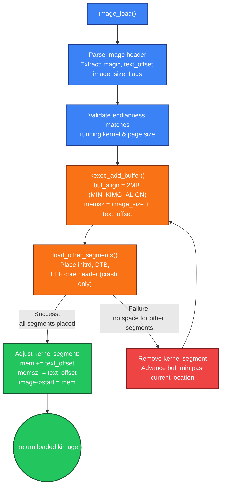

### 7.2 Can the Kernel Be Loaded into Multiple Segments?

**Yes.** The kexec subsystem supports up to **`KEXEC_SEGMENT_MAX` (16) segments** per image. In the `kexec_file_load` path, the kernel is typically loaded as one segment (the Image binary), but the **initrd** and **DTB** are separate segments. For crash kernels, an additional **ELF core header** segment is added. So a typical `kexec_file_load` uses 2–4 segments.

In the `kexec_load` path (legacy), userspace has full control and can split the kernel into as many segments as needed — for example, an ELF vmlinux might have separate segments for `.text`, `.data`, and `.bss`.

> **Normal vs Crash**: In normal kexec, `kexec_add_buffer()` allocates from the general buddy allocator — the kernel pages end up at arbitrary physical addresses and must be relocated later. In crash kexec, `kexec_add_buffer()` constrains allocation to within the `crashkernel=` reserved region, so segments land at their final addresses immediately.

### 7.3 The Initrd and DTB Segments

The `load_other_segments()` function in [arch/arm64/kernel/machine_kexec_file.c](https://github.com/torvalds/linux/blob/v7.2-rc5/arch/arm64/kernel/machine_kexec_file.c#L91-L201) loads additional segments after the kernel:

**Initrd**: Placed after the kernel with no special alignment, but constrained to lie within a **32GB window** starting from the kernel's 1GB-aligned base. This constraint comes from the arm64 boot protocol.

**Device Tree Blob (DTB)**: Constructed by `of_kexec_alloc_and_setup_fdt()`, aligned to **2MB** (to avoid crossing a 2MB boundary), stored in `image->arch.dtb_mem`.

**ELF Core Header** (crash only): Aligned to **64KB** (the largest supported page size on AArch64).

### 7.4 Crash Kernel: Reserved Memory

**Yes — special memory is reserved for crash kernels.** The `crashkernel=` kernel boot parameter (e.g., `crashkernel=256M`) tells the boot-time kernel to reserve a contiguous block of physical memory. This reserved region is visible in `/proc/iomem` as "Crash kernel". The crash kernel's segments are loaded **directly into this reserved region** using `kimage_load_crash_segment()`, which writes to the pre-reserved physical pages rather than allocating new ones from the buddy allocator.

```
┌─────────────────────────────────────────────────────────────────────────────────┐
│  Normal Kexec vs Crash Kexec: Memory Layout                                     │
├─────────────────────────────────────────────────────────────────────────────────┤
│                                                                                 │
│  Normal Kexec:                                                                  │
│  Pages allocated from buddy allocator, scattered in physical memory.            │
│  Relocation routine copies them to final destination at execution time.         │
│                                                                                 │
│  Physical Memory:                                                               │
│  ┌────────┬────────┬────────┬────────┬────────┬────────┬────────┐               │
│  │  old   │ kexec  │  old   │ kexec  │  old   │ kexec  │  old   │               │
│  │ kernel │ src pg │ kernel │ src pg │ kernel │ DTB pg │ kernel │               │
│  └────────┴────────┴────────┴────────┴────────┴────────┴────────┘               │ 
│            ─copy─►dest      ─copy─►dest        ─copy─►dest                      │
│                                                                                 │
│  ════════════════════════════════════════════════════════════════               │
│                                                                                 │
│  Crash Kexec:                                                                   │
│  Segments written directly into pre-reserved crashkernel= region.               │
│  No relocation needed at execution time — already at final address.             │
│                                                                                 │
│  Physical Memory:                                                               │
│  ┌────────────────────┬─────────────────────────────────┬──────────┐            │
│  │                    │  crashkernel= reserved region   │          │            │
│  │    running kernel  │ ┌───────┬────────┬──────┬─────┐ │  other   │            │
│  │    (untouched)     │ │ crash │ initrd │ DTB  │ ELF │ │  memory  │            │
│  │                    │ │kernel │        │      │ hdr │ │          │            │
│  │                    │ └───────┴────────┴──────┴─────┘ │          │            │
│  └────────────────────┴─────────────────────────────────┴──────────┘            │
│                         ▲ already at final physical addresses                   │
│                                                                                 │
└─────────────────────────────────────────────────────────────────────────────────┘
```

### 7.5 How the Kernel Image Is Divided into Segments and Loaded into Memory

The kernel Image is not loaded as a monolithic blob into a single contiguous allocation. Instead, the kexec subsystem breaks it into **page-sized (4KB) chunks** and loads each chunk into a separately allocated physical page. Here is the complete process:

**Step 1 — Segment definition**: `image_load()` calls `kexec_add_buffer()`, which records a **segment descriptor** (`struct kexec_segment`): the source buffer pointer, the buffer size (`bufsz`), the target physical address (`mem`), and the memory size (`memsz`, which may be larger than `bufsz` — the tail is zero-filled for `.bss`).

**Step 2 — Page-by-page loading**: `kimage_load_normal_segment()` in [kernel/kexec_core.c](https://github.com/torvalds/linux/blob/v7.2-rc5/kernel/kexec_core.c#L796-L865) walks the segment, processing one page at a time:

```c
while (mbytes) {
    page = kimage_alloc_page(image, GFP_HIGHUSER, maddr);  // alloc a physical page
    kimage_add_page(image, page_to_boot_pfn(page) << PAGE_SHIFT);  // IND_SOURCE entry
    ptr = kmap_local_page(page);
    clear_page(ptr);                           // zero the page
    memcpy(ptr, kbuf, uchunk);                 // copy data from kernel buffer
    kunmap_local(ptr);
    maddr += PAGE_SIZE;
    mbytes -= PAGE_SIZE;
}
```

For each page of the segment:
1. A physical page is allocated from the buddy allocator (`kimage_alloc_page`)
2. The page's physical address is added to the indirection list as an `IND_SOURCE` entry
3. The page is mapped, zeroed, and then the corresponding chunk of the segment's data is copied in
4. If the buffer data runs out before `memsz` (the `.bss` case), remaining pages are zero-filled

Before the first source page of each segment, `kimage_set_destination()` writes an `IND_DESTINATION` entry with the target physical address.

```
┌─────────────────────────────────────────────────────────────────────────────────┐
│  How a 30MB Kernel Image Becomes ~7,680 Scattered Pages                         │
├─────────────────────────────────────────────────────────────────────────────────┤
│                                                                                 │
│  On Disk:                                                                       │
│  ┌─────────────────────────────────────────────────────────────────┐            │
│  │                    /boot/Image (30MB)                           │            │
│  │  ┌──────────────────────────────────────────────────────────┐   │            │
│  │  │ header │ .text │ .rodata │ .data │ ...remaining code...  │   │            │
│  │  └──────────────────────────────────────────────────────────┘   │            │
│  └─────────────────────────────────────────────────────────────────┘            │
│                             │                                                   │
│                             ▼ kernel_read_file_from_fd()                        │
│                                                                                 │
│  Kernel Buffer (contiguous in virtual memory):                                  │
│  ┌──────────────────────────────────────────────────────────────────┐           │
│  │ page 0 │ page 1 │ page 2 │ ... │ page 7679 │                     │           │
│  │ (4KB)  │ (4KB)  │ (4KB)  │     │ (4KB)     │                     │           │
│  └──────────────────────────────────────────────────────────────────┘           │
│                             │                                                   │
│                             ▼ kimage_load_normal_segment()                      │
│                                                                                 │
│  Physical Memory (pages scattered by buddy allocator):                          │
│  ┌─────┬─────┬─────┬─────┬─────┬─────┬─────┬─────┬─────┬─────┐                  │
│  │     │pg 0 │     │pg 42│     │pg 1 │     │pg 99│     │pg 2 │  ...             │
│  │other│@0x1 │other│@0x3 │other│@0x5 │other│@0x8 │other│@0xA │                  │
│  │data │2000 │data │7000 │data │1000 │data │F000 │data │3000 │                  │
│  └─────┴─────┴─────┴─────┴─────┴─────┴─────┴─────┴─────┴─────┘                  │
│           │            │           │           │           │                    │
│           └────────────┴───────────┴───────────┴───────────┘                    │
│                        recorded in indirection list                             │
│                                                                                 │
│  Indirection List:                                                              │
│  ┌──────────────────────────────────────────────────────────┐                   │
│  │ IND_DESTINATION 0x4020_0000  (2MB-aligned target)        │                   │
│  │ IND_SOURCE      0x0001_2000  (page 0 phys addr)          │                   │
│  │ IND_SOURCE      0x0005_1000  (page 1 phys addr)          │                   │
│  │ IND_SOURCE      0x000A_3000  (page 2 phys addr)          │                   │
│  │ ...             ...          (7,677 more entries)        │                   │
│  │ IND_DONE                                                 │                   │
│  └──────────────────────────────────────────────────────────┘                   │
│                                                                                 │
│  At relocation time, arm64_relocate_new_kernel walks this list and              │
│  copies each scattered source page to the contiguous destination                │
│  starting at 0x4020_0000. After the copy loop, the 30MB kernel                  │
│  image is reassembled contiguously at the 2MB-aligned target.                   │
│                                                                                 │
└─────────────────────────────────────────────────────────────────────────────────┘
```

> **Normal vs Crash**: For crash kexec, `kimage_load_crash_segment()` skips page allocation entirely. It computes `page = boot_pfn_to_page(maddr >> PAGE_SHIFT)` — directly addressing the pre-reserved physical pages — and copies data straight into them. No indirection list entries are created.

### 7.6 Can You Load an Arbitrary C/C++ Binary Instead of a Kernel?

**Short answer: not a normal userspace binary. But a bare-metal binary — yes, in principle.**

When kexec finishes its work and branches to the loaded binary, the execution environment is:
- **MMU is OFF** — there is no virtual memory, no paging, no address translation
- **All interrupts are masked** — no IRQs, no timers, no exceptions
- **No OS services exist** — no syscalls, no libc, no file I/O, no `malloc`
- **CPU state**: `x0` = DTB physical address, `x1` = `x2` = `x3` = 0, all other registers undefined
- **All other CPUs are offline** — only the boot CPU is running

A normal C/C++ userspace binary (`gcc -o hello hello.c`) **cannot run** in this environment because:

```
┌─────────────────────────────────────────────────────────────────────────────────┐
│  Why a Normal Userspace Binary Cannot Be Kexec'd                                │
├─────────────────────────────────────────────────────────────────────────────────┤
│                                                                                 │
│  Normal ELF binary expects:           Kexec provides:                           │
│  ───────────────────────────          ──────────────────                        │
│  Virtual memory (MMU on)              MMU is OFF (physical addressing)          │
│  Dynamic linker (ld-linux.so)         No linker, no filesystem                  │
│  libc (printf, malloc, open)          No libc, no OS, no syscall handler        │
│  Stack set up by kernel               No stack (must set up SP yourself)        │
│  argv/argc/envp on stack              x0 = DTB address, that's it               │
│  Syscall interface (SVC #0)           No exception vectors installed            │
│  User-mode (EL0)                      Running at EL1 (kernel mode)              │
│  Scheduler, signals, threads          Single CPU, no scheduler                  │
│                                                                                 │
│  Result: the binary would fault immediately on the first                        │
│  virtual address access or libc call.                                           │
│                                                                                 │
│  ════════════════════════════════════════════════════════════                   │
│                                                                                 │
│  What CAN be loaded instead of a Linux kernel:                                  │
│                                                                                 │
│  ✓ Another Linux kernel (the normal case)                                       │
│  ✓ A bare-metal / freestanding C program compiled with:                         │
│      -ffreestanding -nostdlib -nostartfiles                                     │
│      + custom linker script to set entry point and load addresses               │
│      + startup assembly to set up stack pointer (SP)                            │
│      + must handle physical addresses directly (no MMU)                         │
│      + must accept DTB in x0 per ARM64 boot protocol                            │
│                                                                                 │
│  ✓ A hypervisor (e.g., Xen, KVM host)                                           │
│  ✓ RTOS (e.g., Zephyr, FreeRTOS — if ported to run bare-metal on ARM64)         │
│  ✓ Diagnostic / manufacturing test firmware                                     │
│  ✓ Purgatory itself is an example: a freestanding C + asm program               │
│    that kexec loads and executes between old and new kernels                    │
│                                                                                 │
│  The binary must:                                                               │
│    1. Be compiled as freestanding (no libc, no OS assumptions)                  │
│    2. Have an ARM64 Image header (ARM\x64 magic) for kexec_file_load,           │
│       or use kexec_load with raw segments (no header check)                     │
│    3. Begin with entry code that sets up its own stack (SP)                     │
│    4. Handle the ARM64 boot protocol: x0=DTB, x1=x2=x3=0, MMU off               │
│    5. Be position-independent or linked to run at its load address              │
│                                                                                 │
└─────────────────────────────────────────────────────────────────────────────────┘
```

**The `kexec_load` path is more flexible**: since userspace constructs the segments directly, you can load *any* raw binary blob at any physical address and set `kimage->start` to its entry point. There is no `ARM\x64` magic check. The kernel doesn't care what the binary is — it just copies pages and jumps. **This is how purgatory itself gets loaded: it's a freestanding ELF binary, not a Linux kernel.**

**The `kexec_file_load` path is restrictive**: `image_probe()` checks for the `ARM\x64` magic at offset 0x30. If your binary doesn't have this header, the probe fails and the syscall returns `-ENOEXEC`. You would need to either prepend a valid ARM64 Image header to your binary or use `kexec_load` instead.

### 7.7 Does the Kernel Run Without the MMU?

Since kexec turns off the MMU before jumping to the new kernel, a natural question arises: does the kernel not need the MMU?

**The kernel absolutely requires the MMU.** The MMU-off phase is an extremely brief transitional window — roughly ~100 assembly instructions in `arch/arm64/kernel/head.S` — during which the kernel builds its initial page tables and enables the MMU before any C code can execute.

```
┌─────────────────────────────────────────────────────────────────────────────────┐
│  Kernel Boot: MMU Timeline                                                      │
├─────────────────────────────────────────────────────────────────────────────────┤
│                                                                                 │
│  Entry (MMU OFF):                                                               │
│  ─────────────────                                                              │
│  Either kexec (turn_off_mmu → br x28) or bootloader/firmware on cold boot       │
│  hands off with the MMU disabled. This is the ARM64 boot protocol.              │
│                                                                                 │
│  ┌───────────────────────────────────────────────────────────────────────┐      │
│  │  _text (head.S) — MMU OFF, physical addressing only                   │      │
│  │                                                                       │      │
│  │  1. Validate CPU (EL1 vs EL2), set exception level                    │      │
│  │  2. Set up initial stack pointer (SP)                                 │      │
│  │  3. Create initial page tables:                                       │      │
│  │     • Identity map for currently executing code (VA == PA)            │      │
│  │     • Kernel map for the TTBR1 range (0xFFFF...)                      │      │
│  │  4. Write page table base to TTBR0_EL1 and TTBR1_EL1                  │      │
│  │  5. Set SCTLR_EL1: M=1 (MMU on), C=1 (D-cache), I=1 (I-cache)         │      │
│  │     ──────────── MMU IS NOW ON ────────────                           │      │
│  │  6. Branch to __primary_switched (now using virtual addresses)        │      │
│  │                                                                       │      │
│  └──────────────────────────────┬────────────────────────────────────────┘      │
│                                 │                                               │
│                                 ▼                                               │
│  ┌───────────────────────────────────────────────────────────────────────┐      │
│  │  start_kernel() — MMU ON, virtual addressing, C code runs             │      │
│  │                                                                       │      │
│  │  Everything from here on requires the MMU:                            │      │
│  │  • mm_init()         — page allocator, slab, vmalloc                  │      │
│  │  • sched_init()      — scheduler, task_struct                         │      │
│  │  • vfs_caches_init() — filesystem layer                               │      │
│  │  • driver_init()     — device probing, bus enumeration                │      │
│  │  • rest_init()       — creates init process (PID 1)                   │      │
│  │                                                                       │      │
│  │  The MMU stays on for the ENTIRE lifetime of the kernel.              │      │
│  │  It is never turned off again — except by the next kexec.             │      │
│  │                                                                       │      │
│  └───────────────────────────────────────────────────────────────────────┘      │
│                                                                                 │
│  Why the kernel cannot function without the MMU:                                │
│  ───────────────────────────────────────────────                                │
│  • All kernel C code is linked to virtual addresses (0xFFFF... range)           │
│  • Process isolation requires separate page tables per process (TTBR0)          │
│  • Memory protection (read-only .text, NX .data) uses page table flags          │
│  • vmalloc, ioremap, kmap — all require address translation                     │
│  • The linear map (phys_to_virt / virt_to_phys) is a page-table mapping         │
│                                                                                 │
└─────────────────────────────────────────────────────────────────────────────────┘
```

This is also why kexec turns the MMU off as its very last act — it ensures the new kernel starts from the exact same clean state as a cold boot, so `head.S` can build its page tables without worrying about stale TLB entries or conflicting mappings from the old kernel.

---

## 8. The Indirection Page List

### 8.1 Why It Exists

During Phase 3 (relocation), the old kernel's data structures — page tables, slab allocator, buddy allocator, `struct page` arrays — are being overwritten by the new kernel's pages. The relocation routine cannot call any kernel functions or dereference any kernel pointers. It needs a **self-contained data structure** that describes exactly which physical pages to copy where, using nothing but a flat list of entries that can be walked with a simple loop in assembly.

This data structure is the **indirection page list** — a linked list of pages, where each page contains an array of 64-bit entries. Each entry is a physical address with flag bits encoded in the lowest 4 bits (which are always zero in a page-aligned address).

> **Normal vs Crash**: The indirection page list is central to **normal kexec** — it's the mechanism that allows scattered source pages to be relocated to contiguous final destinations. **Crash kexec does not use it**. Because crash kernel segments are written directly to their final physical addresses in the reserved `crashkernel=` region, the indirection list head is set to `IND_DONE` immediately. The relocation copy loop is never entered; `cpu_soft_restart` jumps straight to the new kernel.

### 8.2 Entry Format

Each entry in the indirection list is a `kimage_entry_t` (an `unsigned long` — 64 bits on AArch64). The lower 4 bits encode the entry type, and the upper bits encode a page-aligned physical address:

```
┌─────────────────────────────────────────────────────────────────────────────────┐
│  kimage_entry_t Format (64-bit)                                                 │
├─────────────────────────────────────────────────────────────────────────────────┤
│                                                                                 │
│  63                                          12  11        4  3  2  1  0        │
│  ┌──────────────────────────────────────────────┬───────────┬──┬──┬──┬──┐       │
│  │      Physical Page Address (PFN << 12)       │  (zero)   │S │D │I │Ds│       │
│  └──────────────────────────────────────────────┴───────────┴──┴──┴──┴──┘       │
│                                                                                 │
│  Bit 0 (Ds) = IND_DESTINATION  — Set destination address for subsequent copies  │
│  Bit 1 (I)  = IND_INDIRECTION  — Follow pointer to next page of entries         │
│  Bit 2 (D)  = IND_DONE         — End of list; stop processing                   │
│  Bit 3 (S)  = IND_SOURCE       — Copy this page to current destination          │
│                                                                                 │
│  Only one flag bit is set per entry. The address is extracted by masking:       │
│    addr = entry & PAGE_MASK    (clears the low 12 bits)                         │
│                                                                                 │
│  Defined in include/linux/kexec.h:                                              │
│    #define IND_DESTINATION  (1 << 0)                                            │
│    #define IND_INDIRECTION  (1 << 1)                                            │
│    #define IND_DONE         (1 << 2)                                            │
│    #define IND_SOURCE       (1 << 3)                                            │
│                                                                                 │
└─────────────────────────────────────────────────────────────────────────────────┘
```

### 8.3 Walk-Through Example

Consider loading a 12KB kernel (3 pages) at destination 0x4020_0000 and a 4KB DTB at destination 0x4100_0000. The source pages were allocated by the buddy allocator at arbitrary physical addresses:

```
┌─────────────────────────────────────────────────────────────────────────────────┐
│  Indirection List Walk-Through                                                  │
├─────────────────────────────────────────────────────────────────────────────────┤
│                                                                                 │
│  kimage->head points to Indirection Page 0                                      │
│                                                                                 │
│  Indirection Page 0 (at physical 0x8000_0000):                                  │
│  ┌──────┬────────────────────────────────────────────────────────────────────┐  │
│  │ [0]  │ 0x4020_0000 | IND_DESTINATION    → dest = 0x4020_0000              │  │
│  │ [1]  │ 0x5000_3000 | IND_SOURCE         → copy 0x5000_3000 → dest         │  │
│  │      │                                     dest += PAGE_SIZE              │  │
│  │ [2]  │ 0x5001_7000 | IND_SOURCE         → copy 0x5001_7000 → dest         │  │
│  │      │                                     dest += PAGE_SIZE              │  │
│  │ [3]  │ 0x5002_A000 | IND_SOURCE         → copy 0x5002_A000 → dest         │  │
│  │      │                                     dest += PAGE_SIZE              │  │
│  │ [4]  │ 0x4100_0000 | IND_DESTINATION    → dest = 0x4100_0000              │  │
│  │ [5]  │ 0x5003_1000 | IND_SOURCE         → copy 0x5003_1000 → dest         │  │
│  │ [6]  │ 0x0000_0000 | IND_DONE           → STOP                            │  │
│  └──────┴────────────────────────────────────────────────────────────────────┘  │
│                                                                                 │
│  Result after relocation:                                                       │
│    0x4020_0000: kernel page 0 (from 0x5000_3000)                                │
│    0x4020_1000: kernel page 1 (from 0x5001_7000)                                │
│    0x4020_2000: kernel page 2 (from 0x5002_A000)                                │
│    0x4100_0000: DTB page      (from 0x5003_1000)                                │
│                                                                                 │
│  If the list is too long for one page, an IND_INDIRECTION entry points          │
│  to the next page of entries — forming a linked list of pages.                  │
│                                                                                 │
└─────────────────────────────────────────────────────────────────────────────────┘
```

### 8.4 Page Allocation Invariant

The `kimage_alloc_page()` function in [kernel/kexec_core.c](https://github.com/torvalds/linux/blob/v7.2-rc5/kernel/kexec_core.c#L645-L739) implements a critical invariant: **a source page is either its own destination page, or it is not a destination page at all**. This ensures that the copy loop can safely copy pages in any order without data loss.

```
┌─────────────────────────────────────────────────────────────────────────────────┐
│  Page Allocation Invariant (kimage_alloc_page)                                  │
├─────────────────────────────────────────────────────────────────────────────────┤
│                                                                                 │
│  Case 1: Source page IS its own destination → no-op, already in place           │
│  ┌──────────┐                ┌──────────┐                                       │
│  │ Source A │  ─── copy ──►  │ Source A  │   The page is already where          │
│  │ @0x1000  │                │ @0x1000  │   it needs to be.                     │
│  └──────────┘                └──────────┘                                       │
│                                                                                 │
│  Case 2: Source page is NOT any destination → safe to copy                      │
│  ┌──────────┐                ┌──────────┐                                       │
│  │ Source B │  ─── copy ──►  │ Dest B   │   No other copy will overwrite        │
│  │ @0x5000  │                │ @0x2000  │   the source before we read it.       │
│  └──────────┘                └──────────┘                                       │
│                                                                                 │
│  Case 3: Source landed at WRONG destination → swap with swap_page               │
│  ┌──────────┐    ┌──────────┐                                                   │
│  │ Source C │    │swap_page │   Source C is at 0x3000, which is the dest        │
│  │ @0x3000  │◄──►│ @0x7000  │   for another segment. Swap it out so the         │
│  └──────────┘    └──────────┘   invariant holds.                                │
│                                                                                 │
└─────────────────────────────────────────────────────────────────────────────────┘
```

---

## 9. The kimage Structure

### 9.1 Core Fields

At the center of the kexec subsystem is **`struct kimage`**, defined in [include/linux/kexec.h](https://github.com/torvalds/linux/blob/v7.2-rc5/include/linux/kexec.h#L339-L433):

```c
struct kimage {
    kimage_entry_t head;          /* Head of the indirection page list */
    kimage_entry_t *entry;        /* Current position in the list */
    kimage_entry_t *last_entry;   /* Last valid position in current page */
    unsigned long start;          /* Entry point of the new kernel */
    struct page *control_code_page;  /* Page for relocation code */
    struct page *swap_page;       /* Temporary page for swapping during relocation */
    unsigned long nr_segments;
    struct kexec_segment segment[KEXEC_SEGMENT_MAX];
    /* ... lists for control, destination, and unusable pages ... */
    unsigned int type : 1;        /* KEXEC_TYPE_DEFAULT or KEXEC_TYPE_CRASH */
    unsigned int file_mode : 1;   /* Set when using kexec_file_load */
    struct kimage_arch arch;      /* Architecture-specific data */
    /* ... file-mode fields: kernel_buf, initrd_buf, cmdline_buf ... */
};
```

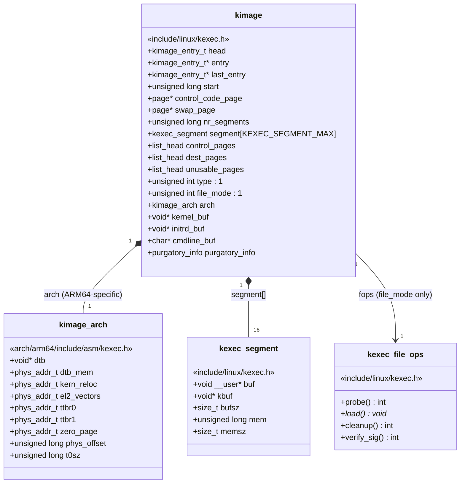

### 9.2 The AArch64-Specific `kimage_arch`

The arm64 architecture extends `kimage` with its own fields, defined in [arch/arm64/include/asm/kexec.h](https://github.com/torvalds/linux/blob/v7.2-rc5/arch/arm64/include/asm/kexec.h#L109-L119):

```c
struct kimage_arch {
    void *dtb;              /* Virtual address of the DTB buffer */
    phys_addr_t dtb_mem;    /* Physical address where DTB is loaded */
    phys_addr_t kern_reloc; /* Physical address of the relocation code */
    phys_addr_t el2_vectors; /* Physical address of EL2 exception vectors */
    phys_addr_t ttbr0;      /* Identity-mapped page table for relocation code */
    phys_addr_t ttbr1;      /* Copy of the kernel's linear map page table */
    phys_addr_t zero_page;  /* Zero page for break-before-make TLB maintenance */
    unsigned long phys_offset; /* Physical-to-virtual offset for address translation */
    unsigned long t0sz;     /* TCR_EL1.T0SZ value for the identity map */
};
```

These fields are populated during `machine_kexec_post_load()` and consumed by `arm64_relocate_new_kernel` during the actual transition.

---

## 10. Post-Load Preparation: machine_kexec_post_load()

After all segments are loaded, `machine_kexec_post_load()` in [arch/arm64/kernel/machine_kexec.c](https://github.com/torvalds/linux/blob/v7.2-rc5/arch/arm64/kernel/machine_kexec.c#L105-L155) prepares the architecture-specific state needed for the transition. This function is critical — it builds all the page tables and copies the relocation code while the full kernel is still operational.

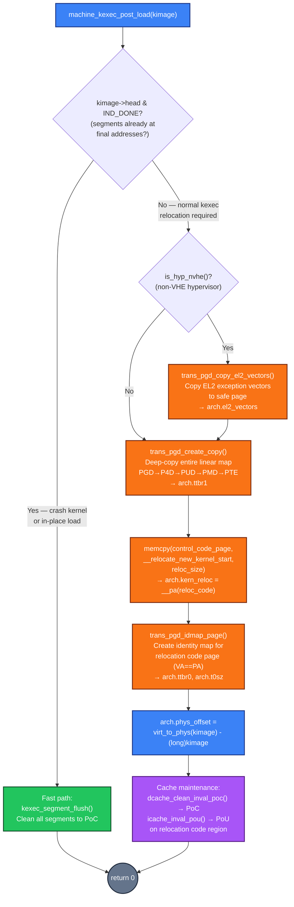

### 10.1 Normal Kexec Path (Full Relocation Setup)

For normal kexec (non-crash), the function performs:

**EL2 vector handling**: If the system is running with **nVHE** hypervisor, EL2 exception vectors are copied to a safe location via `trans_pgd_copy_el2_vectors()`.

**Linear map copy**: Creates a **complete copy of the kernel's TTBR1 page table** (the linear map from `PAGE_OFFSET` to `PAGE_END`) using `trans_pgd_create_copy()` from [arch/arm64/mm/trans_pgd.c](https://github.com/torvalds/linux/blob/v7.2-rc5/arch/arm64/mm/trans_pgd.c). This is necessary because the original page tables may be overwritten during relocation.

**Relocation code copy**: The `arm64_relocate_new_kernel` assembly routine is copied to the **control code page**:

```c
reloc_size = __relocate_new_kernel_end - __relocate_new_kernel_start;
memcpy(reloc_code, __relocate_new_kernel_start, reloc_size);
kimage->arch.kern_reloc = __pa(reloc_code);
```

**Identity map**: `trans_pgd_idmap_page()` creates a **TTBR0 identity map** (VA == PA) for the relocation code page.

**Physical offset**: `kimage->arch.phys_offset = virt_to_phys(kimage) - (long)kimage;`

**Cache maintenance**: D-cache flushed to PoC, I-cache invalidated to PoU on the relocation code.

### 10.2 Crash Kexec Path (Fast Path)

If the indirection list head has `IND_DONE` set (segments are already at their final physical addresses — the crash case), the function takes a fast path:

```c
if (kimage->head & IND_DONE) {
    kexec_segment_flush(kimage);
    return 0;
}
```

It simply flushes all segments to the **Point of Coherency** using `dcache_clean_inval_poc()` and returns. No page table copies, no relocation code setup — the crash kernel is already in place.

---

## 11. TTBR0 and TTBR1: Why Two Page Tables

AArch64 splits the virtual address space into two halves, each controlled by a separate **Translation Table Base Register**:

```
┌─────────────────────────────────────────────────────────────────────────────────┐
│  AArch64 Virtual Address Space Split                                            │
├─────────────────────────────────────────────────────────────────────────────────┤
│                                                                                 │
│  TTBR1_EL1 — Kernel Space (upper VA range)                                      │
│  ══════════════════════════════════════════                                     │
│  Addresses: 0xFFFF_0000_0000_0000 → 0xFFFF_FFFF_FFFF_FFFF                       │
│  Normally:  Maps the kernel's "linear map" — a direct VA-to-PA translation      │
│             of all physical memory. This is how the kernel accesses RAM.        │
│  Size controlled by: TCR_EL1.T1SZ (typically 64 - VA_BITS)                      │
│                                                                                 │
│  TTBR0_EL1 — User Space / Identity Map (lower VA range)                         │
│  ══════════════════════════════════════════                                     │
│  Addresses: 0x0000_0000_0000_0000 → 0x0000_FFFF_FFFF_FFFF                       │
│  Normally:  Maps userspace processes. Each process has its own TTBR0.           │
│  In kexec: Repurposed to create an "identity map" where VA == PA,               │
│            so the relocation code can continue executing after the              │
│            kernel's TTBR1 mappings are replaced.                                │
│  Size controlled by: TCR_EL1.T0SZ                                               │
│                                                                                 │
│  Why both are needed during kexec:                                              │
│  ─────────────────────────────────                                              │
│  The relocation code must:                                                      │
│    1. Read source pages via the linear map (TTBR1 copy)                         │
│    2. Continue executing even as it replaces TTBR1 (via TTBR0 identity map)     │
│    3. Eventually turn off the MMU entirely and branch to the new kernel         │
│                                                                                 │
│  Without TTBR0 identity mapping the relocation code, the CPU would fault        │
│  the instant TTBR1 is switched, because the code would be at an address         │
│  that no longer maps to any physical page.                                      │
│                                                                                 │
└─────────────────────────────────────────────────────────────────────────────────┘
```

---

## 12. The Transitional Page Tables (trans_pgd)

The page table manipulation for kexec on AArch64 is handled by the **trans_pgd** subsystem, shared between kexec and hibernation. It is defined in [arch/arm64/mm/trans_pgd.c](https://github.com/torvalds/linux/blob/v7.2-rc5/arch/arm64/mm/trans_pgd.c) with the interface in [arch/arm64/include/asm/trans_pgd.h](https://github.com/torvalds/linux/blob/v7.2-rc5/arch/arm64/include/asm/trans_pgd.h).

Pages are allocated through a callback mechanism via `struct trans_pgd_info`, which for kexec uses `kimage_alloc_control_pages()` to ensure all page table pages come from safe (non-overlapping) memory:

```c
static void *kexec_page_alloc(void *arg)
{
    struct kimage *kimage = arg;
    struct page *page = kimage_alloc_control_pages(kimage, 0);
    /* ... */
}
```

Two page table trees are built:

1. **TTBR1 copy** (`trans_pgd_create_copy`): A complete deep copy of the linear map (PGD → P4D → PUD → PMD → PTE). All entries are made writable (`pte_mkwrite_novma`) and valid (`pte_mkvalid_k`). This ensures the relocation code can read source pages via their linear-map virtual addresses even as the original page table is being overwritten.

2. **TTBR0 identity map** (`trans_pgd_idmap_page`): A minimal page table mapping a single page (the relocation code) at its physical address (VA == PA). Just enough page table levels to cover that one page, with `T0SZ` set to cover only the required address range.

```
┌─────────────────────────────────────────────────────────────────────────────────┐
│  Transitional Page Table Architecture                                           │
├─────────────────────────────────────────────────────────────────────────────────┤
│                                                                                 │
│  TCR_EL1                                                                        │
│  ┌─────────────────────────────────┬───────────────────────────────────┐        │
│  │  T0SZ (kimage->arch.t0sz)       │  T1SZ (kernel default, 64-VA_BITS)│        │
│  └─────────────────────────────────┴───────────────────────────────────┘        │
│                                                                                 │
│  TTBR0_EL1 ← kimage->arch.ttbr0       TTBR1_EL1 ← kimage->arch.ttbr1            │
│      │                                      │                                   │
│      ▼                                      ▼                                   │
│  ┌──────────┐                         ┌──────────────────┐                      │
│  │ PGD (one │                         │ PGD (deep copy   │                      │
│  │ entry)   │                         │ of linear map)   │                      │
│  └────┬─────┘                         └───────┬──────────┘                      │
│       │                                       │                                 │
│       ▼                                       ▼                                 │
│  ┌──────────┐                         ┌──────────────────┐                      │
│  │ PMD/PTE  │                         │ P4D → PUD → PMD  │                      │
│  │ (single  │                         │ → PTE            │                      │
│  │  page)   │                         │ (full hierarchy) │                      │
│  └────┬─────┘                         └───────┬──────────┘                      │
│       │                                       │                                 │
│       ▼                                       ▼                                 │
│  ┌──────────────────┐                 ┌──────────────────┐                      │
│  │  Relocation code │                 │ Entire physical  │                      │
│  │  identity-mapped │                 │ memory via       │                      │
│  │  VA == PA        │                 │ linear map copy  │                      │
│  └──────────────────┘                 └──────────────────┘                      │
│                                                                                 │
│  Purpose: Execute reloc             Purpose: Read source pages                  │
│  code after MMU state change         while original tables are                  │
│                                      being overwritten                          │
│                                                                                 │
└─────────────────────────────────────────────────────────────────────────────────┘
```

---

## 13. The Execute Phase: kernel_kexec()

The function that orchestrates the entire execute phase is `kernel_kexec()` in [kernel/kexec_core.c](https://github.com/torvalds/linux/blob/v7.2-rc5/kernel/kexec_core.c#L1138-L1237):

```c
kexec_in_progress = true;
kernel_restart_prepare("kexec reboot");  /* Notify reboot chain */
migrate_to_reboot_cpu();                  /* Pin to CPU 0 */
syscore_shutdown();                       /* Shut down syscore ops */
cpu_hotplug_enable();                     /* Re-enable CPU hotplug */
pr_notice("Starting new kernel\n");
machine_shutdown();                       /* Offline all secondary CPUs */
kmsg_dump(KMSG_DUMP_SHUTDOWN);           /* Flush kernel messages */
machine_kexec(kexec_image);              /* THE JUMP — never returns */
```

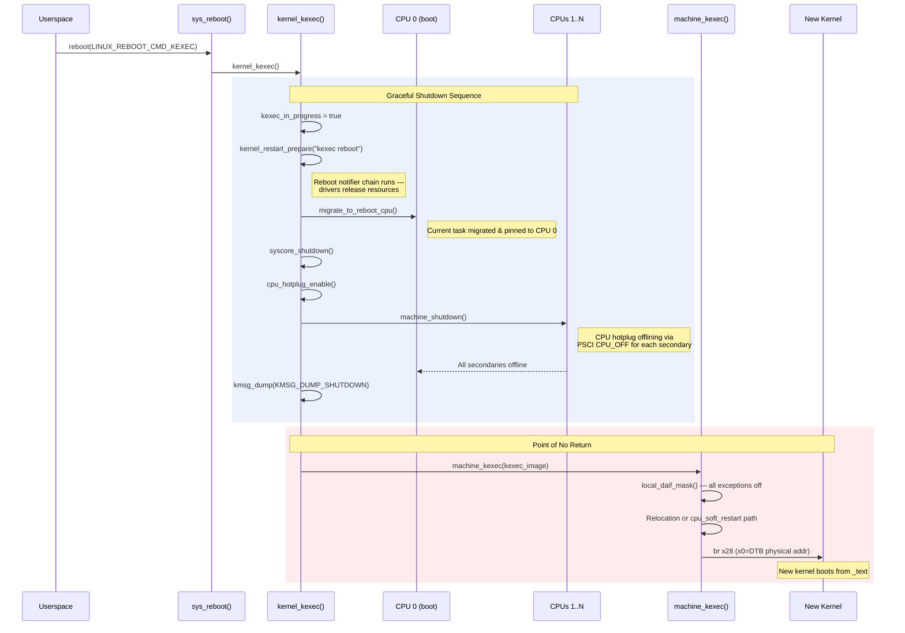

The sequence is:

1. Set the global `kexec_in_progress` flag
2. Notify the reboot notifier chain — drivers release resources
3. Migrate the current task to the reboot CPU (CPU 0)
4. Shut down syscore operations
5. Re-enable CPU hotplug so secondary CPUs can be brought down
6. Call `machine_shutdown()` which offlines every secondary CPU via PSCI `CPU_OFF` calls
7. Flush kernel message buffers
8. Call `machine_kexec()` — this function **never returns**

> **Normal vs Crash**: The above sequence is the **normal kexec** path — a graceful, orderly shutdown. For **crash kexec**, the system has already panicked, so this graceful sequence does NOT run. Instead, the panic handler calls `__crash_kexec()` directly, which invokes `machine_crash_shutdown()`: it force-stops other CPUs via `crash_smp_send_stop()` (NMI), saves crash registers with `crash_save_cpu()`, masks all interrupts, and then calls `machine_kexec(kexec_crash_image)`. There is no reboot notifier chain, no CPU migration, no graceful device shutdown — the system is already broken.

---

## 14. machine_kexec(): The Point of No Return

The `machine_kexec()` function in [arch/arm64/kernel/machine_kexec.c](https://github.com/torvalds/linux/blob/v7.2-rc5/arch/arm64/kernel/machine_kexec.c#L162-L205) is where the old kernel dies and the new kernel is born.

First, it performs pre-flight checks and masks interrupts:

```c
void machine_kexec(struct kimage *kimage)
{
    bool in_kexec_crash = (kimage == kexec_crash_image);
    bool stuck_cpus = cpus_are_stuck_in_kernel();

    BUG_ON(!in_kexec_crash && (stuck_cpus || (num_online_cpus() > 1)));
    WARN(in_kexec_crash && (stuck_cpus || smp_crash_stop_failed()), ...);

    pr_info("Bye!\n");
    local_daif_mask();  /* Mask Debug, SError, IRQ, FIQ */
```

For normal kexec, it is a **fatal error** if any CPUs are stuck or if more than one CPU is online. For crash kexec, stuck CPUs produce only a warning.

### 14.1 The Two Execution Paths

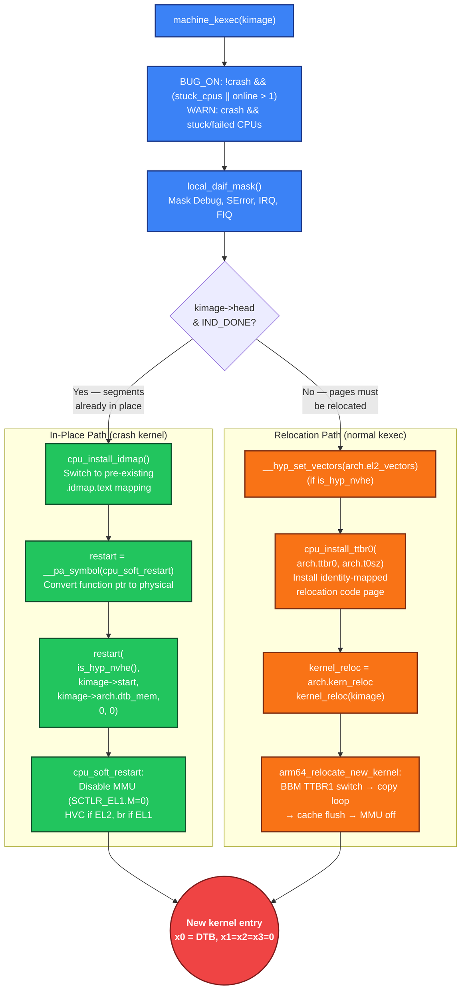

**In-place path** (crash kernel, `IND_DONE` set):

```c
if (kimage->head & IND_DONE) {
    typeof(cpu_soft_restart) *restart;
    cpu_install_idmap();
    restart = (void *)__pa_symbol(cpu_soft_restart);
    restart(is_hyp_nvhe(), kimage->start, kimage->arch.dtb_mem, 0, 0);
}
```

The kernel installs the identity map, converts `cpu_soft_restart` to its physical address, and calls it. `cpu_soft_restart` in [arch/arm64/kernel/cpu-reset.S](https://github.com/torvalds/linux/blob/v7.2-rc5/arch/arm64/kernel/cpu-reset.S#L32-L51) disables the MMU and branches directly to the new kernel.

**Relocation path** (normal kexec):

```c
else {
    void (*kernel_reloc)(struct kimage *kimage);
    if (is_hyp_nvhe())
        __hyp_set_vectors(kimage->arch.el2_vectors);
    cpu_install_ttbr0(kimage->arch.ttbr0, kimage->arch.t0sz);
    kernel_reloc = (void *)kimage->arch.kern_reloc;
    kernel_reloc(kimage);
}
```

Installs the TTBR0 identity map for the relocation code, then jumps to the relocation routine.

---

## 15. The Relocation Routine: arm64_relocate_new_kernel

This is the core of the kexec transition on AArch64, defined in [arch/arm64/kernel/relocate_kernel.S](https://github.com/torvalds/linux/blob/v7.2-rc5/arch/arm64/kernel/relocate_kernel.S#L39-L101). It is placed in a special section `.kexec_relocate.text` and runs with identity-mapped page tables after all kernel services have been shut down.

### 15.1 Why kimage Can Be Overwritten

The routine receives a pointer to `struct kimage` in `x0` and **immediately saves all the values it needs into registers**, because the `kimage` structure itself may be overwritten during relocation. Why? Because `kimage` lives in the old kernel's memory — it was allocated by the old kernel's `kmalloc`/page allocator. During the relocation copy loop, the new kernel's pages are being copied to their **final destination addresses**, and those destinations may overlap with the physical memory where `kimage` currently resides. Once the copy loop overwrites that memory, `kimage` is gone. That's why every needed value is extracted up front:

```asm
ldr   x28, [x0, #KIMAGE_START]              @ New kernel entry point
ldr   x27, [x0, #KIMAGE_ARCH_EL2_VECTORS]   @ EL2 vectors (or 0)
ldr   x26, [x0, #KIMAGE_ARCH_DTB_MEM]       @ DTB physical address
ldr   x18, [x0, #KIMAGE_ARCH_ZERO_PAGE]     @ Zero page for BBM
ldr   x17, [x0, #KIMAGE_ARCH_TTBR1]        @ Linear map copy
ldr   x16, [x0, #KIMAGE_HEAD]              @ First indirection entry
ldr   x22, [x0, #KIMAGE_ARCH_PHYS_OFFSET]  @ Virt-to-phys offset
```

```
┌─────────────────────────────────────────────────────────────────────────────────┐
│  Register Allocation in arm64_relocate_new_kernel                               │
├─────────────────────────────────────────────────────────────────────────────────┤
│                                                                                 │
│  x28  ─  New kernel entry point (kimage->start)                                 │
│  x27  ─  EL2 exception vectors physical address (or 0 if EL1)                   │
│  x26  ─  DTB physical address                                                   │
│  x22  ─  Physical-to-virtual offset (phys_offset)                               │
│  x18  ─  Zero page address (for BBM TTBR switch)                                │
│  x17  ─  TTBR1 value (copied linear map PGD physical address)                   │
│  x16  ─  Current indirection entry being processed                              │
│  x15  ─  D-cache line size                                                      │
│  x14  ─  Current pointer into indirection page (ptr)                            │
│  x13  ─  Current destination virtual address (dest)                             │
│  x12  ─  Scratch: extracted page address from entry                             │
│  x1-x8 ─ Scratch: used by copy_page macro                                       │
│                                                                                 │
│  After these loads, the routine NEVER reads from kimage again.                  │
│                                                                                 │
└─────────────────────────────────────────────────────────────────────────────────┘
```

### 15.2 Break-Before-Make (BBM)

```asm
raw_dcache_line_size x15, x1
break_before_make_ttbr_switch x18, x17, x1, x2
```

The **break-before-make** protocol is an ARM architecture requirement: before changing a valid page table entry, you must first make it invalid, invalidate the TLB, and only then write the new entry. The macro switches TTBR1 from the original kernel page tables to the copied page tables, using the zero page as an intermediate value.

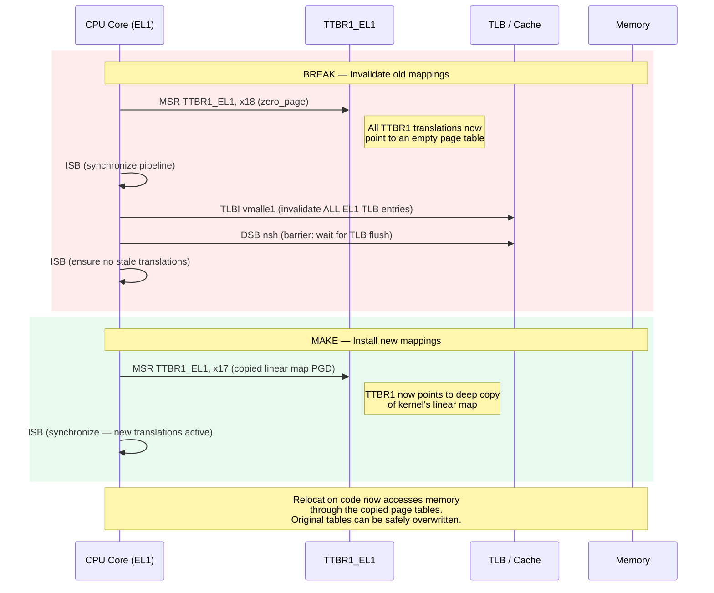

### 15.3 The Copy Loop

The relocation routine walks the indirection list, copying source pages to destination addresses:

```asm
.Lloop:
    and   x12, x16, PAGE_MASK       @ Extract address from entry
    sub   x12, x12, x22             @ Convert physical to virtual (via linear map copy)

.Ltest_source:
    tbz   x16, IND_SOURCE_BIT, .Ltest_indirection
    copy_page x13, x12, x1, x2, x3, x4, x5, x6, x7, x8
    dcache_by_myline_op_nosync civac, x19, x1, x15, x20
    dsb   sy
    b     .Lnext

.Ltest_indirection:
    tbz   x16, IND_INDIRECTION_BIT, .Ltest_destination
    mov   x14, x12
    b     .Lnext

.Ltest_destination:
    tbz   x16, IND_DESTINATION_BIT, .Lnext
    mov   x13, x12

.Lnext:
    ldr   x16, [x14], #8            @ entry = *ptr++
    tbz   x16, IND_DONE_BIT, .Lloop @ Continue until DONE
```

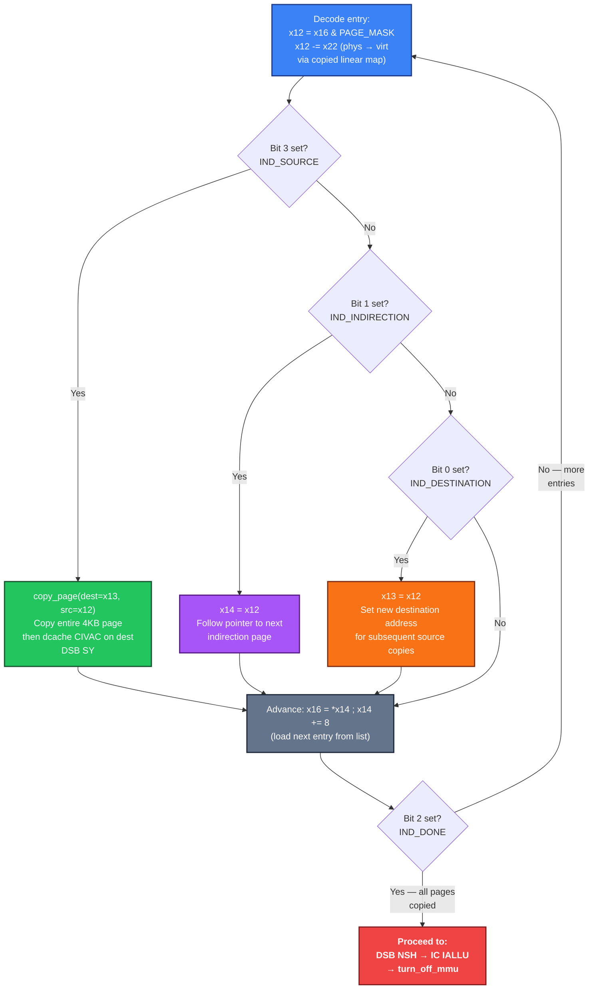

### 15.4 MMU Disable and Kernel Entry

After all pages are copied:

```asm
    dsb   nsh            @ Ensure all writes are visible
    ic    iallu          @ Invalidate entire I-cache
    dsb   nsh
    isb
    turn_off_mmu x12, x13
```

The `turn_off_mmu` macro clears the M (MMU enable), C (Data cache), and I (Instruction cache) bits in `SCTLR_EL1`.

With the MMU off, the code enters the new kernel:

```asm
    cbz   x27, .Lel1         @ If no EL2 vectors, jump from EL1
    mov   x1, x28            @ kernel entry
    mov   x2, x26            @ dtb
    mov   x0, #HVC_SOFT_RESTART
    hvc   #0                  @ Jump via EL2

.Lel1:
    mov   x0, x26            @ dtb address in x0
    mov   x1, xzr
    mov   x2, xzr
    mov   x3, xzr
    br    x28                 @ Jump to kernel entry
```

At **EL1**: `x0` = DTB physical address, `x1` = `x2` = `x3` = 0 (arm64 boot protocol).

At **EL2** (nVHE): transition goes through an HVC call that resets EL2 state first.

> **Normal vs Crash**: This entire section (15) — BBM switch, copy loop, cache flush, MMU disable — is the **normal kexec** relocation path only. **Crash kexec never executes `arm64_relocate_new_kernel`**. Instead, `machine_kexec()` takes the in-place path: `cpu_install_idmap()` → `cpu_soft_restart()` → MMU off → branch to new kernel. The crash kernel's segments are already at their final physical addresses, so no page copying is needed.

---

## 16. Normal Kexec vs Crash Kexec: Complete Comparison

| Aspect | Normal Kexec | Crash Kexec |
|--------|-------------|-------------|
| **Purpose** | Fast reboot into a new kernel | Capture crash dump after a panic |
| **Trigger** | `reboot(LINUX_REBOOT_CMD_KEXEC)` or `kexec -e` | Automatic on kernel panic, or `echo c > /proc/sysrq-trigger` |
| **Load command** | `kexec -s -l /boot/Image` | `kexec -s -p /boot/Image` (the `-p` flag) |
| **kimage type** | `KEXEC_TYPE_DEFAULT` (stored in `kexec_image`) | `KEXEC_TYPE_CRASH` (stored in `kexec_crash_image`) |
| **Memory allocation** | Source pages allocated from buddy allocator, scattered in physical memory | Segments written directly into `crashkernel=` reserved region |
| **Old kernel memory** | **Destroyed** — overwritten by relocation copy loop | **Preserved** — crash kernel boots in reserved region, old memory untouched |
| **Process memory** | All process state (task_struct, stacks, page tables) destroyed | Preserved in physical RAM, readable via `/proc/vmcore` |
| **Built-in module state (=Y)** | All driver `.data`/`.bss` destroyed; drivers re-run `__init` from scratch | State preserved at original physical addresses for forensic analysis |
| **Indirection list** | Full list built with IND_DESTINATION/IND_SOURCE entries | `IND_DONE` set immediately — no relocation needed |
| **Page tables** | Full TTBR1 copy + TTBR0 identity map built | No transitional page tables needed |
| **Relocation code** | `arm64_relocate_new_kernel` copied to control page, runs copy loop | Not used — `cpu_soft_restart` jumps directly |
| **machine_kexec_post_load()** | Builds page tables, copies relocation code, cache flush | Just flushes segments to PoC and returns |
| **CPU handling at execute** | `BUG_ON` if secondaries still online | `WARN` only — system is already broken |
| **Execution path** | `cpu_install_ttbr0()` → `kernel_reloc(kimage)` → copy loop → MMU off → branch | `cpu_install_idmap()` → `cpu_soft_restart()` → MMU off → branch |
| **Shutdown sequence** | Full graceful: `kernel_kexec()` → notify chain → migrate CPU → offline secondaries | `__crash_kexec()` → `machine_crash_shutdown()` → `crash_smp_send_stop()` (NMI) |
| **machine_kexec_prepare()** | Refuses if `cpus_are_stuck_in_kernel()` | Allowed even with stuck CPUs |
| **DTB extras** | Standard `/chosen` properties | Adds `linux,elfcorehdr` and `linux,usable-memory-range` |
| **Sysfs status** | `/sys/kernel/kexec_loaded` | `/sys/kernel/kexec_crash_loaded` |
| **New kernel sees** | Fresh hardware state; no access to old kernel memory | Old kernel memory via `/proc/vmcore`; hardware in arbitrary state |

```
┌─────────────────────────────────────────────────────────────────────────────────┐
│  Side-by-Side Execution Path Comparison                                         │
├─────────────────────────────────────────────────────────────────────────────────┤
│                                                                                 │
│  NORMAL KEXEC                        │  CRASH KEXEC                             │
│  ════════════                        │  ═══════════                             │
│                                      │                                          │
│  reboot(KEXEC)                       │  kernel panic / oops / sysrq-c           │
│       │                              │       │                                  │
│       ▼                              │       ▼                                  │
│  kernel_kexec()                      │  __crash_kexec()                         │
│       │                              │       │                                  │
│       ├─ notify reboot chain         │       ├─ machine_crash_shutdown()        │
│       ├─ migrate to CPU 0            │       │    ├─ crash_smp_send_stop()      │
│       ├─ syscore_shutdown()          │       │    │   (NMI to all CPUs)         │
│       ├─ machine_shutdown()          │       │    ├─ crash_save_cpu(regs)       │
│       │   └─ PSCI CPU_OFF each       │       │    └─ mask_interrupts()          │
│       ├─ kmsg_dump()                 │       │                                  │
│       │                              │       │                                  │
│       ▼                              │       ▼                                  │
│  machine_kexec(kexec_image)          │  machine_kexec(kexec_crash_image)        │
│       │                              │       │                                  │
│       ├─ BUG_ON(online > 1)          │       ├─ WARN(stuck CPUs) [non-fatal]    │
│       ├─ local_daif_mask()           │       ├─ local_daif_mask()               │
│       │                              │       │                                  │
│       ▼                              │       ▼                                  │
│  head & IND_DONE? → NO               │  head & IND_DONE? → YES                  │
│       │                              │       │                                  │
│       ├─ __hyp_set_vectors()         │       ├─ cpu_install_idmap()             │
│       ├─ cpu_install_ttbr0()         │       ├─ restart = __pa(cpu_soft_        │
│       ├─ kernel_reloc(kimage)        │       │               restart)           │
│       │   ├─ BBM TTBR1 switch        │       └─ restart(is_hyp, start,          │
│       │   ├─ copy loop               │              dtb_mem, 0, 0)              │
│       │   ├─ cache flush             │              │                           │
│       │   └─ turn_off_mmu            │              ▼                           │
│       │                              │       cpu_soft_restart:                  │
│       ▼                              │       MMU off → br to new kernel         │
│  br x28 (new kernel)                 │                                          │
│  x0=DTB, x1=x2=x3=0                  │  x0=DTB, x1=x2=x3=0                      │
│                                      │                                          │
│  Old memory: OVERWRITTEN             │  Old memory: PRESERVED                   │
│  by copy loop                        │  for /proc/vmcore                        │
│                                      │                                          │
└─────────────────────────────────────────────────────────────────────────────────┘
```

---

## 17. Device Tree Handling

The device tree is central to AArch64 kexec — it's how the new kernel discovers hardware, memory layout, and boot parameters.

### 17.1 Kernel-Side DTB Construction (kexec_file_load)

In the `kexec_file_load` path, `of_kexec_alloc_and_setup_fdt()` (from `drivers/of/kexec.c`) constructs a new DTB by:

- Copying the current device tree
- Updating the `/chosen` node with the new command line, initrd location, and KASLR seed
- Adding crash-specific properties like `linux,elfcorehdr` and `linux,usable-memory-range` for kdump
- Removing stale entries from previous boots

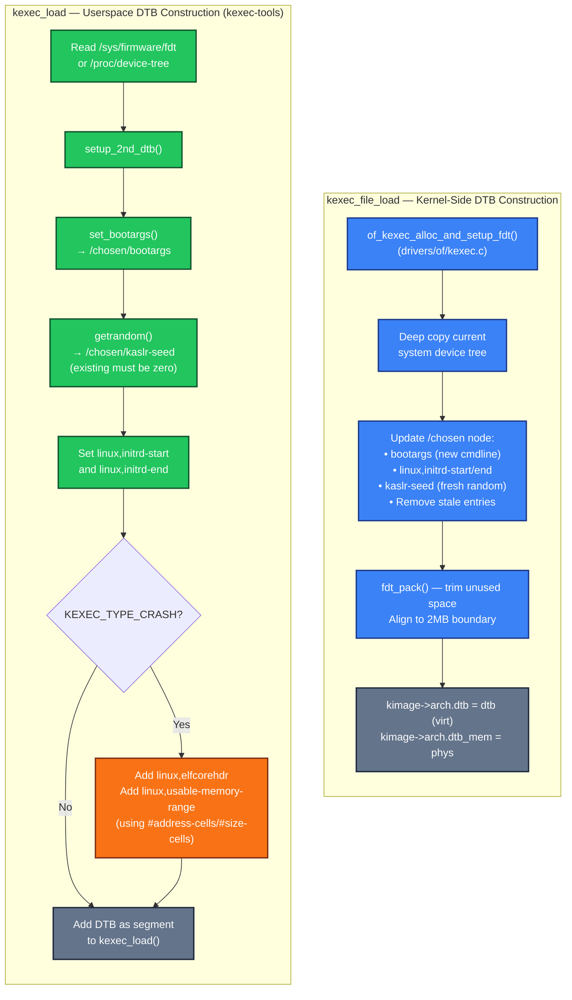

### 17.2 Userspace DTB Construction (kexec_load path)

In the `kexec_load` path, the `setup_2nd_dtb()` function in [kexec/arch/arm64/kexec-arm64.c](https://github.com/torvalds/linux/blob/v7.2-rc5/kexec/arch/arm64/kexec-arm64.c#L498-L679) performs equivalent work from userspace — reading the DTB from `/sys/firmware/fdt`, setting bootargs, generating a fresh `kaslr-seed` via `getrandom()`, and adding crash-specific properties.

---

## 18. The Purgatory (kexec_load Path Only)

On AArch64 with `kexec_file_load`, **there is no purgatory**. The kernel jumps directly to the new kernel. This section covers the purgatory used only in the `kexec_load` legacy path.

When using `kexec_load`, kexec-tools embeds a small standalone program called **purgatory** that runs between the old and new kernels. Its entry point is in [purgatory/arch/arm64/entry.S](https://github.com/torvalds/linux/blob/v7.2-rc5/purgatory/arch/arm64/entry.S):

```asm
purgatory_start:
    adr   x19, .Lstack
    mov   sp, x19
    bl    purgatory         @ Call C purgatory function

    ldr   x17, arm64_kernel_entry
    ldr   x0, arm64_dtb_addr
    mov   x1, xzr
    mov   x2, xzr
    mov   x3, xzr
    br    x17               @ Jump to new kernel
```

The C function `purgatory()` in [purgatory/purgatory.c](https://github.com/torvalds/linux/blob/v7.2-rc5/purgatory/purgatory.c) performs **SHA-256 integrity verification**:

```c
void purgatory(void)
{
    setup_arch();
    if (!skip_checks && verify_sha256_digest()) {
        for(;;) { /* loop forever if verification fails */ }
    }
    post_verification_setup_arch();
}
```

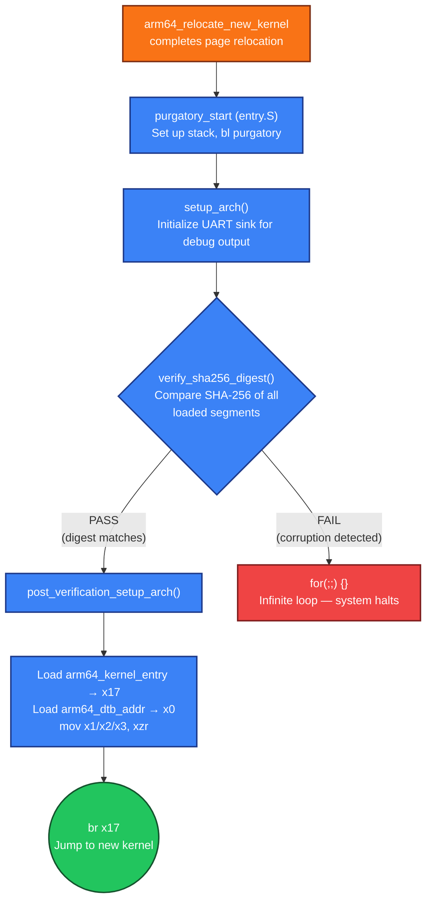

Two global symbols are patched by kexec-tools: **`arm64_kernel_entry`** (physical address of the new kernel's entry) and **`arm64_dtb_addr`** (physical address of the DTB).

AArch64 doesn't define `CONFIG_ARCH_SUPPORTS_KEXEC_PURGATORY`, so in the `kexec_file_load` path, `image->start` points directly to the new kernel and the transition skips purgatory entirely.

---

## 19. The kexec_load Syscall (Legacy Path)

The original `kexec_load` interface is defined in [kernel/kexec.c](https://github.com/torvalds/linux/blob/v7.2-rc5/kernel/kexec.c#L242-L265):

```c
SYSCALL_DEFINE4(kexec_load, unsigned long, entry, unsigned long, nr_segments,
                struct kexec_segment __user *, segments, unsigned long, flags)
```

Userspace is fully responsible for parsing the kernel binary, constructing all memory segments, determining physical load addresses, and setting the entry point. The kernel receives only opaque binary blobs — **it cannot enforce signature verification**.

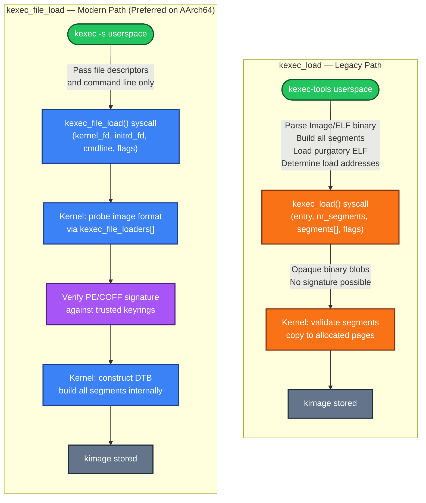

### 19.1 Userspace-Side Loading (kexec-tools)

The arm64 image loader in kexec-tools follows this sequence:

1. **Probe**: `image_arm64_probe()` validates the `ARM\x64` magic
2. **Process header**: `arm64_process_image_header()` in [kexec/arch/arm64/kexec-arm64.c](https://github.com/torvalds/linux/blob/v7.2-rc5/kexec/arch/arm64/kexec-arm64.c#L109-L132) extracts `text_offset` and `image_size`
3. **Locate kernel segment**: `arm64_locate_kernel_segment()` finds a 2MB-aligned hole using `/proc/iomem`
4. **Load other segments**: `arm64_load_other_segments()` in [kexec/arch/arm64/kexec-arm64.c](https://github.com/torvalds/linux/blob/v7.2-rc5/kexec/arch/arm64/kexec-arm64.c#L714-L843) handles DTB, initrd, and purgatory
5. **Issue syscall**: `kexec_load(entry, nr_segments, segments[], flags)`

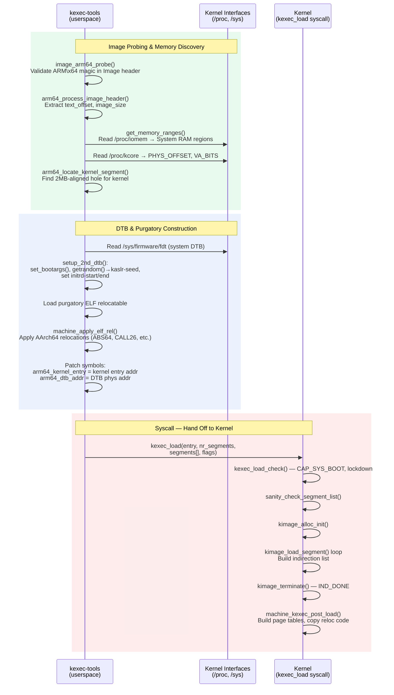

### 19.2 The PHYS_OFFSET Problem

AArch64 systems don't necessarily start physical RAM at address 0. The `get_memory_ranges()` function in [kexec/arch/arm64/kexec-arm64.c](https://github.com/torvalds/linux/blob/v7.2-rc5/kexec/arch/arm64/kexec-arm64.c#L1064-L1202) uses three fallback strategies:

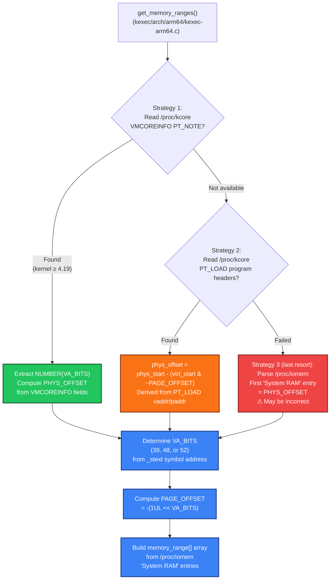

### 19.3 ELF Relocations for Purgatory

The `machine_apply_elf_rel()` function in [kexec/arch/arm64/kexec-arm64.c](https://github.com/torvalds/linux/blob/v7.2-rc5/kexec/arch/arm64/kexec-arm64.c#L1238-L1357) handles AArch64 ELF relocations:

| Relocation | Description |
|---|---|
| `R_AARCH64_ABS64` | 64-bit absolute address |
| `R_AARCH64_PREL32` | 32-bit PC-relative offset |
| `R_AARCH64_MOVW_UABS_G0_NC` through `G3` | MOV/MOVK immediate fields for 64-bit addresses |
| `R_AARCH64_ADR_PREL_PG_HI21` | ADRP instruction: page-relative 21-bit offset |
| `R_AARCH64_ADD_ABS_LO12_NC` | ADD instruction: 12-bit page offset |
| `R_AARCH64_JUMP26` / `R_AARCH64_CALL26` | 26-bit PC-relative branch targets |
| `R_AARCH64_LDST64_ABS_LO12_NC` / `LDST128_ABS_LO12_NC` | Load/store address encoding |

---

## 20. Security Deep Dive

### 20.1 The Security Check Chain

The `kexec_load_check()` function in [kernel/kexec.c](https://github.com/torvalds/linux/blob/v7.2-rc5/kernel/kexec.c#L202-L240) enforces:

- **`CAP_SYS_BOOT`** capability is required
- The **`kexec_load_disabled`** sysctl (write-once from 0 to 1) can permanently disable kexec loading
- **LSM and IMA** checks via `security_kernel_load_data()`
- **Kernel lockdown** via `security_locked_down(LOCKDOWN_KEXEC)` — when lockdown is in integrity mode, `kexec_load` is blocked entirely (cannot verify signatures), while `kexec_file_load` is permitted if signature verification passes

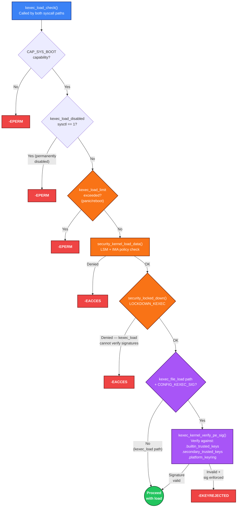

### 20.2 Signature Verification on AArch64

AArch64 enables signature verification by default via Kconfig in [arch/arm64/Kconfig](https://github.com/torvalds/linux/blob/v7.2-rc5/arch/arm64/Kconfig#L1648-L1655):

```
config ARCH_SUPPORTS_KEXEC_SIG
    def_bool y

config ARCH_SUPPORTS_KEXEC_IMAGE_VERIFY_SIG
    def_bool y

config ARCH_DEFAULT_KEXEC_IMAGE_VERIFY_SIG
    def_bool y
```

This uses **PE/COFF signature verification** — the same mechanism used for UEFI Secure Boot.

### 20.3 Load Limits

The kernel provides per-type load limits via sysctls `kexec_load_limit_panic` and `kexec_load_limit_reboot`, implemented in [kernel/kexec_core.c](https://github.com/torvalds/linux/blob/v7.2-rc5/kernel/kexec_core.c#L1017-L1106). These cap the number of times a kexec image can be loaded, providing defense-in-depth.

---

## 21. Kconfig Options for AArch64

The kexec-related Kconfig options for arm64 are defined in [arch/arm64/Kconfig](https://github.com/torvalds/linux/blob/v7.2-rc5/arch/arm64/Kconfig#L1637-L1671):

| Config Option | Default | Description |
|---|---|---|
| `ARCH_SUPPORTS_KEXEC` | `PM_SLEEP_SMP` | Enables `kexec_load`; requires SMP sleep support for CPU offlining |
| `ARCH_SUPPORTS_KEXEC_FILE` | `y` | Enables `kexec_file_load` |
| `ARCH_SUPPORTS_KEXEC_SIG` | `y` | Enables kernel image signature verification |
| `ARCH_SUPPORTS_KEXEC_IMAGE_VERIFY_SIG` | `y` | Enables PE-signature-based verification |
| `ARCH_DEFAULT_KEXEC_IMAGE_VERIFY_SIG` | `y` | Makes signature verification the default |
| `ARCH_SUPPORTS_KEXEC_HANDOVER` | `y` | Enables Kexec Handover (KHO) support |
| `TRANS_TABLE` | `y` (if `HIBERNATION` or `KEXEC_CORE`) | Builds the transitional page table code |

AArch64 sets generous memory limits in [arch/arm64/include/asm/kexec.h](https://github.com/torvalds/linux/blob/v7.2-rc5/arch/arm64/include/asm/kexec.h#L14-L24):

```c
#define KEXEC_SOURCE_MEMORY_LIMIT      (-1UL)  /* All of physical memory */
#define KEXEC_DESTINATION_MEMORY_LIMIT (-1UL)
#define KEXEC_CONTROL_MEMORY_LIMIT     (-1UL)
#define KEXEC_CONTROL_PAGE_SIZE        4096    /* One 4KB page */
```

Before any loading begins, `machine_kexec_prepare()` in [arch/arm64/kernel/machine_kexec.c](https://github.com/torvalds/linux/blob/v7.2-rc5/arch/arm64/kernel/machine_kexec.c#L55-L63) checks that CPUs aren't stuck:

```c
int machine_kexec_prepare(struct kimage *kimage)
{
    if (kimage->type != KEXEC_TYPE_CRASH && cpus_are_stuck_in_kernel()) {
        pr_err("Can't kexec: CPUs are stuck in the kernel.\n");
        return -EBUSY;
    }
    return 0;
}
```

---

## 22. kexec-tools: Supported Image Formats

The kexec-tools utility for arm64 supports multiple kernel image formats, registered in [kexec/arch/arm64/kexec-arm64.c](https://github.com/torvalds/linux/blob/v7.2-rc5/kexec/arch/arm64/kexec-arm64.c#L73-L81):

```c
struct file_type file_type[] = {
    {"vmlinux", elf_arm64_probe, elf_arm64_load, elf_arm64_usage},
    {"Image",   image_arm64_probe, image_arm64_load, image_arm64_usage},
    {"uImage",  uImage_arm64_probe, uImage_arm64_load, uImage_arm64_usage},
    {"vmlinuz", pez_arm64_probe, pez_arm64_load, pez_arm64_usage},
    {"uki",     uki_image_probe, uki_image_load, uki_image_usage},
};
```

| Format | Description | Probe Function |
|--------|-------------|----------------|
| **vmlinux** | Raw ELF kernel; loads segments and extracts entry point | `elf_arm64_probe` |
| **Image** | Standard arm64 binary with `ARM\x64` header | `image_arm64_probe` |
| **uImage** | U-Boot wrapped image format | `uImage_arm64_probe` |
| **vmlinuz** | PE-compressed kernel (gzip/lz4 Image in PE stub) | `pez_arm64_probe` |
| **uki** | Unified Kernel Image format | `uki_image_probe` |

When using `kexec_file_load` (via `kexec -s`), userspace delegates most work to the kernel — DTB handling is skipped (`arm64_opts.dtb = NULL`), since the kernel constructs the DTB internally.

---

## 23. End-to-End Flow Summary

### 23.1 Normal Kexec: Complete End-to-End

```mermaid
flowchart TD
    classDef user fill:#22c55e,stroke:#14532d,stroke-width:2px,color:#fff,font-weight:bold
    classDef kernel fill:#3b82f6,stroke:#1e3a8a,stroke-width:2px,color:#fff
    classDef arch fill:#f97316,stroke:#7c2d12,stroke-width:2px,color:#fff
    classDef asm fill:#ef4444,stroke:#7f1d1d,stroke-width:2px,color:#fff,font-weight:bold
    classDef boot fill:#a855f7,stroke:#581c87,stroke-width:2px,color:#fff,font-weight:bold

    subgraph LOAD ["LOAD PHASE — Full kernel operational"]
        direction TD
        A(["① kexec -s -l /boot/Image"]):::user
        A --> B["② kexec_file_load()\nSyscall entry"]:::kernel
        B --> C["③ Security gates:\nCAP_SYS_BOOT → lockdown → IMA\n→ load limits"]:::kernel
        C --> D["④ image_probe(): ARM\\x64 magic\nValidate header, endianness, page size"]:::kernel
        D --> E["⑤ kexec_kernel_verify_pe_sig()\nPE signature vs trusted keyrings"]:::kernel
        E --> F["⑥ Segment placement:\nKernel (2MB-align) → initrd (32GB window)\n→ DTB (2MB-align, fdt_pack)"]:::kernel
        F --> G["⑦ kimage_load_segment() loop\nBuild indirection list:\nIND_DESTINATION → IND_SOURCE entries"]:::kernel
        G --> H["⑧ kimage_terminate()\nWrite IND_DONE sentinel"]:::kernel
        H --> I["⑨ machine_kexec_post_load():\nCopy linear map → TTBR1\nIdentity-map reloc code → TTBR0\nCopy arm64_relocate_new_kernel"]:::arch
        I --> J["⑩ kexec_image = image\nLoaded and ready"]:::kernel
    end

    subgraph EXEC ["EXECUTE PHASE — Point of no return"]
        direction TD
        K(["⑪ kexec -e\nreboot(LINUX_REBOOT_CMD_KEXEC)"]):::user
        K --> L["⑫ kernel_kexec():\nNotify chain → migrate to CPU 0\n→ machine_shutdown()\n→ PSCI CPU_OFF secondaries"]:::kernel
        L --> M["⑬ machine_kexec():\nBUG_ON(online > 1)\nlocal_daif_mask()"]:::arch
        M --> N["⑭ cpu_install_ttbr0()\nInstall identity-mapped\nrelocation code page table"]:::arch
        N --> O["⑮ arm64_relocate_new_kernel:\nBBM TTBR1 switch to copy\nWalk indirection list\ncopy_page per IND_SOURCE"]:::asm
        O --> P["⑯ DSB NSH → IC IALLU\nFlush D-cache, invalidate I-cache"]:::asm
        P --> Q["⑰ turn_off_mmu\nSCTLR_EL1: M=0, C=0, I=0"]:::asm
        Q --> R["⑱ br x28\nx0 = DTB phys addr\nx1 = x2 = x3 = 0"]:::asm
        R --> S(("⑲ New kernel boots\nfrom _text")):::boot
    end

    J -.->|"Trigger:\nkexec -e"| K
```

| Step | Action | Key Function/Location |
|------|--------|-----------------------|
| 1 | Userspace invokes `kexec -s -l /boot/Image` | kexec-tools |
| 2 | Syscall: `kexec_file_load()` | kernel/kexec_file.c |
| 3 | Permission checks: CAP_SYS_BOOT, lockdown, IMA, limits | kernel/kexec.c |
| 4 | Image probing: `ARM\x64` magic, header validation | arch/arm64/kernel/kexec_image.c |
| 5 | Signature verification: PE signature vs trusted keyrings | kexec_kernel_verify_pe_sig() |
| 6 | Segment construction: kernel, initrd, DTB placed in memory | arch/arm64/kernel/machine_kexec_file.c |
| 7 | Segment loading: data copied, indirection list built | kernel/kexec_core.c |
| 8 | Indirection list terminated with `IND_DONE` | kimage_terminate() |
| 9 | Post-load: page tables built, relocation code copied | arch/arm64/kernel/machine_kexec.c |
| 10 | Image stored as `kexec_image` | kernel/kexec_file.c |
| 11 | Execute: `reboot(LINUX_REBOOT_CMD_KEXEC)` | userspace |
| 12 | Shutdown: notifiers, migrate to CPU 0, offline secondaries | kernel/kexec_core.c |
| 13 | `machine_kexec()`: DAIF mask, safety BUG_ON | arch/arm64/kernel/machine_kexec.c |
| 14 | TTBR0 installed with identity-mapped relocation code | machine_kexec() |
| 15 | Relocation: copy all pages via indirection list | arch/arm64/kernel/relocate_kernel.S |
| 16 | Cache flush: D-cache cleaned, I-cache invalidated | relocate_kernel.S |
| 17 | MMU off: `SCTLR_EL1` cleared | turn_off_mmu macro |
| 18 | `br x28` to new kernel, `x0` = DTB physical address | relocate_kernel.S |
| 19 | New kernel boots from `_text` — init/systemd starts fresh | New kernel |

### 23.2 Complete End-to-End ASCII Diagram: Normal Kexec

```
┌─────────────────────────────────────────────────────────────────────────────────┐
│  NORMAL KEXEC: Complete End-to-End Flow (kexec_file_load on AArch64)            │
├─────────────────────────────────────────────────────────────────────────────────┤
│                                                                                 │
│  ╔═══════════════════════════════════════════════════════════════════════════╗  │
│  ║  PHASE 1: LOAD  (system fully operational, all subsystems available)      ║  │
│  ╚═══════════════════════════════════════════════════════════════════════════╝  │
│                                                                                 │
│  User Space                          Kernel Space                               │
│  ──────────                          ────────────                               │
│  kexec -s -l /boot/Image             sys_kexec_file_load()                      │
│       │                                    │                                    │
│       │  fd, initrd_fd,                    ├─── kexec_load_check()              │
│       │  cmdline, flags                    │     ├── CAP_SYS_BOOT?              │
│       └──── syscall ────────────────►      │     ├── kexec_load_disabled?       │
│                                            │     ├── security_kernel_load_data()│
│                                            │     └── security_locked_down()     │
│                                            │                                    │
│                                            ├─── kernel_read_file_from_fd()      │
│                                            │     └── read Image into kernel buf │
│                                            │                                    │
│                                            ├─── image_probe()                   │
│                                            │     ├── check ARM\x64 magic @0x30  │
│                                            │     ├── validate image_size > 0    │
│                                            │     └── check endianness/page size │
│                                            │                                    │
│                                            ├─── kexec_kernel_verify_pe_sig()    │
│                                            │     └── PE sig vs trusted keyrings │
│                                            │                                    │
│                                            ├─── kimage_file_alloc_init()        │
│                                            │     └── allocate struct kimage     │
│                                            │                                    │
│                                            ├─── image_load()                    │
│                                            │     ├── parse text_offset,         │
│                                            │     │   image_size, flags          │
│                                            │     ├── kexec_add_buffer()         │
│                                            │     │   align=2MB, find mem hole   │
│                                            │     └── load_other_segments()      │
│                                            │          ├── initrd (32GB window)  │
│                                            │          └── DTB (2MB-align)       │
│                                            │                                    │
│                                            ├─── kimage_load_segment() × N       │
│                                            │     ├── copy data into pages       │
│                                            │     └── build indirection list:    │
│                                            │          IND_DESTINATION           │
│                                            │          IND_SOURCE (per page)     │
│                                            │          IND_INDIRECTION (overflow)│
│                                            │                                    │
│                                            ├─── kimage_terminate()              │
│                                            │     └── write IND_DONE sentinel    │
│                                            │                                    │
│                                            ├─── machine_kexec_post_load()       │
│                                            │     ├── trans_pgd_create_copy()    │
│                                            │     │   deep-copy linear map→TTBR1 │
│                                            │     ├── memcpy reloc code →        │
│                                            │     │   control_code_page          │
│                                            │     ├── trans_pgd_idmap_page()     │
│                                            │     │   identity map→TTBR0         │
│                                            │     ├── compute phys_offset        │
│                                            │     └── dcache + icache flush      │
│                                            │                                    │
│                                            └─── kexec_image = image ✓           │
│                                                                                 │
│             ┌─── system continues running normally ──┐                          │
│             │    image sits in memory, waiting       │                          │
│             └────────────────────────────────────────┘                          │
│                                                                                 │
│  ╔═══════════════════════════════════════════════════════════════════════════╗  │
│  ║  PHASE 2: EXECUTE  (graceful shutdown, point of no return).               ║  │
│  ╚═══════════════════════════════════════════════════════════════════════════╝  │
│                                                                                 │
│  kexec -e  ─────────────────────────► reboot(LINUX_REBOOT_CMD_KEXEC)            │
│                                            │                                    │
│                                            ▼                                    │
│                                       kernel_kexec()                            │
│                                            │                                    │
│                                            ├── kexec_in_progress = true         │
│                                            ├── kernel_restart_prepare()         │
│                                            │    └── reboot notifier chain       │
│                                            │        (drivers release resources) │
│                                            ├── migrate_to_reboot_cpu()          │
│                                            │    └── pin to CPU 0                │
│                                            ├── syscore_shutdown()               │
│                                            ├── machine_shutdown()               │
│                                            │    └── PSCI CPU_OFF each secondary │
│                                            ├── kmsg_dump(SHUTDOWN)              │
│                                            │                                    │
│                                            ▼                                    │
│                                       machine_kexec(kexec_image)                │
│                                            │                                    │
│                                            ├── BUG_ON(online > 1)               │
│                                            ├── local_daif_mask()                │
│                                            │   (Debug, SError, IRQ, FIQ off)    │
│                                            │                                    │
│                                            ├── head & IND_DONE? → NO            │
│                                            │                                    │
│                                            ├── __hyp_set_vectors() [if nVHE]    │
│                                            ├── cpu_install_ttbr0(ttbr0, t0sz)   │
│                                            │   (identity map for reloc code)    │
│                                            │                                    │
│                                            ▼                                    │
│                                       kernel_reloc(kimage)                      │
│                                       = arm64_relocate_new_kernel               │
│                                                                                 │
│  ╔═══════════════════════════════════════════════════════════════════════════╗  │
│  ║  PHASE 3: RELOCATION & HANDOFF  (bare-metal assembly, no kernel svcs)     ║  │
│  ╚═══════════════════════════════════════════════════════════════════════════╝  │
│                                                                                 │
│  arm64_relocate_new_kernel (running from control_code_page, VA==PA via TTBR0)   │
│       │                                                                         │
│       ├── Save all kimage fields into registers                                 │
│       │   x28=start, x27=el2_vec, x26=dtb, x17=ttbr1, x16=head ...              │
│       │   (kimage may be overwritten during copy)                               │
│       │                                                                         │
│       ├── break_before_make_ttbr_switch                                         │
│       │   ├── MSR TTBR1, zero_page    (BREAK)                                   │
│       │   ├── ISB → TLBI → DSB → ISB  (invalidate)                              │
│       │   └── MSR TTBR1, copied_pgd   (MAKE)                                    │
│       │                                                                         │
│       ├── Copy Loop:                                                            │
│       │   ┌─────────────────────────────────────────────┐                       │
│       │   │ for each entry in indirection list:         │                       │
│       │   │   IND_DESTINATION → set dest address        │                       │
│       │   │   IND_SOURCE      → copy_page(dest, src)    │                       │
│       │   │                     dcache CIVAC on dest    │                       │
│       │   │                     dest += PAGE_SIZE       │                       │
│       │   │   IND_INDIRECTION → follow to next page     │                       │
│       │   │   IND_DONE        → exit loop               │                       │
│       │   └─────────────────────────────────────────────┘                       │
│       │                                                                         │
│       ├── DSB NSH → IC IALLU → DSB NSH → ISB                                    │
│       │   (ensure writes visible, invalidate I-cache)                           │
│       │                                                                         │
│       ├── turn_off_mmu                                                          │
│       │   SCTLR_EL1: clear M (MMU), C (D-cache), I (I-cache)                    │
│       │                                                                         │
│       └── Branch to new kernel:                                                 │
│           ├── [EL2/nVHE] HVC #0 → soft restart via EL2                          │
│           └── [EL1]      br x28                                                 │
│                          x0 = DTB physical address                              │
│                          x1 = x2 = x3 = 0                                       │
│                                                                                 │
│       ════════════════════════════════════════════                              │
│       OLD KERNEL MEMORY: DESTROYED (overwritten by copy loop)                   │
│       NEW KERNEL: boots from _text, runs start_kernel()                         │
│       USERSPACE: init/systemd starts from scratch                               │
│       ════════════════════════════════════════════                              │
│                                                                                 │
└─────────────────────────────────────────────────────────────────────────────────┘
```

### 23.3 Complete End-to-End ASCII Diagram: Crash Kexec

```
┌─────────────────────────────────────────────────────────────────────────────────┐
│  CRASH KEXEC: Complete End-to-End Flow (kexec_file_load on AArch64)             │
├─────────────────────────────────────────────────────────────────────────────────┤
│                                                                                 │
│  ╔═══════════════════════════════════════════════════════════════════════════╗  │
│  ║  PHASE 1: LOAD  (pre-loaded while system is healthy)                      ║  │
│  ╚═══════════════════════════════════════════════════════════════════════════╝  │
│                                                                                 │
│  User Space                          Kernel Space                               │
│  ──────────                          ────────────                               │
│  kexec -s -p /boot/Image             sys_kexec_file_load(flags=ON_CRASH)        │
│       │                                    │                                    │
│       │  -p flag sets                      ├─── kexec_load_check()              │
│       │  KEXEC_FILE_ON_CRASH               │     └── same security gates        │
│       └──── syscall ────────────────►      │                                    │
│                                            ├─── image_probe() + verify_sig()    │
│                                            │     └── same validation as normal  │
│                                            │                                    │
│                                            ├─── kimage_file_alloc_init()        │
│                                            │     └── type = KEXEC_TYPE_CRASH    │
│                                            │                                    │
│                                            ├─── image_load()                    │
│                                            │     └── segments placed WITHIN     │
│                                            │         crashkernel= reserved      │
│                                            │         region only                │
│                                            │                                    │
│                                            ├─── load_other_segments()           │
│                                            │     ├── prepare_elf_headers()      │
│                                            │     │   └── ELF core header for    │
│                                            │     │       old kernel memory map  │
│                                            │     ├── initrd (in reserved region)│
│                                            │     └── DTB with extra properties: │
│                                            │          linux,elfcorehdr          │
│                                            │          linux,usable-memory-range │
│                                            │                                    │
│                                            ├─── kimage_load_crash_segment() × N │
│                                            │     └── write directly to reserved │
│                                            │         physical pages (no scatter)│
│                                            │         head = IND_DONE (immediate)│
│                                            │                                    │
│                                            ├─── machine_kexec_post_load()       │
│                                            │     └── FAST PATH:                 │
│                                            │         kexec_segment_flush()      │
│                                            │         (flush to PoC, return)     │
│                                            │         NO page tables built       │
│                                            │         NO reloc code copied       │
│                                            │                                    │
│                                            └─── kexec_crash_image = image ✓     │
│                                                                                 │
│             ┌─── system continues running ───────────────────────┐              │
│             │  crash kernel pre-loaded in reserved memory,       │              │
│             │  waiting for a panic event                         │              │
│             └────────────────────────────────────────────────────┘              │
│                                                                                 │
│  ╔═══════════════════════════════════════════════════════════════════════════╗  │
│  ║  PHASE 2: CRASH TRIGGER  (system has panicked, no graceful shutdown)      ║  │
│  ╚═══════════════════════════════════════════════════════════════════════════╝  │
│                                                                                 │
│  Trigger: kernel panic / BUG() / oops / sysrq-c / watchdog                      │
│       │                                                                         │
│       ▼                                                                         │
│  __crash_kexec(regs)                 (called from panic() path)                 │
│       │                                                                         │
│       ├── machine_crash_shutdown(regs)                                          │
│       │    ├── local_irq_disable()                                              │
│       │    ├── crash_smp_send_stop()                                            │
│       │    │    └── send NMI/IPI to ALL other CPUs                              │
│       │    │        force them to stop immediately                              │
│       │    │        (no graceful offlining — system is broken)                  │
│       │    ├── crash_save_cpu(regs, smp_processor_id())                         │
│       │    │    └── save register state for crash dump                          │
│       │    └── machine_kexec_mask_interrupts()                                  │
│       │                                                                         │
│       ▼                                                                         │
│  machine_kexec(kexec_crash_image)                                               │
│       │                                                                         │
│       ├── WARN(stuck_cpus || smp_crash_stop_failed())                           │
│       │   (warning only — not fatal, system already broken)                     │
│       ├── local_daif_mask()                                                     │
│       │                                                                         │
│       ├── head & IND_DONE? → YES                                                │
│       │                                                                         │
│       ▼                                                                         │
│  IN-PLACE PATH (no relocation):                                                 │
│       │                                                                         │
│       ├── cpu_install_idmap()                                                   │
│       │   └── switch to pre-existing .idmap.text identity map                   │
│       │                                                                         │
│       ├── restart = (void *)__pa_symbol(cpu_soft_restart)                       │
│       │   └── convert function pointer to physical address                      │
│       │                                                                         │
│       └── restart(is_hyp_nvhe(), kimage->start, dtb_mem, 0, 0)                  │
│            │                                                                    │
│            ▼                                                                    │
│       cpu_soft_restart (arch/arm64/kernel/cpu-reset.S)                          │
│            ├── disable MMU (SCTLR_EL1.M = 0)                                    │
│            ├── [EL2] HVC to reset EL2 state                                     │
│            └── br to new kernel entry                                           │
│                x0 = DTB physical address                                        │
│                x1 = x2 = x3 = 0                                                 │
│                                                                                 │
│       ════════════════════════════════════════════                              │
│       OLD KERNEL MEMORY: PRESERVED (not overwritten)                            │
│         → accessible via /proc/vmcore in crash kernel                           │
│         → process state, driver state, dmesg log intact                         │
│       CRASH KERNEL: boots from reserved region                                  │
│       USERSPACE: minimal initramfs runs makedumpfile                            │
│         → saves dump to disk, then reboots normally                             │
│       ════════════════════════════════════════════                              │
│                                                                                 │
└─────────────────────────────────────────────────────────────────────────────────┘
```

### 23.4 Physical Memory: Before and After (Both Paths)

```
┌─────────────────────────────────────────────────────────────────────────────────┐
│  Physical Memory State: Before and After Kexec                                  │
├─────────────────────────────────────────────────────────────────────────────────┤
│                                                                                 │
│  BEFORE (both paths — image loaded, waiting for trigger):                       │
│                                                                                 │
│  0x0000_0000                                                     0xFFFF_FFFF    │
│  ┌──────────┬──────┬──────┬──────┬───────────────┬──────┬──────┬──────────┐     │
│  │ old      │kexec │ old  │kexec │ crashkernel=  │kexec │ old  │ device   │     │
│  │ kernel   │ src  │kernel│ src  │ reserved      │ DTB  │kernel│ MMIO     │     │
│  │ .text    │ pg 0 │ data │ pg 1 │ (crash only)  │ pg   │ heap │          │     │
│  │ .data    │      │      │      │               │      │      │          │     │
│  │ drivers  │      │      │      │ ┌───────────┐ │      │      │          │     │
│  │ process  │      │      │      │ │crash kern │ │      │      │          │     │
│  │ state    │      │      │      │ │crash DTB  │ │      │      │          │     │
│  │          │      │      │      │ │elfcorehdr │ │      │      │          │     │
│  │          │      │      │      │ └───────────┘ │      │      │          │     │
│  └──────────┴──────┴──────┴──────┴───────────────┴──────┴──────┴──────────┘     │
│   ▲ normal kexec src pages                        ▲ crash kexec segments        │
│     scattered by buddy allocator                    at final addresses          │
│                                                                                 │
│  ═══════════════════════════════════════════════════════════════════════════    │
│                                                                                 │
│  AFTER NORMAL KEXEC (relocation complete, new kernel running):                  │
│                                                                                 │
│  0x0000_0000                                                     0xFFFF_FFFF    │
│  ┌──────────────────────────┬───────────────┬──────────┬───────────────────┐    │
│  │ █████████████████████    │ crashkernel=  │ new      │ device            │    │
│  │ ████ OVERWRITTEN ████    │ reserved      │ kernel   │ MMIO              │    │
│  │ ████ old kernel  ████    │(still reserved│ @ 2MB    │                   │    │
│  │ ████ memory is   ████    │ for future    │ aligned  │                   │    │
│  │ ████ DESTROYED   ████    │ crash kexec)  │ dest     │                   │    │
│  │ █████████████████████    │               │ ┌──────┐ │                   │    │
│  │                          │               │ │.text │ │                   │    │
│  │  (freed by new kernel's  │               │ │.data │ │                   │    │
│  │   memblock/buddy init)   │               │ │initrd│ │                   │    │
│  │                          │               │ │ DTB  │ │                   │    │
│  │                          │               │ └──────┘ │                   │    │
│  └──────────────────────────┴───────────────┴──────────┴───────────────────┘    │
│                                                                                 │
│  ═══════════════════════════════════════════════════════════════════════════    │
│                                                                                 │
│  AFTER CRASH KEXEC (crash kernel running, old memory preserved):                │
│                                                                                 │
│  0x0000_0000                                                   0xFFFF_FFFF      │
│  ┌──────────────────────────┬───────────────┬─────────────────────────────┐     │
│  │ OLD KERNEL MEMORY        │ crashkernel=  │                             │     │
│  │ ┌──────────────────────┐ │ reserved      │   other RAM                 │     │
│  │ │ PRESERVED INTACT     │ │               │   (old kernel data)         │     │
│  │ │                      │ │ ┌───────────┐ │                             │     │
│  │ │ • kernel .text/.data │ │ │ CRASH     │ │   ┌───────────────────┐     │     │
│  │ │ • task_struct list   │ │ │ KERNEL    │ │   │ ALSO PRESERVED    │     │     │
│  │ │ • page tables        │ │ │ running   │ │   │ • page cache      │     │     │
│  │ │ • slab caches        │ │ │ here      │ │   │ • process stacks  │     │     │
│  │ │ • driver state (=Y)  │ │ │           │ │   │ • module data (=M)│     │     │
│  │ │ • log_buf (dmesg)    │ │ │ initrd    │ │   │ • network buffers │     │     │
│  │ │ • module state (=M)  │ │ │ DTB       │ │   └───────────────────┘     │     │
│  │ │                      │ │ │ elfcorehdr│ │                             │     │
│  │ └──────────────────────┘ │ └───────────┘ │                             │     │
│  │                          │               │                             │     │
│  │  ← /proc/vmcore →        │ ← crash kernel│                             │     │
│  │    maps this memory      │   runs here   │                             │     │
│  └──────────────────────────┴───────────────┴─────────────────────────────┘     │
│                                                                                 │
└─────────────────────────────────────────────────────────────────────────────────┘
```

---

## 24. Key Differences from x86_64

| Aspect | AArch64 | x86_64 |
|--------|---------|--------|
| **Firmware bypass** | No BIOS POST; uses PSCI for power management | Bypasses entire BIOS POST and UEFI init |
| **Purgatory (kexec_file_load)** | No purgatory; jumps directly to new kernel | Purgatory runs in both paths |
| **Hardware discovery** | Device Tree Blob passed in `x0` | boot_params / zero page structure |
| **Exception levels** | Must manage EL1/EL2, potentially reset EL2 state | No equivalent concern |
| **Page table updates** | Break-Before-Make (BBM) protocol required | No BBM requirement |
| **CPU shutdown** | PSCI `CPU_OFF` via SMP hotplug | IPIs (Inter-Processor Interrupts) |
| **Boot protocol** | `x0=DTB, x1=x2=x3=0` | Entry via boot_params pointer |
